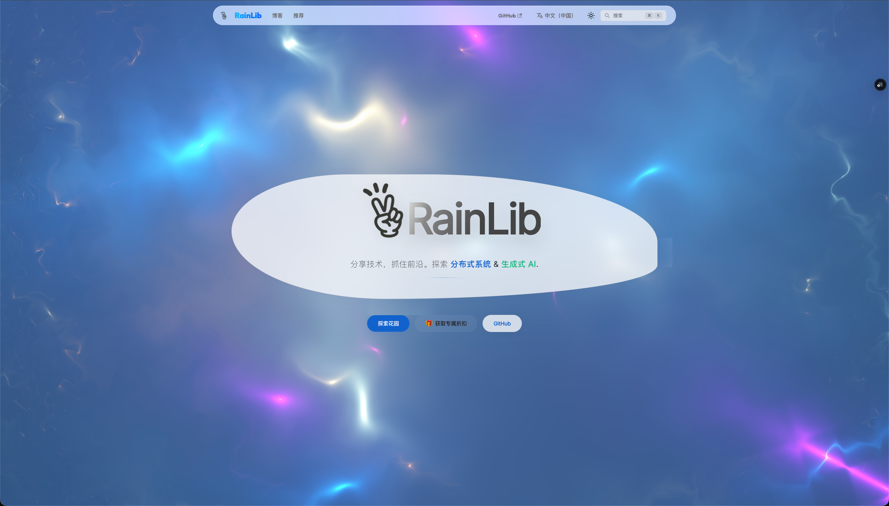
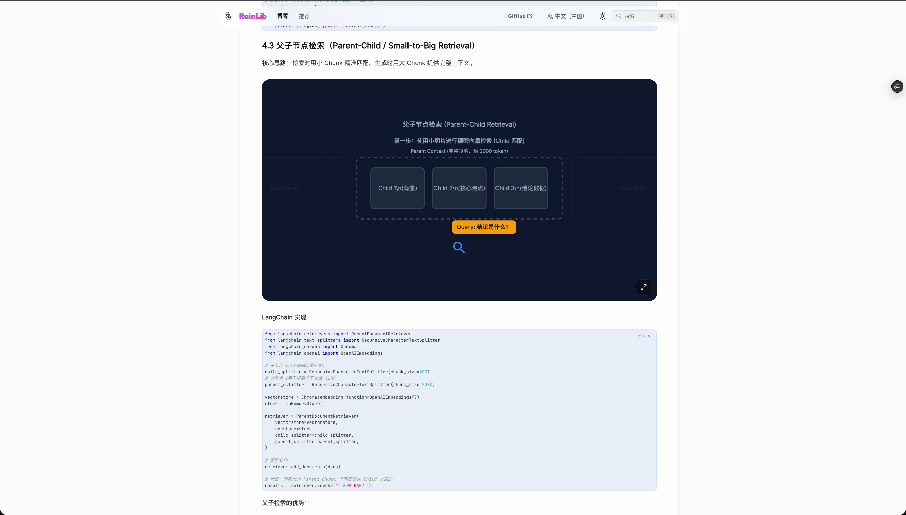

# 🌧️ RainLib - 开发者内容平台与架构可视化工具

[](LICENSE)
[](https://docusaurus.io/)
[](https://reactjs.org/)
[](https://www.typescriptlang.org/)

[English Version (README.md)](./README.md) | [在线体验: blog.rainlib.com](https://blog.rainlib.com/)

RainLib 是一个开源的、以开发者为中心的技术博客平台与数字花园系统。基于 **Docusaurus 3** 构建，旨在提供现代化的技术内容管理、文档编写与知识共享体验。本项目的一个核心特色是深度集成了 [Motion Canvas](https://motioncanvas.io/)，允许在博文中直接渲染**交互式的高级系统架构动态动画**。

---

## ✨ 核心特性

- **🚀 Motion Canvas 集成**: 独立的 `/animation` 工作区，用于创建和嵌入专业的系统架构动画。
- **🌍 深度定制的国际化 (i18n)**: 原生支持中英文无缝切换，助力技术博客迈向全球化。
- **🔧 极客写作工具链**:
  - **MDX 支持**: 在 Markdown 中直接调用 React 组件，实现图文并茂的交互体验。
  - **学术级公式渲染**: 集成 `remark-math` 和 `rehype-katex`，支持复杂数学公式。
  - **Mermaid 图表**: 支持响应式的流程图、解构图与时序图。
- **🔍 极速本地搜索**: 基于 `@easyops-cn/docusaurus-search-local`，纯离线极速索引。
- **🎁 定制化推荐体系**: 独有的 `recommendationPlugin`，将高质量开源项目、论文、工具转化为组件化卡片。
- **🎨 现代化审美**: 采用 Tailwind CSS 构建，支持深色模式优先的精致视觉设计。

---

## 🖼️ 效果展示

### 🏠 首页设计


_极具现代感的首页，支持动态背景与交互式设计。_

### 📝 博客列表


_清晰的博客列表页，支持标签分类与置顶文章。_

### 🎬 交互式动画 (Motion Canvas)


_在博文中嵌入的 Motion Canvas 动画，直观地展示复杂的系统架构。_

### 🎁 推荐资源库


_精心设计的组件化卡片视图，用于推荐高质量的工具、论文和开源项目。_

---

## 🛠️ 技术栈

| 组件         | 技术                         | 作用                      |
| :----------- | :--------------------------- | :------------------------ |
| **核心框架** | React 19 + Docusaurus 3      | 静态生成 (SSG) 与水合能力 |
| **动画引擎** | Motion Canvas + Vite         | 矢量级系统架构动画渲染    |
| **样式系统** | Tailwind CSS + Framer Motion | 现代化 UI/UX 设计         |
| **编程语言** | TypeScript                   | 全栈类型安全              |

---

## 💻 快速开始

### 1. 环境准备

请确保本机已安装 Node.js (>= 20.0) 和相应的包管理器（npm/yarn）。

### 2. 依赖安装

我们提供了 `Makefile` 来简化多工作区的依赖管理：

```bash
# 一键安装主站和动画引擎的所有依赖
make install
```

### 3. 本地开发

启动带有热更新的博客开发服务器：

```bash
# 该命令会自动构建动画资源并启动 Docusaurus 服务 (默认地址: http://localhost:3000)
make start
```

如果你只想创作系统架构动画（Motion Canvas）：

```bash
# 进入动画目录并启动 Vite 渲染器
cd animation && npm run start
```

---

## 🚢 生产构建

生成可用于部署的静态站点：

```bash
# 先编译动画资源，再构建 Docusaurus 静态页面
make build
```

---

## 📜 开源协议

本项目采用 MIT 协议开源。详情请参阅 [LICENSE](LICENSE) 文件。
