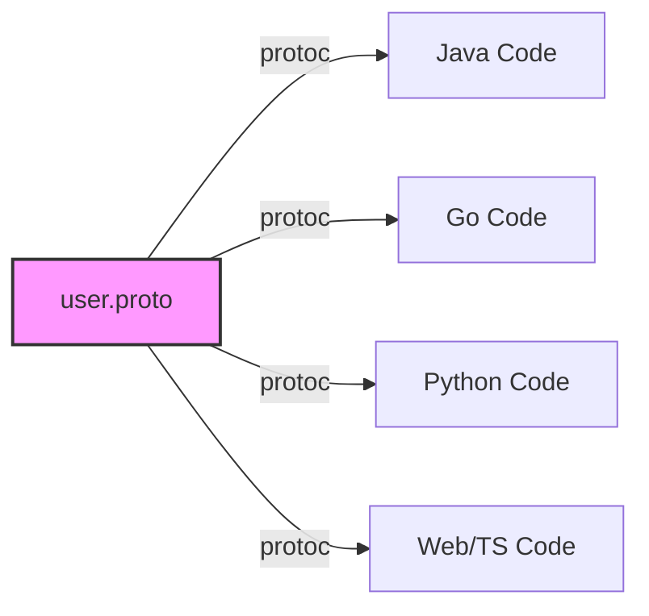

# gRPC 进阶 (2)：Java 实现原理与生产环境避坑指南

> “写 Demo 很简单，但在生产环境中跑稳 gRPC 是一门艺术。”

在 [上一篇](/blog/grpc-protocol) 中，我们深度解构了 gRPC 的灵魂——HTTP/2 协议。
本文将落地到 **Java 实现层** 和 **生产实战**，带你剥开 `grpc-java` 的源码，探讨 Netty 线程模型、零拷贝技术，以及在微服务治理中那些经典的“坑”。

{/* truncate */}

---

## 一、 Java 实现层：grpc-java 的高性能奥秘

gRPC 的 Java 实现 (`grpc-java`) 建立在 **Netty** 之上。它如何将底层的 ByteBuf 高效转化为业务对象？

### 1.1 零拷贝 (Zero Copy) 与 Netty 适配

gRPC 在处理 Protobuf 消息时，尽量减少了内存复制。
当 Netty 读取到网络包（ByteBuf）时，gRPC 并没有急着将其拷贝到 byte[] 数组中，而是通过 `CompositeByteBuf` 或类似的很多 Slice 机制，将其直接“切片”传递给 Protobuf 解析器。

```java
// 伪代码示意：NettyClientHandler 读取数据
public void channelRead(ChannelHandlerContext ctx, Object msg) {
    ByteBuf nettyBuffer = (ByteBuf) msg;
    // gRPC 并不立即通过 byte[] copy 转换
    // 而是包装成 ReadableBuffer 传递给 FrameListener
    GrpcHttp2ConnectionHandler.handleFrame(nettyBuffer);
}
```

### 1.2 线程模型：EventLoop 的交接

理解线程模型是避免生产事故的关键。

1.  **I/O 线程**：Netty 的 `EventLoopGroup` 负责处理网络 I/O（读写 ByteBuf）。千万不要在这里阻塞！
2.  **应用线程**：gRPC 默认会将回调逻辑提交到 `Executor`（通常是 CachedThreadPool 或 ForkJoinPool）。

**避坑指南**：不仅要在服务端，客户端的 `StreamObserver` 回调也是在 gRPC 的线程池中执行的。如果你在 `onNext()` 里做了数据库查询或锁等待，可能会耗尽 gRPC 的内部线程池，导致整个服务卡死。

**最佳实践**：

- 使用自定义的 `Executor` 提供给 ServerBuilder。
- 所有的阻塞操作必须异步化，或者提交到专门的业务线程池。

---

## 二、 跨语言的魅力：IDL 与代码生成

gRPC 的杀手锏之一是 **Protobuf (Protocol Buffers)**。它不仅是序列化协议，更是 **IDL (Interface Definition Language)**。

### 2.1 一份合约，多处履行

你只需要写一份 `.proto` 文件，就能自动生成 Java, Go, Python, C++, Node.js 等十几种语言的代码。这解决了微服务架构中最大的痛点：**接口文档与代码脱节**。



### 2.2 实战场景：Java 后端 + Python AI

在 AI 爆发的今天，我们经常需要用 Java 写业务逻辑，用 Python 跑 PyTorch 模型。gRPC 是连接这两者的最佳桥梁。

- **Java 侧**：作为 Client，调用 `PredictionService`。
- **Python 侧**：作为 Server，加载模型，暴露 gRPC 接口。
  相比于 RESTful API，gRPC 的强类型和高性能在这里优势巨大。

---

## 三、 分布式治理：生产环境的那些坑

### 3.1 为什么 L4 负载均衡（LVS/HAProxy TCP模式）对 gRPC “无效”？

这是一个经典的误区。

- **HTTP/1.1**：连接是短暂的。每次请求可能新建连接，或者复用几次就断开。L4 LB 可以在连接建立时将其分配给不同后端。
- **gRPC (HTTP/2)**：**长连接**是常态。客户端启动时建立一条 TCP 连接，之后数百万次请求都通过这一条连接发送。

**结果**：如果你开了 10 个 Server，但 Client 只启动了一次，它建立的那条连接只会连到其中 1 个 Server。后续的所有流量都会打死这 1 个 Server，其他 9 个围观。

**解决方案**：

1.  **Client-side LB**：客户端感知所有后端地址（通过 Nacos/Consul/K8s Headless Service），自己做轮询/随机。(`ManagedChannelBuilder.forTarget("dns:///myservice")`)
2.  **L7 Load Balance**：使用 Envoy / Nginx (支持 HTTP/2) / Istio。它们会终结 TCP 连接，解析每个 HTTP/2 Frame，然后重新把 Request 分发给后端。

### 3.2 拦截器 (Interceptor) 的 Context 陷阱

在做鉴权（如 OpenID Connect）时，我们常使用 Interceptor。

```java
public class AuthInterceptor implements ServerInterceptor {
    @Override
    public <ReqT, RespT> ServerCall.Listener<ReqT> interceptCall(...) {
        String token = metadata.get(AUTH_HEADER);
        // 校验 token...
        Context ctx = Context.current().withValue(USER_ID, userId);
        return Contexts.interceptCall(ctx, call, headers, next);
    }
}
```

**坑**：gRPC 的 `Context` 是基于 ThreadLocal 的。但是由于 gRPC 的异步非阻塞特性，Request 的处理可能会跨越多个线程。gRPC 框架会自动在回调间传播 Context，但如果你自己手动开启了新线程（`new Thread()`），Context 就会丢失！

---

## 四、 总结与未来

gRPC 不仅仅是一个 RPC 框架，它是 **HTTP/2 协议**、**Protobuf 序列化** 和 **Netty 网络编程** 的集大成者。

- **想要快**：理解 HTTP/2 的分帧和 HPack (见[第一篇](/blog/grpc-protocol))。
- **想要稳**：理解 Netty 的线程模型，坚决不阻塞 I/O 线程。
- **想要扩**：理解长连接对负载均衡的挑战，选择正确的 LB 策略 (Client-side 或 Mesh)。

### 4.1 未来局势：Proxyless Service Mesh

随着 Istio 等 Service Mesh 的成熟，**Distributeless gRPC (Proxyless)** 正在成为新趋势。
Java 应用可以直接通过 xDS 协议与控制面通信，无需 Sidecar 也能实现高级流量治理。这是 Java 工程师值得关注的下一个风口。
