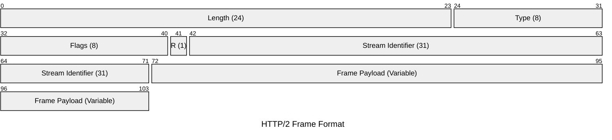
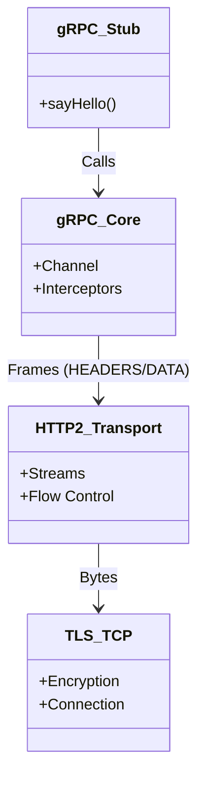
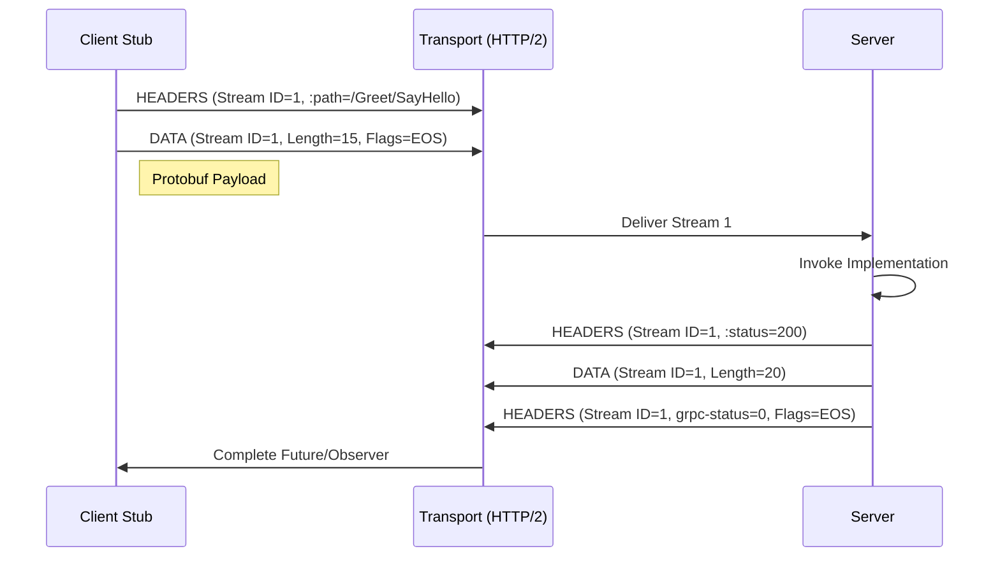

import MotionCanvasPlayer from "@site/src/components/MotionCanvasPlayer";

# gRPC 进阶 (1)：HTTP/2 协议层深度解构

> “不要只学会怎么用，更要明白底层发生了什么。”

在 [上一篇](/blog/grpc-idl) 中，我们扫清了 Protobuf 的语法障碍。
本文作为 gRPC 进阶系列的第二篇，将带你深入协议层，可视化地理解 gRPC 高性能的奥秘。

{/* truncate */}

---

## 一、 为什么 HTTP/2 是 gRPC 的灵魂？

gRPC 的高性能并非凭空而来，很大程度上得益于底层的 **HTTP/2** 协议。相比于 HTTP/1.1 的文本协议和阻塞模型，HTTP/2 引入了 **二进制分帧 (Binary Framing)** 和 **多路复用 (Multiplexing)**。

### 1.1 可视化演示：分帧与多路复用

所有的通信在 HTTP/2 中都被拆分为更小的消息和帧，并以二进制格式编码。

#### HTTP/1.1: 串行阻塞 (Head-of-Line Blocking)

  <MotionCanvasPlayer
    src="/animation/src/project.js?scene=http1_flow"
    auto={true}
  />

#### HTTP/2: 多路复用 (Multiplexing)

  <MotionCanvasPlayer
    src="/animation/src/project.js?scene=http2_flow"
    auto={true}
  />

如上图所示：

- **Connection (连接)**：一个 TCP 连接包含多个流（Stream）。
- **Stream (流)**：双向流动的字节流，每个流都有唯一的 ID（如 Stream 1, 3, 5）。
- **Frame (帧)**：最小通信单位。HEADERS 帧包含元数据，DATA 帧包含 Payload。

在 gRPC 中，你的一个 RPC 调用（比如 `sayHello`）实际上就是在一个特定的 Stream 上发送了一组 HEADERS 帧（包含 `:path`, `:method` 等）和 DATA 帧（包含 Protobuf 序列化后的二进制数据）。

### 1.2 协议封包可视化 (Packet Diagram)

为了更直观地理解 HTTP/2 的二进制分帧结构，我们使用 Mermaid 的 Packet 语法来展示：

#### HTTP/2 Frame Format

- **Length**: Frame Payload 的长度。
- **Type**: 帧类型（如 DATA=0, HEADERS=1, SETTINGS=4）。
- **Flags**: 标志位（如 END_STREAM=0x1）。
- **Stream ID**: 标识该帧属于哪个流。
- **Payload**: 实际的数据内容。

### 1.3 头部压缩 (HPACK)

HTTP/1.x 每次请求都会携带大量的 Header（如 `User-Agent`, `Cookie`），这些数据往往是重复且冗余的。
HTTP/2 引入了 **HPACK** 算法，客户端和服务端共同维护一个“静态字典”和“动态字典”。

- **静态字典**：预定义了常见的 Header（如 `:method: GET`）。
- **动态字典**：记录本次连接中之前发送过的 Header。

**实战价值**：在长连接的高频 RPC 调用中，后续请求的 Header 甚至只需要传输几个字节的索引号，极大地节省了带宽。

---

## 二、 进阶：从 HTTP/2 到 QUIC (HTTP/3)

虽然 HTTP/2 解决了应用层的队头阻塞，但它依然运行在 TCP 之上。这意味着：

> **TCP 层的队头阻塞 (TCP Head-of-Line Blocking)**：
> 如果 TCP 窗口中的**一个数据包**丢失，操作系统必须等待重传。在此期间，**所有流**（Stream 1, 3, 5...）的数据都会被内核卡住，即使 Stream 3 的数据包已经完整到达了。

这在弱网环境下（如移动端 4G/5G 切换）会导致严重的延迟抖动。

### 2.1 QUIC 的革命

QUIC (Quick UDP Internet Connections) 抛弃了 TCP，直接基于 **UDP** 实现了一套可靠传输协议。

- **流独立 (Stream Independence)**：Stream 1 的丢包只会阻塞 Stream 1，Stream 3 和 5 可以继续被应用层读取。
- **0-RTT 建连**：重用之前的连接信息，实现 0 RTT 发送数据。
- **连接迁移 (Connection Migration)**：手机从 WiFi 切到 4G，IP 变了，但 Connection ID 没变，连接依然不断！

### 2.2 QUIC 可视化：独立流与抗丢包

下图展示了 QUIC 如何通过 UDP 实现独立流传输，即使发生丢包（红色 Stream 1），其他流（Stream 3, 5）依然畅通无阻：

  <MotionCanvasPlayer
    src="/animation/src/project.js?scene=quic_flow"
    auto={true}
  />

---

## 三、 协议层图解：gRPC 协议栈

让我们用 Mermaid 来直观地看下 gRPC 的协议栈结构。

### 2.1 请求流程时序图

一个标准的 gRPC Unary 调用流程，并在传输层分解为 Frame：

---

## 三、 总结

gRPC 的“快”，首先建立在 HTTP/2 的“快”之上。

- **多路复用** 解决了 HTTP/1.1 的队头阻塞 (Head-of-Line Blocking) 问题（虽然 TCP 层仍有阻塞，但在应用层已极大缓解）。
- **二进制分帧** 让协议解析更高效。
- **HPACK** 极大地减少了元数据的传输开销。

在 [下一篇文章](/blog/grpc-production) 中，我们将离开协议层，深入 **Java 实现层** 和 **生产环境治理**，探讨 Netty 线程模型、零拷贝技术以及在 Kubernetes 中的负载均衡陷阱。
