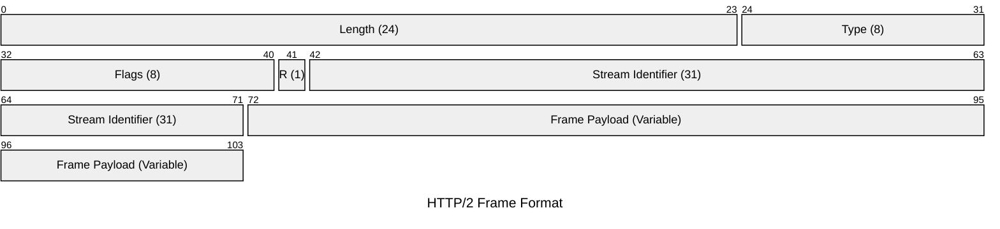
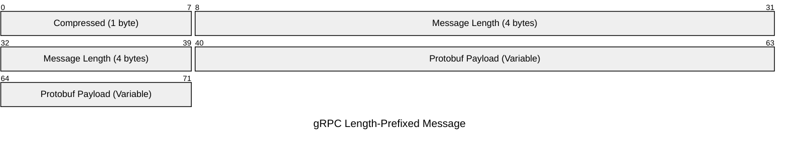
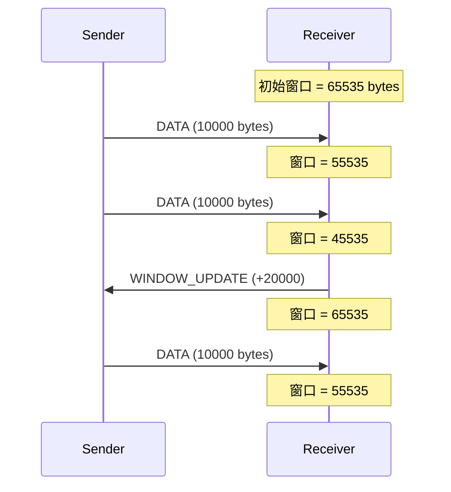
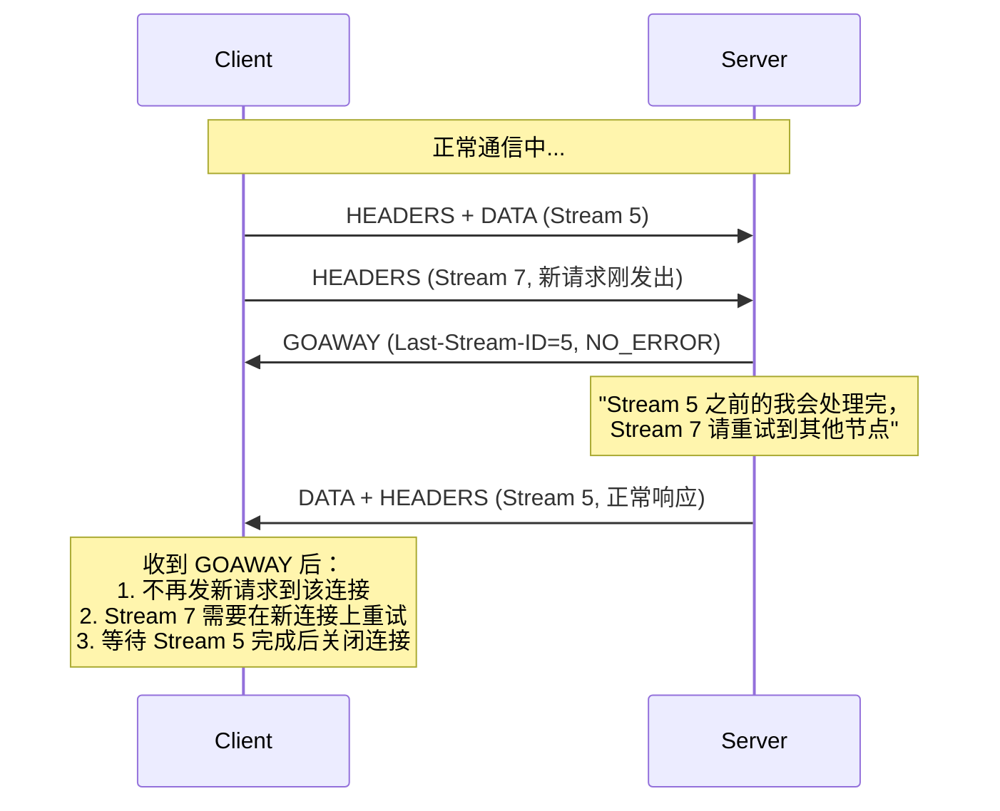
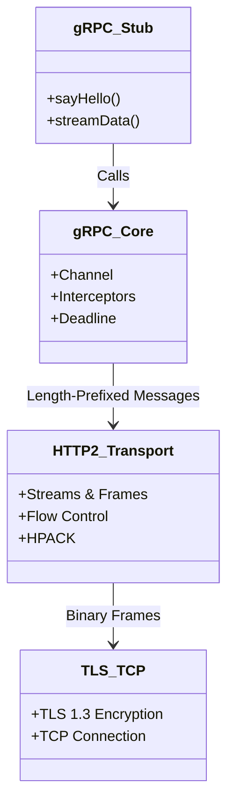
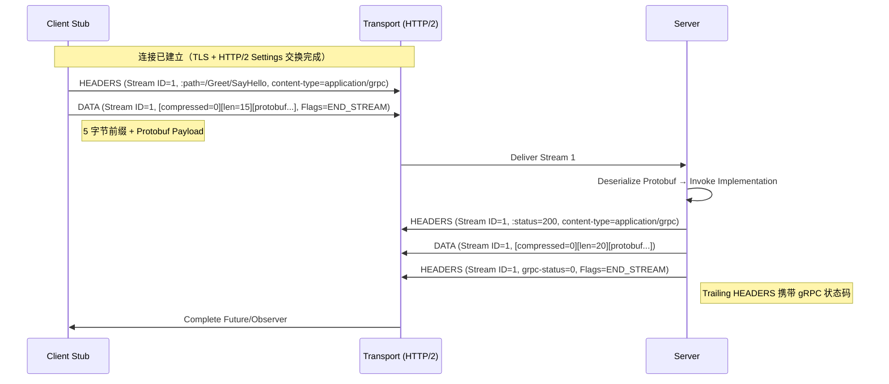

import MotionCanvasPlayer from "@site/src/components/MotionCanvasPlayer";

# gRPC 进阶 (1)：HTTP/2 协议层深度解构

> "不要只学会怎么用，更要明白底层发生了什么。"

在 [上一篇](/blog/grpc-idl) 中，我们扫清了 Protobuf 的语法障碍。
本文作为 gRPC 进阶系列的第二篇，将带你深入协议层，可视化地理解 gRPC 高性能的奥秘。

{/* truncate */}

---

## 一、 为什么 HTTP/2 是 gRPC 的灵魂？

gRPC 的高性能并非凭空而来，很大程度上得益于底层的 **HTTP/2** 协议。相比于 HTTP/1.1 的文本协议和阻塞模型，HTTP/2 引入了 **二进制分帧 (Binary Framing)** 和 **多路复用 (Multiplexing)**。

### 1.1 可视化演示：分帧与多路复用

所有的通信在 HTTP/2 中都被拆分为更小的消息和帧，并以二进制格式编码。

#### HTTP/1.1: 串行阻塞 (Head-of-Line Blocking)

<div>
  <MotionCanvasPlayer
    src="/animation/src/project.js?scene=http1_flow"
    auto={true}
  />
</div>

#### HTTP/2: 多路复用 (Multiplexing)

<div>
  <MotionCanvasPlayer
    src="/animation/src/project.js?scene=http2_flow"
    auto={true}
  />
</div>

如上图所示：

- **Connection (连接)**：一个 TCP 连接包含多个流（Stream）。
- **Stream (流)**：双向流动的字节流，每个流都有唯一的 ID（如 Stream 1, 3, 5）。客户端发起的流用**奇数 ID**，服务端发起的用偶数 ID。
- **Frame (帧)**：最小通信单位。HEADERS 帧包含元数据，DATA 帧包含 Payload。

在 gRPC 中，你的一个 RPC 调用（比如 `sayHello`）实际上就是在一个特定的 Stream 上发送了一组 HEADERS 帧（包含 `:path`, `:method` 等）和 DATA 帧（包含 Protobuf 序列化后的二进制数据）。

### 1.2 协议封包可视化 (Packet Diagram)

为了更直观地理解 HTTP/2 的二进制分帧结构，我们使用 Mermaid 的 Packet 语法来展示：

#### HTTP/2 Frame Format



- **Length**: Frame Payload 的长度（最大 2^14 = 16384 字节，可通过 SETTINGS 帧协商增大至 2^24）。
- **Type**: 帧类型（如 DATA=0x0, HEADERS=0x1, PRIORITY=0x2, RST_STREAM=0x3, SETTINGS=0x4, PING=0x6, GOAWAY=0x7, WINDOW_UPDATE=0x8）。
- **Flags**: 标志位（如 END_STREAM=0x1, END_HEADERS=0x4, PADDED=0x8）。
- **R**: 保留位，必须为 0。
- **Stream ID**: 标识该帧属于哪个流。Stream 0 用于连接级别的控制帧（SETTINGS, PING, GOAWAY）。
- **Payload**: 实际的数据内容。

### 1.3 头部压缩 (HPACK)

HTTP/1.x 每次请求都会携带大量的 Header（如 `User-Agent`, `Cookie`），这些数据往往是重复且冗余的。
HTTP/2 引入了 **HPACK** 算法（[RFC 7541](https://datatracker.ietf.org/doc/html/rfc7541)），客户端和服务端共同维护一张索引表：

- **静态表 (Static Table)**：预定义了 61 个常见的 Header（如 `:method: GET` 索引 2，`:path: /` 索引 4）。
- **动态表 (Dynamic Table)**：记录本次连接中已发送过的 Header Key-Value 对。

**压缩过程示例：**

```
第一次请求：
  :method: POST         → 静态表索引 3  （1 字节）
  :path: /Greet/SayHello → 不在表中，编码完整值 + 存入动态表
  content-type: application/grpc → 不在表中，编码完整值 + 存入动态表

第二次请求（同一连接）：
  :method: POST         → 静态表索引 3  （1 字节）
  :path: /Greet/SayHello → 动态表索引 62 （1 字节！）
  content-type: application/grpc → 动态表索引 63 （1 字节！）
```

**实战价值**：在长连接的高频 RPC 调用中，后续请求的 Header 甚至只需要传输几个字节的索引号，极大地节省了带宽。gRPC 服务间可能每秒数千次调用，HPACK 的累计收益非常可观。

---

## 二、 gRPC Wire Format：Protobuf 如何封装到 HTTP/2

理解 gRPC 在 HTTP/2 之上的封装格式，是调试和抓包的基础。

### 2.1 Length-Prefixed Message

gRPC 不是直接把 Protobuf 字节丢进 DATA 帧。每条消息都使用 **5 字节前缀**封装：



| 字段             | 长度    | 说明                                          |
| ---------------- | ------- | --------------------------------------------- |
| Compressed       | 1 byte  | `0` = 未压缩，`1` = 使用 gRPC 压缩（如 gzip） |
| Message Length   | 4 bytes | 后续 Protobuf payload 的字节长度（大端序）    |
| Protobuf Payload | 可变    | Protobuf 编码后的二进制数据                   |

**为什么需要这个前缀？** 因为 HTTP/2 DATA 帧可能会拆分或合并——一条 Protobuf 消息可能跨多个 DATA 帧，或者一个 DATA 帧包含多条消息。5 字节前缀明确了每条消息的边界。

### 2.2 gRPC 请求/响应映射

一个 gRPC 调用在 HTTP/2 层面的完整映射：

**请求 → HTTP/2 HEADERS 帧：**

| HTTP/2 Header   | 值                        | 说明                             |
| --------------- | ------------------------- | -------------------------------- |
| `:method`       | `POST`                    | gRPC 固定使用 POST               |
| `:scheme`       | `http` / `https`          | 协议方案                         |
| `:path`         | `/package.Service/Method` | 对应 proto 定义的 service 和 rpc |
| `content-type`  | `application/grpc`        | gRPC 标识（必须）                |
| `te`            | `trailers`                | 表示支持 Trailers                |
| `grpc-timeout`  | `1S` / `100m`             | 可选，Deadline 超时              |
| `grpc-encoding` | `gzip`                    | 可选，压缩算法                   |

**响应 → HTTP/2 HEADERS + Trailers 帧：**

| 位置             | Header         | 值                                           |
| ---------------- | -------------- | -------------------------------------------- |
| 初始 HEADERS     | `:status`      | `200`（HTTP 状态码，即使 gRPC 错误也是 200） |
| 初始 HEADERS     | `content-type` | `application/grpc`                           |
| Trailing HEADERS | `grpc-status`  | `0` = OK, `13` = INTERNAL 等                 |
| Trailing HEADERS | `grpc-message` | 可选，错误描述（URL 编码）                   |

:::warning 关键陷阱
gRPC 的错误码在 **Trailers** 中（而非 HTTP 状态码）。这意味着不支持 Trailers 的代理（如某些老旧 Nginx 配置）可能会丢失 gRPC 错误信息。
:::

---

## 三、 流量控制 (Flow Control)

HTTP/2 内建了**流量控制机制**，防止发送方以过快的速度淹没接收方。这对 gRPC 的流式调用尤为重要。

### 3.1 工作原理

流量控制基于 **WINDOW_UPDATE 帧**实现：

1. 每个连接和每个流各有独立的**接收窗口**（默认 65,535 字节）。
2. 发送方发送 DATA 帧会消耗窗口大小。
3. 接收方处理完数据后，发送 `WINDOW_UPDATE` 帧归还消耗的窗口额度。
4. 当窗口为 0 时，发送方**必须停止**发送 DATA 帧。



### 3.2 对 gRPC 的影响

- **Server Streaming**：如果客户端消费速度慢于服务端推送速度，流量控制会自动**反压 (backpressure)** 服务端，避免 OOM。
- **Client Streaming**：同理，服务端处理慢时会反压客户端。
- **调优**：gRPC 允许通过 `NettyChannelBuilder.initialFlowControlWindow()` 调整初始窗口大小。大窗口适合高吞吐场景，小窗口适合内存受限的环境。

:::tip 生产建议
对于大数据量的流式传输，建议将 `initialFlowControlWindow` 设置为 **1MB 或更大**，以减少 WINDOW_UPDATE 帧的往返开销。
:::

---

## 四、 连接生命周期管理

HTTP/2 连接不是永久的。理解连接的生命周期对诊断生产问题至关重要。

### 4.1 GOAWAY 帧：优雅关闭

服务端需要重启时（如滚动升级），不应粗暴断开连接。HTTP/2 提供了 **GOAWAY 帧**：



**在 gRPC 中的意义**：

- **K8s 滚动升级**：Pod 终止前应发送 GOAWAY，让客户端将后续请求发到新 Pod。
- **grpc-java** 的 `Server.shutdown()` 会自动发送 GOAWAY 并等待正在处理的 RPC 完成。
- **GOAWAY 携带错误码**：`NO_ERROR` 表示正常关闭；`ENHANCE_YOUR_CALM` 表示客户端发送过于频繁（常见于 Keepalive 配置不当）。

### 4.2 PING 帧：连接保活

PING 帧用于检测连接是否存活，以及测量往返延迟：

```
Client → Server: PING (8 bytes opaque data)
Server → Client: PING ACK (echo back same 8 bytes)
```

如果在超时时间内未收到 PING ACK，连接将被视为断开。gRPC 通过 Keepalive 参数控制 PING 行为（详见 [生产实践篇](/blog/grpc-production)）。

---

## 五、 进阶：从 HTTP/2 到 QUIC (HTTP/3)

虽然 HTTP/2 解决了应用层的队头阻塞，但它依然运行在 TCP 之上。这意味着：

> **TCP 层的队头阻塞 (TCP Head-of-Line Blocking)**：
> 如果 TCP 窗口中的**一个数据包**丢失，操作系统必须等待重传。在此期间，**所有流**（Stream 1, 3, 5...）的数据都会被内核卡住，即使 Stream 3 的数据包已经完整到达了。

这在弱网环境下（如移动端 4G/5G 切换）会导致严重的延迟抖动。

### 5.1 QUIC 的革命

QUIC (Quick UDP Internet Connections) 抛弃了 TCP，直接基于 **UDP** 实现了一套可靠传输协议。

- **流独立 (Stream Independence)**：Stream 1 的丢包只会阻塞 Stream 1，Stream 3 和 5 可以继续被应用层读取。彻底消除了 TCP 层队头阻塞。
- **0-RTT 建连**：重用之前的连接信息（TLS Session Ticket），实现 0 RTT 发送数据。传统 TCP+TLS 需要 2-3 个 RTT。
- **连接迁移 (Connection Migration)**：使用 Connection ID（而非四元组）标识连接。手机从 WiFi 切到 4G，IP 变了，但 Connection ID 没变，连接依然不断！

### 5.2 QUIC 可视化：独立流与抗丢包

下图展示了 QUIC 如何通过 UDP 实现独立流传输，即使发生丢包（红色 Stream 1），其他流（Stream 3, 5）依然畅通无阻：

<div>
  <MotionCanvasPlayer
    src="/animation/src/project.js?scene=quic_flow"
    auto={true}
  />
</div>

### 5.3 gRPC 与 QUIC 的未来

gRPC 团队正在推进对 HTTP/3 (QUIC) 的支持：

- **grpc-go** 已在实验性支持 QUIC。
- **Envoy Proxy** 已支持 HTTP/3 上行/下行。
- 对于 gRPC 的流式调用、移动端场景，QUIC 的价值将尤为显著。

---

## 六、 协议栈图解

让我们用 Mermaid 来直观地看下 gRPC 的完整协议栈：



### 6.1 请求流程时序图

一个标准的 gRPC Unary 调用流程，并在传输层分解为 Frame：



---

## 七、 总结

gRPC 的"快"，首先建立在 HTTP/2 的"快"之上：

| 特性             | 解决的问题        | 收益                 |
| ---------------- | ----------------- | -------------------- |
| **多路复用**     | HTTP/1.1 队头阻塞 | 单连接并发多个 RPC   |
| **二进制分帧**   | 文本解析开销      | 协议解析更高效       |
| **HPACK**        | 重复 Header 传输  | 高频调用节省大量带宽 |
| **Flow Control** | 接收方被淹没      | 自动反压保护         |
| **GOAWAY**       | 暴力断连          | 优雅关闭，零宕机升级 |

**gRPC Wire Format** 在 HTTP/2 之上又增加了 5 字节的 Length-Prefixed 封装，明确了消息边界，支持压缩标记。

在 [下一篇文章](/blog/grpc-production) 中，我们将离开协议层，深入 **Java 实现层**，探讨 Netty 线程模型、零拷贝技术以及跨语言调用实践。

---

## 参考资料

- [RFC 7540 - Hypertext Transfer Protocol Version 2 (HTTP/2)](https://datatracker.ietf.org/doc/html/rfc7540) — HTTP/2 协议规范
- [RFC 7541 - HPACK: Header Compression for HTTP/2](https://datatracker.ietf.org/doc/html/rfc7541) — HPACK 头部压缩算法
- [RFC 9000 - QUIC: A UDP-Based Multiplexed and Secure Transport](https://datatracker.ietf.org/doc/html/rfc9000) — QUIC 协议规范
- [gRPC over HTTP/2](https://github.com/grpc/grpc/blob/master/doc/PROTOCOL-HTTP2.md) — gRPC 官方 HTTP/2 协议映射文档
- [gRPC on HTTP/2 Engineering a Robust, High-performance Protocol](https://grpc.io/blog/grpc-on-http2/) — gRPC 官方博客深度解析
- [HTTP/2 简介 — Web Fundamentals (Google)](https://web.dev/articles/performance/http2) — Google 的 HTTP/2 入门指南
- [High Performance Browser Networking - HTTP/2](https://hpbn.co/http2/) — Ilya Grigorik 经典著作免费在线版
