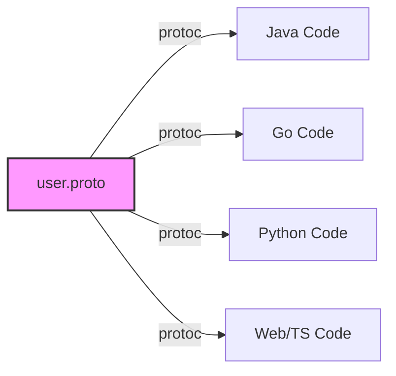
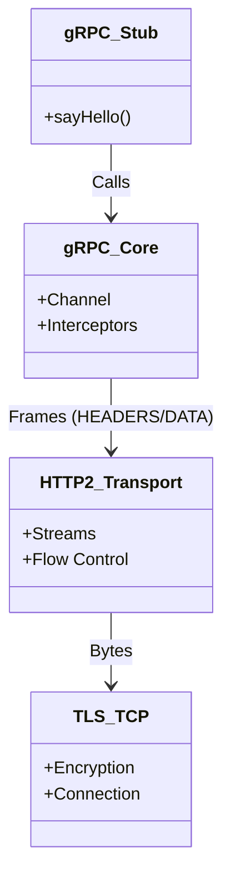
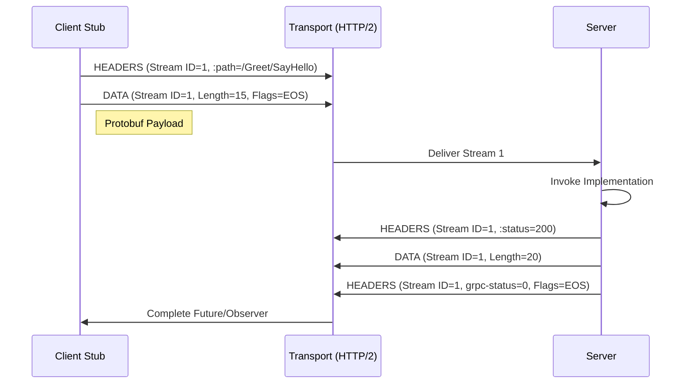

import MotionCanvasPlayer from "@site/src/components/MotionCanvasPlayer";

# gRPC 进阶：从 HTTP/2 分帧到 Java 网络原型的深度解构

> “不要只学会怎么用，更要明白底层发生了什么。”

在微服务架构中，gRPC 已经成为高性能服务间通信的事实标准。但你是否在大规模生产环境中遇到过**负载均衡失效**、**线程池耗尽**或者**间歇性延迟抖动**的问题？

本文将剥开 gRPC 的封装外壳，从协议层、实现层到治理层，深度解构其底层原理。

{/* truncate */}

---

## 一、 协议层：为什么 HTTP/2 是 gRPC 的灵魂？

gRPC 的高性能并非凭空而来，很大程度上得益于底层的 **HTTP/2** 协议。相比于 HTTP/1.1 的文本协议和阻塞模型，HTTP/2 引入了 **二进制分帧 (Binary Framing)** 和 **多路复用 (Multiplexing)**。

### 1.1 可也就是化演示：分帧与多路复用

所有的通信在 HTTP/2 中都被拆分为更小的消息和帧，并以二进制格式编码。

<div>
  <MotionCanvasPlayer src="/animation/src/project.js" auto={true} />
</div>

如上图所示：

- **Connection (连接)**：一个 TCP 连接包含多个流（Stream）。
- **Stream (流)**：双向流动的字节流，每个流都有唯一的 ID（如 Stream 1, 3, 5）。
- **Frame (帧)**：最小通信单位。HEADERS 帧包含元数据，DATA 帧包含 Payload。

在 gRPC 中，你的一个 RPC 调用（比如 `sayHello`）实际上就是在一个特定的 Stream 上发送了一组 HEADERS 帧（包含 `:path`, `:method` 等）和 DATA 帧（包含 Protobuf 序列化后的二进制数据）。

### 1.2 头部压缩 (HPACK)

HTTP/1.x 每次请求都会携带大量的 Header（如 `User-Agent`, `Cookie`），这些数据往往是重复且冗余的。
HTTP/2 引入了 **HPACK** 算法，客户端和服务端共同维护一个“静态字典”和“动态字典”。

- **静态字典**：预定义了常见的 Header（如 `:method: GET`）。
- **动态字典**：记录本次连接中之前发送过的 Header。

**实战价值**：在长连接的高频 RPC 调用中，后续请求的 Header 甚至只需要传输几个字节的索引号，极大地节省了带宽。

---

## 二、 Java 实现层：grpc-java 的高性能奥秘

gRPC 的 Java 实现 (`grpc-java`) 建立在 **Netty** 之上。它如何将底层的 ByteBuf 高效转化为业务对象？

### 2.1 零拷贝 (Zero Copy) 与 Netty 适配

gRPC 在处理 Protobuf 消息时，尽量减少了内存复制。
当 Netty 读取到网络包（ByteBuf）时，gRPC 并没有急着将其拷贝到 byte[] 数组中，而是通过 `CompositeByteBuf` 或类似的很多 Slice 机制，将其直接“切片”传递给 Protobuf 解析器。

```java
// 伪代码示意：NettyClientHandler 读取数据
public void channelRead(ChannelHandlerContext ctx, Object msg) {
    ByteBuf nettyBuffer = (ByteBuf) msg;
    // gRPC 并不立即通过 byte[] copy 转换
    // 而是包装成 ReadableBuffer 传递给 FrameListener
    GrpcHttp2ConnectionHandler.handleFrame(nettyBuffer);
}
```

### 2.2 线程模型：EventLoop 的交接

理解线程模型是避免生产事故的关键。

1.  **I/O 线程**：Netty 的 `EventLoopGroup` 负责处理网络 I/O（读写 ByteBuf）。千万不要在这里阻塞！
2.  **应用线程**：gRPC 默认会将回调逻辑提交到 `Executor`（通常是 CachedThreadPool 或 ForkJoinPool）。

**避坑指南**：不仅要在服务端，客户端的 `StreamObserver` 回调也是在 gRPC 的线程池中执行的。如果你在 `onNext()` 里做了数据库查询或锁等待，可能会耗尽 gRPC 的内部线程池，导致整个服务卡死。

**最佳实践**：

- 使用自定义的 `Executor` 提供给 ServerBuilder。
- 所有的阻塞操作必须异步化，或者提交到专门的业务线程池。

---

## 三、 跨语言的魅力：IDL 与代码生成

gRPC 的杀手锏之一是 **Protobuf (Protocol Buffers)**。它不仅是序列化协议，更是 **IDL (Interface Definition Language)**。

### 3.1 一份合约，多处履行

你只需要写一份 `.proto` 文件，就能自动生成 Java, Go, Python, C++, Node.js 等十几种语言的代码。这解决了微服务架构中最大的痛点：**接口文档与代码脱节**。



### 3.2 实战场景：Java 后端 + Python AI

在 AI 爆发的今天，我们经常需要用 Java 写业务逻辑，用 Python 跑 PyTorch 模型。gRPC 是连接这两者的最佳桥梁。

- **Java 侧**：作为 Client，调用 `PredictionService`。
- **Python 侧**：作为 Server，加载模型，暴露 gRPC 接口。
  相比于 RESTful API，gRPC 的强类型和高性能在这里优势巨大。

---

## 四、 协议层图解：HTTP/2 与 gRPC 栈

让我们用 Mermaid 来直观地看下 gRPC 的协议栈结构。



### 4.1 请求流程时序图

一个标准的 gRPC Unary 调用流程如下：



---

## 五、 不同场景的应对之道

### 5.1 数据中心内部 (East-West Traffic)

- **场景**：微服务 A 调用 微服务 B。
- **推荐**：
  - **协议**：原生 gRPC (Protobuf)。
  - **LB**：Client-side LB (配合 Nacos/Consul) 或 Service Mesh (Istio)。
  - **关键点**：追求极致的低延迟和高吞吐。

### 5.2 移动端/Web端 (North-South Traffic)

- **场景**：手机 App 或 浏览器 调用后端服务。
- **挑战**：浏览器对 HTTP/2 底层控制能力有限（无法直接操作 Frame）。
- **推荐**：
  - **Web**：使用 **gRPC-Web** + Envoy Proxy 进行协议转换 (gRPC-Web text -> gRPC binary)。
  - **App**：可以直接用 gRPC Mobile，但要注意弱网环境下的重连机制。

### 5.3 对外 OpenAPI

- **场景**：开放接口给第三方。
- **推荐**：
  - 使用 **Google API Extensions** (Transcoding)。
  - 在 Envoy 或 gRPC Gateway 层，将 RESTful JSON 请求自动转换为内部的 gRPC 请求。
  - **好处**：你只需要写一套 gRPC 代码，自动拥有了 gRPC 和 REST 两个接口。

---

## 六、 分布式治理：生产环境的那些坑

### 6.1 为什么 L4 负载均衡（LVS/HAProxy TCP模式）对 gRPC “无效”？

这是一个经典的误区。

- **HTTP/1.1**：连接是短暂的。每次请求可能新建连接，或者复用几次就断开。L4 LB 可以在连接建立时将其分配给不同后端。
- **gRPC (HTTP/2)**：**长连接**是常态。客户端启动时建立一条 TCP 连接，之后数百万次请求都通过这一条连接发送。

**结果**：如果你开了 10 个 Server，但 Client 只启动了一次，它建立的那条连接只会连到其中 1 个 Server。后续的所有流量都会打死这 1 个 Server，其他 9 个围观。

**解决方案**：

1.  **Client-side LB**：客户端感知所有后端地址（通过 Nacos/Consul/K8s Headless Service），自己做轮询/随机。(`ManagedChannelBuilder.forTarget("dns:///myservice")`)
2.  **L7 Load Balance**：使用 Envoy / Nginx (支持 HTTP/2) / Istio。它们会终结 TCP 连接，解析每个 HTTP/2 Frame，然后重新把 Request 分发给后端。

### 3.2 拦截器 (Interceptor) 的 Context 陷阱

在做鉴权（如 OpenID Connect）时，我们常使用 Interceptor。

```java
public class AuthInterceptor implements ServerInterceptor {
    @Override
    public <ReqT, RespT> ServerCall.Listener<ReqT> interceptCall(...) {
        String token = metadata.get(AUTH_HEADER);
        // 校验 token...
        Context ctx = Context.current().withValue(USER_ID, userId);
        return Contexts.interceptCall(ctx, call, headers, next);
    }
}
```

**坑**：gRPC 的 `Context` 是基于 ThreadLocal 的。但是由于 gRPC 的异步非阻塞特性，Request 的处理可能会跨越多个线程。gRPC 框架会自动在回调间传播 Context，但如果你自己手动开启了新线程（`new Thread()`），Context 就会丢失！

---

## 四、 总结

gRPC 不仅仅是一个 RPC 框架，它是 **HTTP/2 协议**、**Protobuf 序列化** 和 **Netty 网络编程** 的集大成者。

- **想要快**：理解 HTTP/2 的分帧和 HPack。
- **想要稳**：理解 Netty 的线程模型，坚决不阻塞 I/O 线程。
- **想要扩**：理解长连接对负载均衡的挑战，选择正确的 LB 策略 (Client-side 或 Mesh)。

希望这篇深度解构能让你在下一次的技术分享或生产故障排查中游刃有余。
