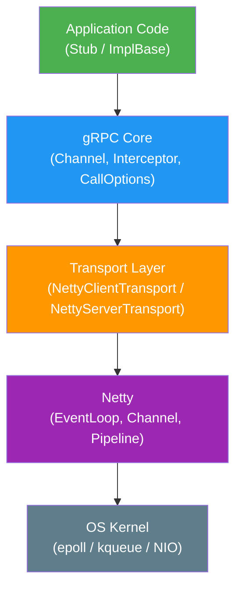
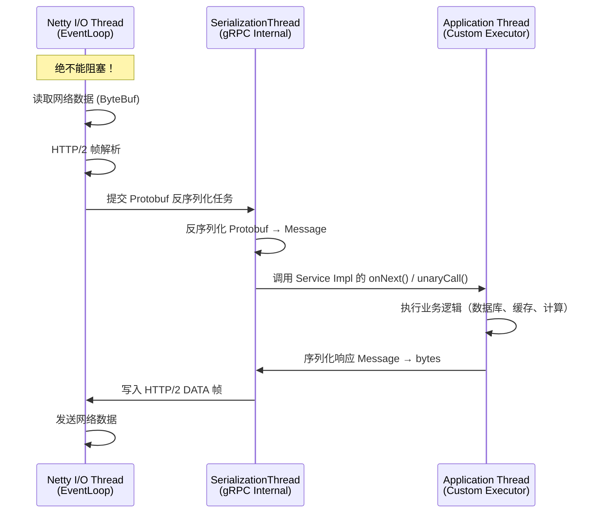
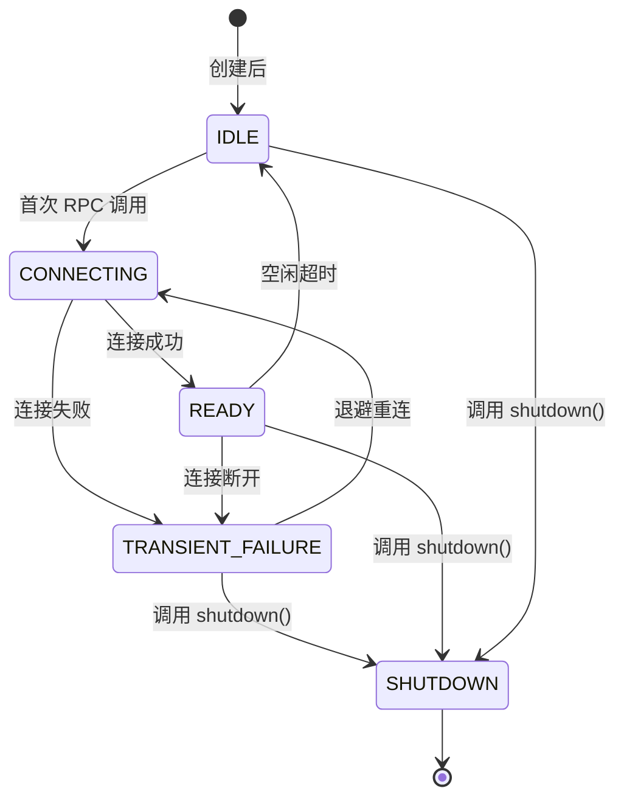

import MotionCanvasPlayer from "@site/src/components/MotionCanvasPlayer";

# gRPC 进阶 (2)：Java 实现原理与 Netty 线程模型

> "写 Demo 很简单，但理解框架底层才能不被生产事故打个措手不及。"

在 [上一篇](/blog/grpc-protocol) 中，我们深度解构了 gRPC 的灵魂——HTTP/2 协议。
本文将落地到 **Java 实现层**，带你剥开 `grpc-java` 的源码，理解 Netty 线程模型和跨语言调用的实践。

{/* truncate */}

---

## 一、 Java 实现层：grpc-java 的高性能奥秘

gRPC 的 Java 实现 (`grpc-java`) 建立在 **Netty** 之上。它如何将底层的 ByteBuf 高效转化为业务对象？

### 1.1 架构分层



- **Application Code**：你写的业务逻辑（继承 `ImplBase` 或使用 `Stub`）。
- **gRPC Core**：管理 Channel、Interceptor、序列化/反序列化。
- **Transport Layer**：将 gRPC 的概念映射到 HTTP/2 帧。
- **Netty**：真正的 I/O 引擎。
- **OS Kernel**：epoll (Linux) / kqueue (macOS) 多路复用。

### 1.2 零拷贝 (Zero Copy) 与 Netty 适配

gRPC 在处理 Protobuf 消息时，尽量减少了内存复制。

当 Netty 读取到网络包（`ByteBuf`）时，gRPC 并没有急着将其拷贝到 `byte[]` 数组中，而是通过 `CompositeByteBuf` 或 Slice 机制，将其直接"切片"传递给 Protobuf 解析器：

```java
// 伪代码示意：NettyClientHandler 读取数据
@Override
public void channelRead(ChannelHandlerContext ctx, Object msg) {
    ByteBuf nettyBuffer = (ByteBuf) msg;
    // gRPC 并不立即通过 byte[] copy 转换
    // 而是包装成 ReadableBuffer 传递给 MessageDeframer
    ReadableBuffer grpcBuffer = new NettyReadableBuffer(nettyBuffer.retain());
    // MessageDeframer 负责解析 5 字节前缀 + Protobuf payload
    messageDeframer.deframe(grpcBuffer);
}
```

**完整的数据流路径**：

```
网络数据包
  → Netty ByteBuf (堆外内存, 零拷贝读取)
  → NettyReadableBuffer (引用传递, 不拷贝)
  → MessageDeframer (解析 5 字节前缀, 提取 payload 切片)
  → ProtobufInputStream (直接从 ByteBuf 读取, 不拷贝到 byte[])
  → Message 对象 (最终的业务对象)
```

:::tip 为什么这很重要？
在高吞吐场景下（如每秒 10 万次 RPC），每少一次内存拷贝就能减少 GC 压力。gRPC 的这种设计使得 Java 实现的性能接近 C++ 实现。
:::

### 1.3 线程模型：EventLoop 的交接

理解线程模型是避免生产事故的关键：



**三类线程**：

| 线程类型                          | 负责工作                 | 能否阻塞？        |
| --------------------------------- | ------------------------ | ----------------- |
| **Netty I/O Thread** (EventLoop)  | 网络读写、HTTP/2 帧处理  | ❌ **绝对不能**   |
| **gRPC Internal Thread**          | Protobuf 序列化/反序列化 | ❌ 不建议         |
| **Application Thread** (Executor) | 业务逻辑                 | ✅ 但要控制线程池 |

:::danger 经典事故
在 `StreamObserver.onNext()` 回调中执行数据库查询或加锁操作 → 耗尽 gRPC 内部线程池 → **整个服务卡死**，所有 RPC 超时。

**修复方案**：

```java
// ❌ 错误：直接在回调中阻塞
@Override
public void onNext(Request request) {
    User user = database.findById(request.getId()); // 阻塞！
    responseObserver.onNext(buildResponse(user));
}

// ✅ 正确：提交到业务线程池
@Override
public void onNext(Request request) {
    businessExecutor.submit(() -> {
        User user = database.findById(request.getId());
        responseObserver.onNext(buildResponse(user));
    });
}
```

:::

**服务端 Executor 配置**：

```java
Server server = ServerBuilder.forPort(8080)
    // 自定义业务线程池
    .executor(new ThreadPoolExecutor(
        10,   // 核心线程
        200,  // 最大线程
        60, TimeUnit.SECONDS,
        new LinkedBlockingQueue<>(1000), // 队列容量
        new ThreadFactoryBuilder().setNameFormat("grpc-biz-%d").build(),
        new ThreadPoolExecutor.CallerRunsPolicy() // 拒绝策略
    ))
    .addService(new MyServiceImpl())
    .build();
```

---

## 二、 跨语言的魅力：IDL 与代码生成

gRPC 的杀手锏之一是 **Protobuf (Protocol Buffers)**。它不仅是序列化协议，更是 **IDL (Interface Definition Language)**。

### 2.1 一份合约，多处履行

你只需要写一份 `.proto` 文件，就能自动生成 Java, Go, Python, C++, Node.js 等十几种语言的代码。这解决了微服务架构中最大的痛点：**接口文档与代码脱节**。

<MotionCanvasPlayer src="/animation/src/project.js?scene=grpc_code_gen" />

### 2.2 实战场景：Java 后端 + Python AI

在 AI 爆发的今天，我们经常需要用 Java 写业务逻辑，用 Python 跑 PyTorch 模型。gRPC 是连接这两者的最佳桥梁：

```protobuf
// prediction.proto
service PredictionService {
  rpc Predict(PredictionRequest) returns (PredictionResponse);
}

message PredictionRequest {
  repeated float features = 1;
  string model_name = 2;
}

message PredictionResponse {
  repeated float predictions = 1;
  float confidence = 2;
}
```

**Java 侧 (Client)**：

```java
PredictionResponse response = predictionStub
    .withDeadlineAfter(500, TimeUnit.MILLISECONDS)  // 设置超时
    .predict(PredictionRequest.newBuilder()
        .addAllFeatures(Arrays.asList(1.0f, 2.0f, 3.0f))
        .setModelName("recommendation_v2")
        .build());
```

**Python 侧 (Server)**：

```python
class PredictionServicer(prediction_pb2_grpc.PredictionServiceServicer):
    def Predict(self, request, context):
        model = load_model(request.model_name)
        result = model.predict(np.array(request.features))
        return prediction_pb2.PredictionResponse(
            predictions=result.tolist(),
            confidence=0.95
        )
```

相比 RESTful API，gRPC 在这种场景下的优势：

- **强类型**：proto 文件即是文档，编译期就能发现接口不匹配。
- **高性能**：Protobuf 二进制编码比 JSON 小 3-10 倍，解析速度快 5-100 倍。
- **流式支持**：可以一边推理一边返回结果（Server Streaming）。

---

## 三、 拦截器 (Interceptor) 深度实践

gRPC Interceptor 等价于 Spring 的 Filter / AOP，是实现横切关注点的核心机制。

### 3.1 鉴权拦截器

```java
public class AuthInterceptor implements ServerInterceptor {
    private static final Metadata.Key<String> AUTH_HEADER =
        Metadata.Key.of("authorization", Metadata.ASCII_STRING_MARSHALLER);

    private static final Context.Key<String> USER_ID =
        Context.key("user-id");

    @Override
    public <ReqT, RespT> ServerCall.Listener<ReqT> interceptCall(
            ServerCall<ReqT, RespT> call,
            Metadata headers,
            ServerCallHandler<ReqT, RespT> next) {

        String token = headers.get(AUTH_HEADER);
        if (token == null || !token.startsWith("Bearer ")) {
            call.close(Status.UNAUTHENTICATED
                .withDescription("Missing or invalid token"), new Metadata());
            return new ServerCall.Listener<>() {}; // no-op listener
        }

        String userId = validateAndExtractUserId(token);
        Context ctx = Context.current().withValue(USER_ID, userId);
        return Contexts.interceptCall(ctx, call, headers, next);
    }
}
```

在业务代码中读取 Context：

```java
@Override
public void getOrder(OrderRequest request, StreamObserver<OrderResponse> responseObserver) {
    String userId = AuthInterceptor.USER_ID.get();
    // userId 从拦截器传递过来，无需重复解析 token
}
```

### 3.2 Context 跨线程传播陷阱

:::danger Context 丢失
gRPC 的 `Context` 是基于 `ThreadLocal` 的。框架会自动在回调间传播 Context，但如果你自己手动开启了新线程，Context 就会丢失！
:::

```java
// ❌ 错误：手动创建线程，Context 丢失
new Thread(() -> {
    String userId = USER_ID.get(); // null！
    doSomething(userId);
}).start();

// ✅ 正确方案 1：使用 Context.currentContextExecutor()
Context.currentContextExecutor(executor).execute(() -> {
    String userId = USER_ID.get(); // 正常获取
    doSomething(userId);
});

// ✅ 正确方案 2：手动 fork
Context forked = Context.current().fork();
executor.execute(() -> {
    Context prev = forked.attach();
    try {
        String userId = USER_ID.get(); // 正常获取
        doSomething(userId);
    } finally {
        forked.detach(prev);
    }
});
```

### 3.3 日志与追踪拦截器

```java
public class LoggingInterceptor implements ServerInterceptor {
    @Override
    public <ReqT, RespT> ServerCall.Listener<ReqT> interceptCall(
            ServerCall<ReqT, RespT> call,
            Metadata headers,
            ServerCallHandler<ReqT, RespT> next) {

        long startTime = System.nanoTime();
        String method = call.getMethodDescriptor().getFullMethodName();

        return new ForwardingServerCallListener.SimpleForwardingServerCallListener<>(
                next.startCall(
                    new ForwardingServerCall.SimpleForwardingServerCall<>(call) {
                        @Override
                        public void close(Status status, Metadata trailers) {
                            long duration = (System.nanoTime() - startTime) / 1_000_000;
                            log.info("gRPC {} completed: status={}, duration={}ms",
                                method, status.getCode(), duration);
                            super.close(status, trailers);
                        }
                    }, headers)) {};
    }
}
```

**注册多个 Interceptor（执行顺序从后到前）：**

```java
Server server = ServerBuilder.forPort(8080)
    .addService(ServerInterceptors.intercept(
        new MyServiceImpl(),
        new AuthInterceptor(),     // 第二个执行
        new LoggingInterceptor()   // 第一个执行
    ))
    .build();
```

---

## 四、 Channel 管理与连接策略

### 4.1 ManagedChannel 生命周期

`ManagedChannel` 是 gRPC 客户端的核心，管理底层的 HTTP/2 连接池：

```java
// ✅ 正确用法：全局共享，应用生命周期内复用
ManagedChannel channel = ManagedChannelBuilder
    .forTarget("dns:///myservice.default.svc.cluster.local:8080")
    .defaultLoadBalancingPolicy("round_robin")  // 客户端负载均衡
    .keepAliveTime(30, TimeUnit.SECONDS)          // Keepalive
    .keepAliveTimeout(5, TimeUnit.SECONDS)
    .maxInboundMessageSize(10 * 1024 * 1024)     // 10MB
    .usePlaintext()  // 仅开发环境！生产使用 TLS
    .build();

// Stub 从 Channel 创建，可以创建多个
OrderServiceGrpc.OrderServiceBlockingStub stub =
    OrderServiceGrpc.newBlockingStub(channel);

// 应用关闭时
channel.shutdown().awaitTermination(5, TimeUnit.SECONDS);
```

:::warning 常见错误
**每次 RPC 都创建新 Channel** → 每次都建立 TCP 连接 + TLS 握手 → 性能灾难！

Channel 应该在应用启动时创建，在 `@PreDestroy` 中关闭。
:::

### 4.2 连接状态机

`ManagedChannel` 有 5 种状态：



- **IDLE**：初始状态，等待第一个 RPC 触发连接。
- **CONNECTING**：正在建立 TCP + TLS 连接。
- **READY**：连接就绪，可以发送 RPC。
- **TRANSIENT_FAILURE**：连接失败，正在指数退避重连。
- **SHUTDOWN**：终态，不再接受新 RPC。

---

## 五、 总结

`grpc-java` 的高性能来源于两大支柱：

| 支柱         | 关键技术            | 要点                               |
| ------------ | ------------------- | ---------------------------------- |
| **Netty**    | EventLoop + ByteBuf | 零拷贝读取、非阻塞 I/O             |
| **线程模型** | I/O 线程 → 业务线程 | 严禁阻塞 I/O 线程，自定义 Executor |

核心实践要点：

- **Channel 复用**：全局共享 `ManagedChannel`，不要每次请求创建。
- **线程隔离**：I/O 线程、gRPC 内部线程、业务线程各司其职。
- **Interceptor**：善用拦截器实现鉴权、日志、追踪等横切关注点。
- **Context 传播**：跨线程时使用 `Context.currentContextExecutor()`。

在 [下一篇文章](/blog/grpc-governance) 中，我们将进入 **生产治理**领域，探讨 Health Check、Deadline、重试策略、负载均衡陷阱以及可观测性实践。

---

## 参考资料

- [grpc-java GitHub 仓库](https://github.com/grpc/grpc-java) — 源码与官方示例
- [gRPC Java API Reference](https://grpc.github.io/grpc-java/javadoc/) — Javadoc 文档
- [gRPC Java Quick Start](https://grpc.io/docs/languages/java/quickstart/) — 官方快速入门
- [Netty in Action (Manning)](https://www.manning.com/books/netty-in-action) — Netty 权威指南
- [gRPC Context 传播文档](https://grpc.github.io/grpc-java/javadoc/io/grpc/Context.html) — Context 跨线程传播 API
- [gRPC 性能最佳实践](https://grpc.io/docs/guides/performance/) — 官方性能调优建议
