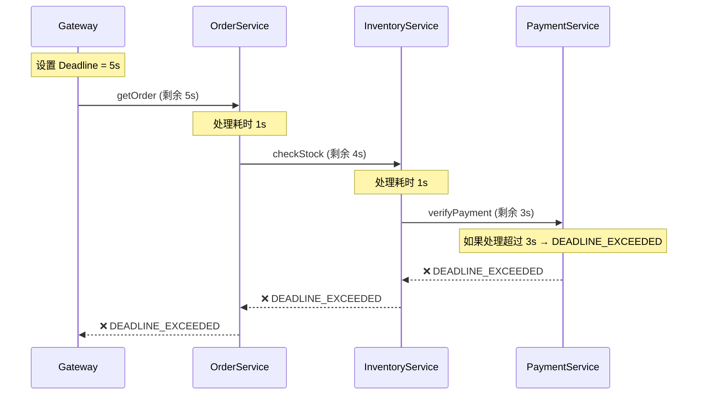
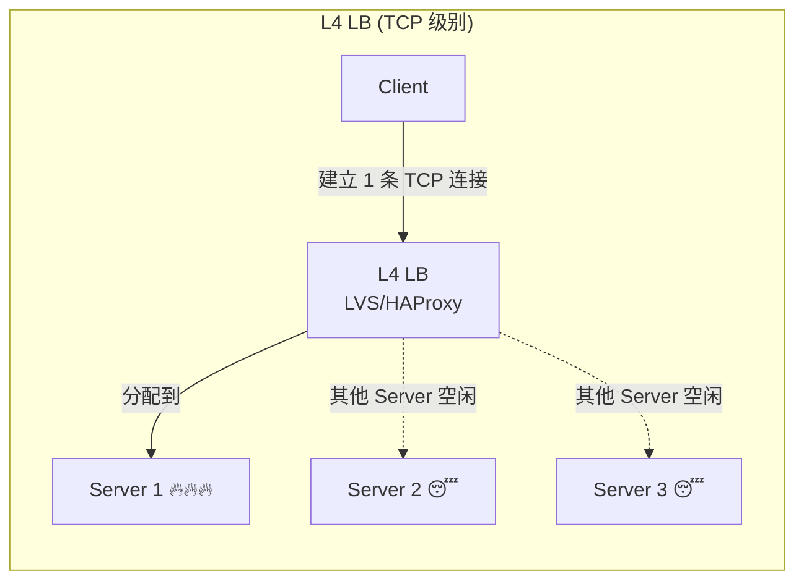
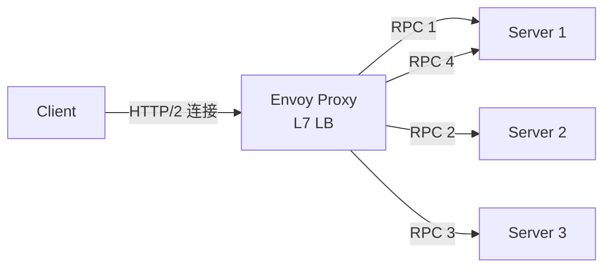
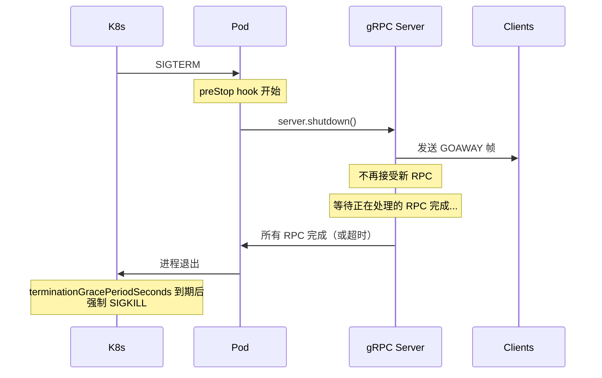

# gRPC 进阶 (3)：生产环境治理全指南

> "框架的 Hello World 只需要 5 分钟，但在生产环境中跑稳它需要 5 年的经验。"

在 [上一篇](/blog/grpc-production) 中，我们深入了 `grpc-java` 的内部实现。
本文聚焦 **生产环境治理**——当你的 gRPC 服务部署到 Kubernetes 集群后，你需要关心的每一件事。

{/* truncate */}

---

## 一、 Health Check：服务健康检查

gRPC 定义了标准的 [健康检查协议](https://github.com/grpc/grpc/blob/master/doc/health-checking.md)，它是一个内置的 gRPC 服务。

### 1.1 协议定义

```protobuf
// 官方标准定义 grpc.health.v1
syntax = "proto3";

package grpc.health.v1;

service Health {
  // 一元检查：查询服务状态
  rpc Check(HealthCheckRequest) returns (HealthCheckResponse);

  // 流式检查：持续监听服务状态变化
  rpc Watch(HealthCheckRequest) returns (stream HealthCheckResponse);
}

message HealthCheckRequest {
  string service = 1;
  // 空字符串 "" 代表整个 Server 的状态
  // 非空字符串代表特定 gRPC 服务（如 "com.example.OrderService"）
}

message HealthCheckResponse {
  enum ServingStatus {
    UNKNOWN = 0;
    SERVING = 1;         // 服务正常
    NOT_SERVING = 2;     // 服务不可用
    SERVICE_UNKNOWN = 3; // 服务未注册
  }
  ServingStatus status = 1;
}
```

### 1.2 Java 实现

`grpc-java` 提供了开箱即用的 `HealthStatusManager`：

```java
import io.grpc.services.HealthStatusManager;

public class GrpcServer {
    public static void main(String[] args) throws Exception {
        HealthStatusManager healthManager = new HealthStatusManager();

        Server server = ServerBuilder.forPort(8080)
            // 注册 Health Check 服务
            .addService(healthManager.getHealthService())
            // 注册业务服务
            .addService(new OrderServiceImpl())
            .build()
            .start();

        // 标记整个 Server 为 SERVING
        healthManager.setStatus("", HealthCheckResponse.ServingStatus.SERVING);
        // 标记具体服务为 SERVING
        healthManager.setStatus(
            "com.example.OrderService",
            HealthCheckResponse.ServingStatus.SERVING
        );

        // 当数据库连接断开时，可以动态更新状态
        dbConnectionPool.addListener(event -> {
            if (event.isDown()) {
                healthManager.setStatus("",
                    HealthCheckResponse.ServingStatus.NOT_SERVING);
            } else {
                healthManager.setStatus("",
                    HealthCheckResponse.ServingStatus.SERVING);
            }
        });

        server.awaitTermination();
    }
}
```

### 1.3 Kubernetes 集成

从 Kubernetes **1.24** 开始，原生支持 gRPC 健康探针（无需安装 `grpc_health_probe` 工具）：

```yaml
apiVersion: apps/v1
kind: Deployment
metadata:
  name: order-service
spec:
  template:
    spec:
      containers:
        - name: order-service
          ports:
            - containerPort: 8080

          # 存活探针：失败则重启 Pod
          livenessProbe:
            grpc:
              port: 8080
              service: "" # 空字符串 = 检查整个 Server
            initialDelaySeconds: 10
            periodSeconds: 10
            failureThreshold: 3

          # 就绪探针：失败则从 Service 摘流
          readinessProbe:
            grpc:
              port: 8080
              service: "com.example.OrderService"
            initialDelaySeconds: 5
            periodSeconds: 5
            failureThreshold: 2

          # 启动探针：保护慢启动应用
          startupProbe:
            grpc:
              port: 8080
            initialDelaySeconds: 0
            periodSeconds: 2
            failureThreshold: 30 # 最多等 60 秒启动
```

:::tip 三种探针的分工
| 探针 | 失败后果 | 典型用途 |
|------|---------|---------|
| **liveness** | 重启 Pod | 检测死锁、无限循环 |
| **readiness** | 从 Service 摘流 | 等待缓存预热、数据库连接池就绪 |
| **startup** | 禁用 liveness/readiness | 保护需要长时间启动的应用 |
:::

### 1.4 客户端 Health-Based LB

gRPC 客户端也可以利用 Health Check 做智能负载均衡——只向健康的后端发送请求：

```java
ManagedChannel channel = ManagedChannelBuilder
    .forTarget("dns:///myservice:8080")
    .defaultLoadBalancingPolicy("round_robin")
    .defaultServiceConfig(Map.of(
        "healthCheckConfig", Map.of(
            "serviceName", ""  // 监听后端的健康状态
        )
    ))
    .build();
```

当 Health Check 返回 `NOT_SERVING` 时，该后端会自动从负载均衡中摘除。

---

## 二、 Deadline / Timeout：超时控制

Deadline 是 gRPC 最重要的治理机制之一。**没有 Deadline 的 RPC 就像没有安全绳的攀岩——迟早出事。**

### 2.1 基本用法

```java
// 客户端设置 Deadline
OrderResponse response = orderStub
    .withDeadlineAfter(3, TimeUnit.SECONDS)  // 3 秒超时
    .getOrder(request);

// 或者使用绝对 Deadline
Deadline deadline = Deadline.after(3, TimeUnit.SECONDS);
OrderResponse response = orderStub
    .withDeadline(deadline)
    .getOrder(request);
```

超时后，客户端收到 `StatusRuntimeException`，状态码为 `DEADLINE_EXCEEDED`。

### 2.2 Deadline 传播（级联调用）

这是 Deadline 最强大的特性——**自动级联传播**：



**核心机制**：

- Gateway 设置了 5 秒的 Deadline。
- 当请求到达 OrderService 时，已耗时一部分，gRPC 框架会自动把**剩余时间**传递到下游。
- 如果总用时超过 5 秒，链路上的所有服务都会收到 `DEADLINE_EXCEEDED`。

### 2.3 服务端检测 Deadline

```java
@Override
public void getOrder(OrderRequest request,
                     StreamObserver<OrderResponse> responseObserver) {
    // 检查 Deadline 是否已过
    if (Context.current().isCancelled()) {
        responseObserver.onError(Status.CANCELLED
            .withDescription("Request already cancelled")
            .asRuntimeException());
        return;
    }

    // 在长耗时计算中定期检查
    for (int i = 0; i < items.size(); i++) {
        if (Context.current().getDeadline().isExpired()) {
            // 提前退出，避免浪费资源
            responseObserver.onError(Status.DEADLINE_EXCEEDED
                .asRuntimeException());
            return;
        }
        processItem(items.get(i));
    }

    responseObserver.onNext(response);
    responseObserver.onCompleted();
}
```

:::danger 不设 Deadline 的后果
如果下游服务挂了且未设 Deadline：

- 请求线程永远等待 → 线程池耗尽 → 级联雪崩
- 连锁反应：A → B → C，C 挂了，A 和 B 的线程全部被占满

**黄金法则**：**每个外部 RPC 调用必须设置 Deadline。**
:::

---

## 三、 错误处理与 Status Codes

### 3.1 gRPC 状态码

gRPC 定义了 [17 个标准状态码](https://grpc.io/docs/guides/status-codes/)，类似但不同于 HTTP 状态码：

| Code | 名称                 | 含义       | 常见触发场景                |
| ---- | -------------------- | ---------- | --------------------------- |
| 0    | `OK`                 | 成功       | —                           |
| 1    | `CANCELLED`          | 客户端取消 | 用户关闭页面、Deadline 传播 |
| 2    | `UNKNOWN`            | 未知错误   | 未被处理的异常              |
| 3    | `INVALID_ARGUMENT`   | 参数无效   | 参数校验失败                |
| 4    | `DEADLINE_EXCEEDED`  | 超时       | 处理时间超过 Deadline       |
| 5    | `NOT_FOUND`          | 资源不存在 | 查询无结果                  |
| 7    | `PERMISSION_DENIED`  | 权限不足   | ACL 校验失败                |
| 8    | `RESOURCE_EXHAUSTED` | 资源耗尽   | 限流、消息过大              |
| 12   | `UNIMPLEMENTED`      | 方法未实现 | 调用了未实现的 RPC          |
| 13   | `INTERNAL`           | 内部错误   | 服务端 bug                  |
| 14   | `UNAVAILABLE`        | 服务不可用 | 连接断开、服务启动中        |
| 16   | `UNAUTHENTICATED`    | 未认证     | Token 缺失或过期            |

### 3.2 Rich Error Model（详细错误信息）

基础的 `Status` 只有 code + message，信息有限。Google 推荐使用 [Rich Error Model](https://cloud.google.com/apis/design/errors#error_model)，通过 `Any` 类型传递结构化的错误详情：

```java
import com.google.rpc.Status;
import com.google.rpc.BadRequest;
import io.grpc.protobuf.StatusProto;

// 构建 Rich Error
Status richStatus = Status.newBuilder()
    .setCode(Code.INVALID_ARGUMENT.getNumber())
    .setMessage("Invalid order request")
    .addDetails(Any.pack(
        BadRequest.newBuilder()
            .addFieldViolations(
                BadRequest.FieldViolation.newBuilder()
                    .setField("quantity")
                    .setDescription("Quantity must be positive")
                    .build())
            .addFieldViolations(
                BadRequest.FieldViolation.newBuilder()
                    .setField("address")
                    .setDescription("Address cannot be empty")
                    .build())
            .build()))
    .build();

// 抛出错误
responseObserver.onError(StatusProto.toStatusRuntimeException(richStatus));
```

客户端解析：

```java
try {
    OrderResponse response = stub.createOrder(request);
} catch (StatusRuntimeException e) {
    Status status = StatusProto.fromThrowable(e);
    if (status != null) {
        for (Any detail : status.getDetailsList()) {
            if (detail.is(BadRequest.class)) {
                BadRequest badRequest = detail.unpack(BadRequest.class);
                badRequest.getFieldViolationsList().forEach(v ->
                    log.error("Field '{}': {}", v.getField(), v.getDescription()));
            }
        }
    }
}
```

---

## 四、 重试与对冲 (Retry & Hedging)

gRPC 内置了 **Service Config** 驱动的自动重试机制，无需手动编码。

### 4.1 重试策略 (Retry Policy)

适用于**幂等操作**或**明确可重试的错误码**：

```java
// 通过 Service Config 配置
String serviceConfig = """
{
  "methodConfig": [{
    "name": [{"service": "com.example.OrderService"}],
    "retryPolicy": {
      "maxAttempts": 3,
      "initialBackoff": "0.1s",
      "maxBackoff": "1s",
      "backoffMultiplier": 2.0,
      "retryableStatusCodes": ["UNAVAILABLE", "DEADLINE_EXCEEDED"]
    }
  }]
}
""";

ManagedChannel channel = ManagedChannelBuilder
    .forTarget("dns:///myservice:8080")
    .defaultServiceConfig(new Gson().fromJson(serviceConfig, Map.class))
    .enableRetry()  // 必须显式启用！
    .build();
```

**退避策略**：第 1 次重试等待 0.1s，第 2 次等待 0.2s，第 3 次等待 0.4s（均加随机抖动，上限 1s）。

### 4.2 对冲策略 (Hedging Policy)

适用于**延迟敏感**的场景——不等失败，提前并发发送多个请求，取最快的响应：

```json
{
  "methodConfig": [
    {
      "name": [
        {
          "service": "com.example.RecommendService",
          "method": "GetRecommendations"
        }
      ],
      "hedgingPolicy": {
        "maxAttempts": 3,
        "hedgingDelay": "200ms",
        "nonFatalStatusCodes": ["UNAVAILABLE", "INTERNAL"]
      }
    }
  ]
}
```

**工作流程**：

1. 发送第 1 个请求。
2. 200ms 内未收到响应 → 发送第 2 个请求。
3. 再过 200ms → 发送第 3 个请求。
4. 取最先成功的响应，**取消**其余请求。

:::warning 注意

- **Retry 和 Hedging 不能同时配置**在同一个 Method 上。
- Hedging 会增加后端负载，确保后端能承受。
- 确保被调用的方法是**幂等的**。
  :::

---

## 五、 负载均衡：长连接的陷阱与方案

### 5.1 为什么 L4 负载均衡对 gRPC "无效"？

这是一个经典误区：



- **HTTP/1.1**：每次请求可能新建连接，L4 LB 可以分散到不同后端。
- **gRPC (HTTP/2)**：**长连接**是常态。客户端启动后建立一条 TCP 连接，之后所有请求通过这一条连接发送。L4 LB 只在**连接建立时**做分配，之后**数百万次 RPC 都打到同一个 Server**。

### 5.2 解决方案

**方案一：Client-side LB（推荐）**

客户端感知所有后端地址，自己做轮询/随机/加权：

```java
ManagedChannel channel = ManagedChannelBuilder
    // 使用 dns:/// 前缀触发 DNS 解析
    .forTarget("dns:///myservice.default.svc.cluster.local:8080")
    // 客户端轮询
    .defaultLoadBalancingPolicy("round_robin")
    .build();
```

:::info K8s Headless Service

```yaml
apiVersion: v1
kind: Service
metadata:
  name: myservice
spec:
  clusterIP: None # Headless！DNS 返回所有 Pod IP
  selector:
    app: myservice
  ports:
    - port: 8080
```

:::

**方案二：L7 代理（Envoy / Istio）**

L7 代理解析 HTTP/2 帧，在 **RPC 级别**做负载均衡：



**方案三：Proxyless Service Mesh（前沿）**

Java 应用通过 **xDS 协议** 直接与 Istio 控制面通信，无需 Sidecar：

```java
ManagedChannel channel = ManagedChannelBuilder
    .forTarget("xds:///myservice")  // xDS 协议
    .build();
```

---

## 六、 Keepalive 机制

gRPC 通过 HTTP/2 的 PING 帧实现连接保活，这在穿越 NAT、防火墙或云负载均衡器时至关重要。

### 6.1 参数配置

| 参数                          | 客户端 | 服务端 | 说明                              |
| ----------------------------- | ------ | ------ | --------------------------------- |
| `keepAliveTime`               | ✅     | ✅     | 空闲多久后发送 PING（默认无限大） |
| `keepAliveTimeout`            | ✅     | ✅     | PING 超时时间（默认 20s）         |
| `keepAliveWithoutCalls`       | ✅     | —      | 无活跃 RPC 时是否仍发送 PING      |
| `permitKeepAliveTime`         | —      | ✅     | 客户端 PING 最小间隔（防滥用）    |
| `permitKeepAliveWithoutCalls` | —      | ✅     | 是否允许无 RPC 时的 PING          |

### 6.2 实战配置

**客户端**：

```java
ManagedChannel channel = NettyChannelBuilder
    .forTarget("myservice:8080")
    .keepAliveTime(30, TimeUnit.SECONDS)      // 30s 无活动则 PING
    .keepAliveTimeout(5, TimeUnit.SECONDS)     // 5s 无响应则断连
    .keepAliveWithoutCalls(true)               // 即使没有 RPC 也保活
    .build();
```

**服务端**：

```java
Server server = NettyServerBuilder.forPort(8080)
    .permitKeepAliveTime(10, TimeUnit.SECONDS)  // 允许客户端最频繁 10s PING
    .permitKeepAliveWithoutCalls(true)           // 允许无 RPC 时 PING
    .build();
```

:::danger ENHANCE_YOUR_CALM 错误
如果客户端的 `keepAliveTime` **小于** 服务端的 `permitKeepAliveTime`，服务端会发送 GOAWAY（error code = `ENHANCE_YOUR_CALM`），客户端被踢掉。

**黄金法则**：`client.keepAliveTime >= server.permitKeepAliveTime`
:::

### 6.3 为什么需要 Keepalive？

1. **NAT 超时**：AWS ALB / GCP LB 通常有 350-400 秒的空闲超时。Keepalive 保持连接活跃。
2. **防火墙清理**：企业防火墙发现空闲连接会静默丢弃 ，客户端毫不知情。Keepalive 让双方尽早发现连接已死。
3. **快速故障检测**：检测服务端进程崩溃（不同于 TCP keepalive，gRPC keepalive 在应用层工作，响应更快）。

---

## 七、 TLS / mTLS 安全

生产环境 **必须** 启用 TLS。

### 7.1 服务端 TLS

```java
Server server = NettyServerBuilder.forPort(8443)
    .useTransportSecurity(
        new File("/certs/server.crt"),   // 服务端证书
        new File("/certs/server.key")    // 服务端私钥
    )
    .addService(new OrderServiceImpl())
    .build();
```

### 7.2 客户端 TLS

```java
ManagedChannel channel = NettyChannelBuilder
    .forTarget("myservice:8443")
    .sslContext(GrpcSslContexts.forClient()
        .trustManager(new File("/certs/ca.crt"))  // CA 证书
        .build())
    .build();
```

### 7.3 双向 TLS (mTLS)

在微服务间通信中，mTLS 确保**双方都验证对方身份**（零信任架构的基础）：

```java
// 服务端：要求客户端提供证书
Server server = NettyServerBuilder.forPort(8443)
    .sslContext(GrpcSslContexts.forServer(
            new File("/certs/server.crt"),
            new File("/certs/server.key"))
        .trustManager(new File("/certs/ca.crt"))
        .clientAuth(ClientAuth.REQUIRE)  // 强制客户端证书
        .build())
    .build();

// 客户端：提供客户端证书
ManagedChannel channel = NettyChannelBuilder
    .forTarget("myservice:8443")
    .sslContext(GrpcSslContexts.forClient()
        .keyManager(
            new File("/certs/client.crt"),  // 客户端证书
            new File("/certs/client.key"))  // 客户端私钥
        .trustManager(new File("/certs/ca.crt"))
        .build())
    .build();
```

:::tip Istio 自动 mTLS
如果使用 Istio Service Mesh，Sidecar 代理会自动处理 mTLS，应用代码无需修改。但直接使用 gRPC mTLS 能减少一层代理开销。
:::

---

## 八、 优雅关闭 (Graceful Shutdown)

在 Kubernetes 滚动升级时，Pod 被终止前必须**优雅关闭**——完成正在处理的请求，拒绝新请求。

### 8.1 关闭流程



### 8.2 Java 实现

```java
public class GrpcServer {
    private Server server;

    public void start() throws IOException {
        server = ServerBuilder.forPort(8080)
            .addService(new OrderServiceImpl())
            .addService(healthManager.getHealthService())
            .build()
            .start();

        // 注册 JVM 关闭钩子
        Runtime.getRuntime().addShutdownHook(new Thread(() -> {
            System.out.println("Shutting down gRPC server...");

            // 1. 先标记不健康，让 K8s 摘流
            healthManager.setStatus("",
                HealthCheckResponse.ServingStatus.NOT_SERVING);

            // 2. 短暂等待，让 K8s readiness probe 检测到
            try { Thread.sleep(3000); } catch (InterruptedException e) {}

            // 3. 优雅关闭：发送 GOAWAY，等待正在处理的 RPC
            server.shutdown();
            try {
                // 等待最多 30 秒
                if (!server.awaitTermination(30, TimeUnit.SECONDS)) {
                    // 超时后强制关闭
                    server.shutdownNow();
                    server.awaitTermination(5, TimeUnit.SECONDS);
                }
            } catch (InterruptedException e) {
                server.shutdownNow();
            }
            System.out.println("gRPC server stopped.");
        }));
    }
}
```

### 8.3 Kubernetes 配置

```yaml
spec:
  terminationGracePeriodSeconds: 60 # 给足优雅关闭时间
  containers:
    - name: order-service
      lifecycle:
        preStop:
          exec:
            command: ["sleep", "5"] # 等待 K8s 更新 Endpoints
```

:::warning 常见陷阱
K8s 发送 SIGTERM 和从 Service Endpoints 摘除 Pod 是**并行的**。如果你的服务在收到 SIGTERM 后立即停止接受请求，但 K8s Endpoints 还没更新，其他 Pod 仍会向你发送请求。

**解决方案**：`preStop` hook 延迟 3-5 秒，等待 Endpoints 更新完成。
:::

---

## 九、 可观测性 (Observability)

### 9.1 OpenTelemetry 集成

gRPC 官方提供了 OpenTelemetry 插件，自动采集 Metrics 和 Traces：

```xml
<!-- Maven 依赖 -->
<dependency>
    <groupId>io.opentelemetry.instrumentation</groupId>
    <artifactId>opentelemetry-grpc-1.6</artifactId>
</dependency>
```

```java
// 自动注入 OpenTelemetry 拦截器
Server server = ServerBuilder.forPort(8080)
    .intercept(GrpcTelemetry.create(openTelemetry)
        .newServerInterceptor())
    .addService(new OrderServiceImpl())
    .build();

ManagedChannel channel = ManagedChannelBuilder
    .forTarget("myservice:8080")
    .intercept(GrpcTelemetry.create(openTelemetry)
        .newClientInterceptor())
    .build();
```

### 9.2 关键 Metrics

| Metric                                                | 类型      | 说明                 |
| ----------------------------------------------------- | --------- | -------------------- |
| `grpc.server.call.duration`                           | Histogram | RPC 处理耗时         |
| `grpc.server.call.sent_total_compressed_message_size` | Histogram | 发送的消息大小       |
| `grpc.server.call.rcvd_total_compressed_message_size` | Histogram | 接收的消息大小       |
| `grpc.client.attempt.duration`                        | Histogram | 客户端请求耗时       |
| `grpc.client.attempt.started`                         | Counter   | 请求开始数（含重试） |

### 9.3 Channelz：gRPC 内置调试工具

[Channelz](https://grpc.io/blog/a-short-introduction-to-channelz/) 是 gRPC 内置的诊断页面，提供 Channel、Server、Socket 的实时状态：

```java
// 启用 Channelz
Server server = ServerBuilder.forPort(8080)
    .addService(new OrderServiceImpl())
    .addService(ChannelzService.newInstance(100))  // 最近 100 条记录
    .build();
```

Channelz 暴露的信息包括：

- 所有 Channel 的状态（READY / TRANSIENT_FAILURE / ...）
- 每个 Subchannel 的连接状态
- 发送/接收的消息数、字节数
- 最近的错误和异常
- Socket 级别的 TCP 信息

可以通过 [grpc-zpages](https://github.com/grpc/grpc-java/tree/master/services) 在 Web UI 中查看，或通过 gRPC CLI 工具查询。

---

## 十、 总结：生产 Checklist

部署 gRPC 到生产环境前，逐项检查：

| 类别          | 检查项                                      | 状态 |
| ------------- | ------------------------------------------- | ---- |
| **健康检查**  | 实现 gRPC Health Check 协议                 | ☐    |
| **健康检查**  | 配置 K8s liveness + readiness 探针          | ☐    |
| **超时**      | 所有外部 RPC 调用设置 Deadline              | ☐    |
| **错误处理**  | 使用标准 Status Code，实现 Rich Error Model | ☐    |
| **重试**      | 配置 Service Config 的 retryPolicy          | ☐    |
| **负载均衡**  | 使用 Client-side LB 或 L7 代理              | ☐    |
| **Keepalive** | 配置客户端/服务端 Keepalive 参数            | ☐    |
| **安全**      | 启用 TLS（或 mTLS）                         | ☐    |
| **优雅关闭**  | 实现 shutdown hook + preStop 延迟           | ☐    |
| **可观测性**  | 接入 OpenTelemetry + 启用 Channelz          | ☐    |

---

## 参考资料

- [gRPC Health Checking Protocol](https://github.com/grpc/grpc/blob/master/doc/health-checking.md) — 官方健康检查协议规范
- [gRPC Status Codes](https://grpc.io/docs/guides/status-codes/) — 标准状态码定义与使用场景
- [Google Cloud Error Model](https://cloud.google.com/apis/design/errors) — Rich Error Model 设计指南
- [gRPC Service Config](https://github.com/grpc/grpc/blob/master/doc/service_config.md) — 重试、对冲、超时配置文档
- [gRPC Keepalive](https://github.com/grpc/grpc/blob/master/doc/keepalive.md) — Keepalive 机制详解
- [gRPC Load Balancing](https://grpc.io/blog/grpc-load-balancing/) — 负载均衡策略详解
- [Kubernetes gRPC Health Probes](https://kubernetes.io/docs/tasks/configure-pod-container/configure-liveness-readiness-startup-probes/#define-a-grpc-liveness-probe) — K8s 原生 gRPC 探针
- [gRPC Performance Best Practices](https://grpc.io/docs/guides/performance/) — 官方性能调优建议
- [OpenTelemetry gRPC Instrumentation](https://opentelemetry.io/docs/languages/java/instrumentation/) — OTel Java gRPC 集成
- [Channelz: gRPC 诊断工具](https://grpc.io/blog/a-short-introduction-to-channelz/) — 内置诊断页面介绍
- [gRPC Proxyless Service Mesh](https://cloud.google.com/traffic-director/docs/proxyless-overview) — xDS 协议直连方案
