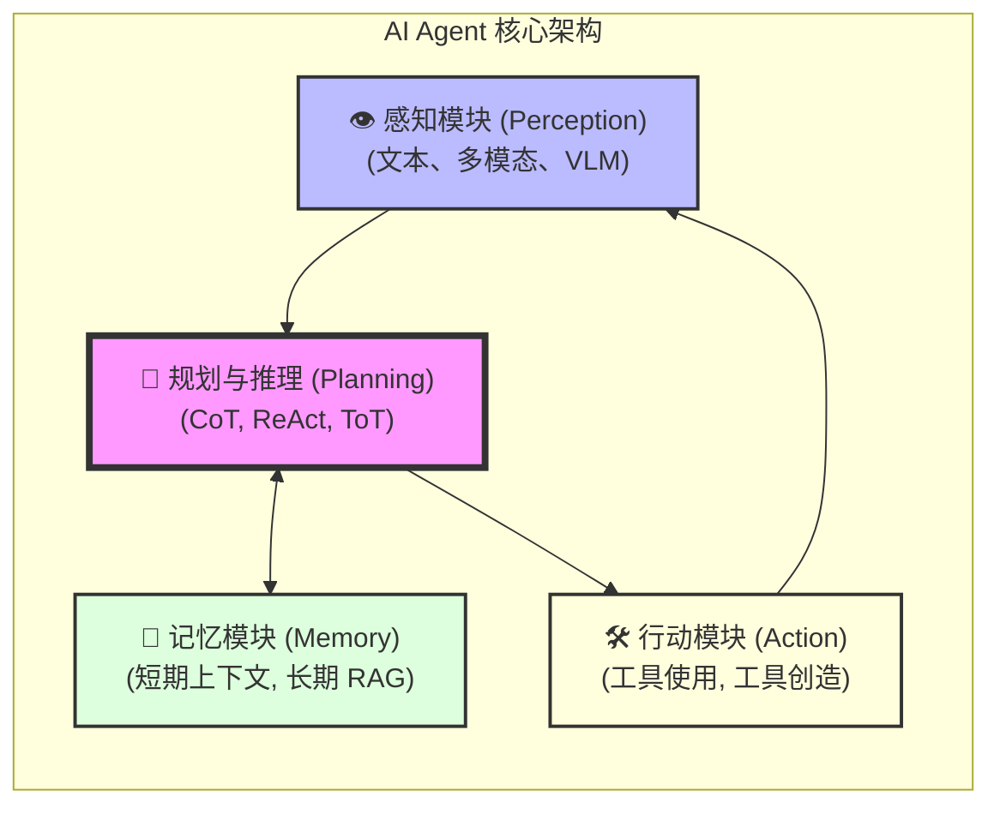

# LangGraph 深度解析：从 AI Agent 理论到生产级工作流实战

> "The future of AI is not just chatbots, but autonomous agents working together."

Agentic AI（智能体人工智能）正在改变我们构建应用的方式。传统的基于单次调用（One-shot）大模型的应用在处理复杂任务时往往力不从心，而引入多步骤推理、工具调用和状态管理的 Agent 系统则能极大地提升任务完成率。

在众多 Agent 框架中，**LangGraph** 凭借其独特的基于图（Graph）的架构设计脱颖而出。它作为 LangChain 生态的重要扩展，专门为了解决复杂多 Agent 工作流中的**状态管理 (State Management)** 和**循环执行 (Cyclic Execution)** 问题而生。

{/* truncate */}

---

## 一、AI 智能体背景与核心架构

在深入技术细节之前，我们需要建立对 AI Agent 的宏观认知。目前的 AI Agent 研究通常被定义为：能够感知环境、进行自主决策并采取行动以达成目标的系统。

### 1.1 基础综述与演进

对于希望构建知识体系的开发者，建议查阅以下权威综述：

- **A Survey on Large Language Model based Autonomous Agents** (Wang et al., 2023)：提出了目前通用的 Agent 架构模型（画像、记忆、规划、行动）。
- **Agentic Large Language Models, a survey** (Plaat et al., 2025)：将 Agent 能力归纳为：推理 (Reason)、行动 (Act) 和交互 (Interact)。

### 1.2 核心架构蓝图：五个核心模块 (带有辅助组件)



大多数基于 LLM 的单体智能体都可以被解构成一个包含四个核心模块的统一框架：

1.  **感知模块 (Perception Module)**：智能体与环境交互的入口，负责接收和处理来自外部世界的原始信息（如文本、视觉截图等），并将其转化为内部可理解的表示。
2.  **规划与推理模块 (Planning & Reasoning Module)**：智能体的认知核心。负责将宏大、复杂的目标分解为一系列更小、更具体的可执行步骤或子任务。
3.  **记忆模块 (Memory Module)**：赋予智能体学习和适应能力的关键。它负责存储和检索信息，包括短期记忆（Session Context）和长期记忆（RAG, Experience）。
4.  **行动模块 (Action Module)**：将决策转化为与外部环境的实际交互。通常通过调用外部工具（API, Code Interpreter, DB Query）来实现。

---

## 二、四大核心模块深度解析

### 2.1 感知模块：连接数字与物理世界

感知是智能体连接世界的桥梁。

- **文本感知**：最基础的形式，处理用户指令、API 返回文本等。
- **多模态感知**：通过 **视觉语言模型 (VLMs)** 理解图像、视频或网页截图。
- **核心技术与挑战**：精确识别界面元素（Element Grounding）至关重要。目前面临处理高分辨率输入（Token 成本）和抗干扰性（冗余视觉信息）等挑战。

### 2.2 规划与推理模块：认知核心

推理能力是 Agent 的灵魂。下表对比了核心推理技术：

| 技术名称             | 核心思想            | 主要优势                       | 适用场景               |
| :------------------- | :------------------ | :----------------------------- | :--------------------- |
| **CoT**              | 思维链，一步步思考  | 显著提升复杂计算、逻辑任务表现 | 算术、常识推理         |
| **Self-Consistency** | 多路径投票          | 提高答案的准确性和稳定性       | 对结果精度要求高的任务 |
| **ReAct**            | 思考-行动-观察 循环 | 缓解幻觉，将推理与环境接地     | 需要调用外部工具的任务 |
| **ToT**              | 思维树，探索与回溯  | 应对系统性搜索和深思熟虑的决策 | 复杂策略、多路径探索   |

### 2.3 记忆模块：实现学习与情境感知

- **短期记忆 (Short-Term)**：对应 LLM 的上下文窗口。
- **长期记忆 (Long-Term)**：通过外部 **向量数据库 (Vector DB)** 存储。
  - **RAG (检索增强生成)**：让 Agent 回答锚定在可靠事实上。
  - **Agentic RAG**：在检索流程中引入 Agent 动态管理检索策略。
  - **A-Mem**：智能体化记忆系统，像人类一样动态组织和演化记忆。

### 2.4 行动模块：任务执行与工具使用

- **自监督工具学习 (Toolformer)**：让模型自主学会何时调用 API。
- **掌握海量 API (Gorilla, ToolLLM)**：通过微调让开源模型具备调用成千上万真实 API 的能力。
- **工具创造 (LATM)**：Agent 从“工具使用者”进化为“工具创造者”。

---

## 三、智能体开发框架纵览

| 框架           | 核心抽象          | 主要用例                       | 关键优势                       |
| :------------- | :---------------- | :----------------------------- | :----------------------------- |
| **LangChain**  | 组件链 (Chains)   | 快速原型化各类 LLM 应用        | 极高的模块化程度和庞大的生态   |
| **LangGraph**  | 状态图 (Graphs)   | **构建复杂的有状态循环 Agent** | **精准的循环控制与强状态管理** |
| **LlamaIndex** | 数据索引/查询     | 以数据为中心的 RAG 应用        | 深度数据优化与检索增强         |
| **AutoGen**    | 可对话智能体      | 多智能体协作系统 (MAS)         | 灵活的对话编排与管理           |
| **MS-Agent**   | 自主探索/工具调用 | 代码生成、深度研究、通用工具   | 轻量级、多模态、高效           |

---

## 四、为什么需要 LangGraph？

在理解了通用架构后，我们来看 LangGraph 如何解决传统链路的局限：

1. **状态管理困难**：在多步交互中，维护和更正中间状态非常复杂。
2. **缺乏控制力**：传统 Prompt 路由容易跳转，难以确保关键流程的强制执行。
3. **循环难以处理**：DAG 工作流无法原生支持自我反思（Reflection）和重试必需的“循环”。
4. **多 Agent 协作弱**：LangGraph 允许节点作为独立的 Agent 协同工作，共享统一状态。

---

## 五、LangGraph 核心概念

1.  **状态 (State)**：图的“血液”，通常是 TypedDict。支持通过 `operator.add` 实现消息追加。
2.  **节点 (Nodes)**：业务逻辑节点。调用 LLM、执行工具、处理数据。
3.  **边 (Edges)**：定义控制流。
    - **普通边**：A -> B。
    - **条件边 (Conditional Edges)**：根据输出决定走分支 (Tools vs. END)。

---

## 六、构建完整的 Agent 工作流 (代码实战)

```python
# 定义状态
class AgentState(TypedDict):
    messages: Annotated[list, operator.add]

# 构建图
workflow = StateGraph(AgentState)
workflow.add_node("agent", chatbot_node)
workflow.add_node("tools", tool_node)

workflow.set_entry_point("agent")
workflow.add_conditional_edges("agent", should_continue, {"continue": "tools", "end": END})
workflow.add_edge("tools", "agent")

app = workflow.compile()
```

---

## 七、LangGraph 高阶生产特性

1.  **持久化与记忆 (Checkpointer)**：支持 `thread_id` 恢复对话，“时间旅行”查看历史状态。
2.  **人为干预 (Human-in-the-loop)**：支持 `Interrupt`（断点），高危动作申请人工授权，支持修改状态后恢复。
3.  **流式输出 (Streaming)**：支持节点更新 (Updates) 或详细消息流 (Messages) 实时输出。

---

## 八、多智能体系统 (MAS)

- **范式**：线性流水线、扁平圆桌会议、层级化管理。
- **典型案例：ChatDev**：通过 CEO、产品经理、程序员等角色协作，自动化完成软件开发全流程。
- **关键挑战**：任务最优分配、多层级上下文管理、群体共享记忆。

---

## 九、经典的 LangGraph 应用模式与实战教程

以下是官方沉淀的高级工作流及其参考实现：

- **1. 多 Agent 协同 (Multi-agent Collaboration)**
  - 🔗 [教程：Multi-agent Collaboration](https://github.com/langchain-ai/langgraph/blob/23961cff61a42b52525f3b20b4094d8d2fba1744/docs/docs/tutorials/multi_agent/multi-agent-collaboration.ipynb)
- **2. 计划和执行 (Plan and Execute)**
  - 🔗 [教程：Plan and Execute](https://github.com/langchain-ai/langgraph/blob/23961cff61a42b52525f3b20b4094d8d2fba1744/docs/docs/tutorials/plan-and-execute/plan-and-execute.ipynb)
- **3. 自适应 RAG (Adaptive RAG)**
  - 🔗 [教程：Adaptive RAG](https://github.com/langchain-ai/langgraph/blob/23961cff61a42b52525f3b20b4094d8d2fba1744/docs/docs/tutorials/rag/langgraph_adaptive_rag.ipynb)
- **4. 自我反思与 Reflexion**
  - 🔗 [教程：Reflection](https://github.com/langchain-ai/langgraph/blob/23961cff61a42b52525f3b20b4094d8d2fba1744/docs/docs/tutorials/reflection/reflection.ipynb)
  - 🔗 [教程：Reflexion](https://github.com/langchain-ai/langgraph/blob/23961cff61a42b52525f3b20b4094d8d2fba1744/docs/docs/tutorials/reflexion/reflexion.ipynb)
- **5. 思维树 (ToT) 与 ReWOO**
  - 🔗 [教程：Tree of Thoughts (ToT)](https://github.com/langchain-ai/langgraph/blob/23961cff61a42b52525f3b20b4094d8d2fba1744/docs/docs/tutorials/tot/tot.ipynb)
  - 🔗 [教程：ReWOO](https://github.com/langchain-ai/langgraph/blob/23961cff61a42b52525f3b20b4094d8d2fba1744/docs/docs/tutorials/rewoo/rewoo.ipynb)
- **6. 并行调度器 (LLMCompiler)**
  - 🔗 [教程：LLMCompiler](https://github.com/langchain-ai/langgraph/blob/23961cff61a42b52525f3b20b4094d8d2fba1744/docs/docs/tutorials/llm-compiler/LLMCompiler.ipynb)

---

## 十、可信度、安全与评估

- **对齐 (Alignment)**：**宪法 AI (Constitutional AI)** 通过来自 AI 反馈的强化学习（RLAIF）实现自我纠偏。
- **防御机制**：部署前置/后置守卫模型过滤恶意输入，利用 MAS 辩论机制增强鲁棒性。
- **评估基准**：
  - **AgentBench**：评估单智能体在 OS、DB、网页等环境的综合编排能力。
  - **MultiAgentBench**：评估多智能体在协作与竞争场景中的互动质量。

---

## 十一、总结

LangGraph 将“不可预测的 Prompt 魔法”转化为“确定性的状态机流转”。它为探索前沿 Agent 架构提供了极富弹性的基石。随着感知保真度的提升、RAG 的 Agentic 化以及 MAS 模式的成熟，我们正步入能够解决真实世界复杂逻辑的“大智能体时代”。

---

## 十二、参考资料与拓展阅读 (References)

### 📚 精选资源

- **[LangGraph 官方文档主页](https://langchain-ai.github.io/langgraph/)**: 最权威的入门指南与核心概念详解。
- **[LangChain 官方博客](https://blog.langchain.dev/)**: 包含大量演进历程与最新最佳实践。
- **[Awesome-LLM-Reasoning](https://github.com/atfortes/Awesome-LLM-Reasoning)**: 大模型推理前沿论文、项目与教程聚合。

### 🎓 核心学术论文

- **Reflection**: _Self-Refine: Iterative Refinement with Self-Feedback_ ([arXiv:2303.17651](https://arxiv.org/abs/2303.17651))
- **Reflexion**: _Reflexion: Language Agents with Verbal Reinforcement Learning_ ([arXiv:2303.11366](https://arxiv.org/abs/2303.11366))
- **Tree of Thoughts**: _Tree of Thoughts: Deliberate Problem Solving with Large Language Models_ ([arXiv:2305.10601](https://arxiv.org/abs/2305.10601))
- **ReWOO**: _ReWOO: Decoupling Reasoning from Observations for Efficient Augmented Language Models_ ([arXiv:2305.18323](https://arxiv.org/abs/2305.18323))
- **LLMCompiler**: _An LLM Compiler for Parallel Function Calling_ ([arXiv:2312.04511](https://arxiv.org/abs/2312.04511))
- **Constitutional AI**: _Constitutional AI: Harmlessness from AI Feedback_ ([arXiv:2212.08073](https://arxiv.org/abs/2212.08073))
