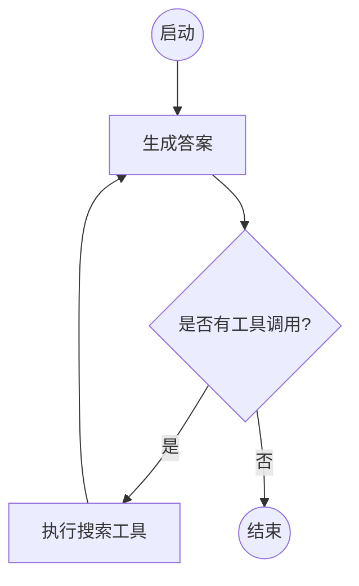

# LangGraph 深度解析：构建可靠的多 Agent 工作流

> "The future of AI is not just chatbots, but autonomous agents working together."

Agentic AI（智能体人工智能）正在改变我们构建应用的方式。传统的基于单次调用（One-shot）大模型的应用在处理复杂任务时往往力不从心，而引入多步骤推理、工具调用和状态管理的 Agent 系统则能极大地提升任务完成率。

在众多 Agent 框架中，**LangGraph** 凭借其独特的基于图（Graph）的架构设计脱颖而出。它作为 LangChain 生态的重要扩展，专门为了解决复杂多 Agent 工作流中的**状态管理 (State Management)** 和**循环执行 (Cyclic Execution)** 问题而生。

{/* truncate */}

---

## 一、为什么需要 LangGraph？

在理解 LangGraph 之前，我们需要先了解传统 Agent 构建方式（如 LangChain 的 AgentExecutor）的局限性：

1. **状态管理困难**：在多步交互中，维护和更正中间状态非常复杂。
2. **缺乏控制力**：传统的基于提示词（Prompt）驱动的路由容易出现不可控跳转，难以确保关键流程的强制执行。
3. **循环难以处理**：DAG（有向无环图）工作流框架（如传统的流程编排引擎）无法原生支持 LLM 自我反思（Reflection）和重试（Retry）所必需的“循环”（Cycles）。
4. **多 Agent 协作弱**：让多个拥有不同技能的 Agent 协同工作，并且共享同一个上下文状态，在之前的框架中实现起来非常繁琐。

**LangGraph 的核心优势在于将应用建模为状态机（State Machine）**。通过定义节点（Nodes，代表计算或动作）和边（Edges，代表控制流），开发者可以精确掌握 Agent 的执行路径。

---

## 二、LangGraph 核心概念

LangGraph 的设计不仅优雅而且非常直观，其核心由以下几个部分组成：

### 2.1 状态 (State)

状态是整个图的“血液”。在定义图时，首先需要定义一个状态结构（通常是一个 TypedDict 或 Pydantic BaseModel）。这个状态会在图的各个节点之间传递，并在每一帧被更新。

```python
from typing import TypedDict, Annotated
import operator

class AgentState(TypedDict):
    # 使用 Annotated 和 operator.add 表示这个字段在更新时是追加（Append）而不是覆盖
    messages: Annotated[list, operator.add]
    current_task: str
    final_answer: str
```

### 2.2 节点 (Nodes)

节点是业务逻辑的承载者。任何 Python 函数都可以成为一个节点，只要它的输入是当前的状态，输出是状态的更新内容。节点可以是调用大模型、执行工具、或是普通的数据处理逻辑。

```python
def chatbot_node(state: AgentState):
    # 获取状态中的消息历史
    messages = state["messages"]
    # 调用 LLM
    response = llm.invoke(messages)
    # 返回状态的更新（追加新消息）
    return {"messages": [response]}
```

### 2.3 边 (Edges)

边定义了图的拓扑结构，即节点之间的流转规则。LangGraph 提供两类边：

- **普通边 (Normal Edges)**：无条件地从节点 A 流向节点 B。
- **条件边 (Conditional Edges)**：根据前一个节点的状态或输出，动态决定下一个执行哪个节点。这就是实现 LLM 路由和循环判断的关键。

```python
def should_continue(state: AgentState) -> str:
    messages = state['messages']
    last_message = messages[-1]
    # 如果 LLM 决定调用工具，则走向 tools 节点，否则结束
    if last_message.tool_calls:
        return "continue"
    return "end"
```

---

## 三、构建一个完整的 Agent 工作流

让我们通过一个简单的例子展示 LangGraph 是如何工作的：一个包含检索和自我反思循环的 Agent。



### 实现步骤：

1. **定义状态**: 存储对话历史和中间结果。
2. **初始化图**: `workflow = StateGraph(AgentState)`。
3. **添加节点**:
   - `workflow.add_node("agent", agent_function)`
   - `workflow.add_node("action", tool_executor)`
4. **添加边**:
   - `workflow.set_entry_point("agent")`
   - `workflow.add_conditional_edges("agent", should_continue, {"continue": "action", "end": END})`
   - `workflow.add_edge("action", "agent")` (关键：工具执行完后强制回到 agent 节点进行判断，形成**循环**)
5. **编译运行**: `app = workflow.compile()`

---

## 四、LangGraph 高阶特性

除了基础的图构建，LangGraph 还是一个**生产级**的框架，提供了一系列重要的工程特性：

### 4.1 持久化与记忆 (Persistence & Memory)

通过 `checkpointer` 机制，LangGraph 可以在每一步后将图的状态自动保存到数据库（如 SQLite, PostgreSQL）。这意味着：

- **线程管理**：你可以用一个唯一的 `thread_id` 恢复之前的对话状态。
- **时间旅行**：支持查看图在任意历史步骤的状态。

### 4.2 审查与人为干预 (Human-in-the-loop)

借助于持久化特性，你可以配置图在到达某个特定节点前**暂停运行（Interrupt Before）**。
例如，在执行一个高危工具（如转账、删库）之前，系统会暂停并等待用户界面的授权。用户还可以修改状态后再恢复图的执行。

### 4.3 流式输出 (Streaming)

在复杂的 Agent 工作流中，用户不可能等待几十秒图执行完毕才看到结果。LangGraph 支持细粒度的事件流输出：

- `stream_mode="updates"`：每次节点状态更新时吐出。
- `stream_mode="messages"`：像常规 Chatbot 一样逐字吐出 LLM 的流式输出，即使这个 LLM 被深层嵌套在某个节点内部。

---

## 五、经典的 LangGraph 应用模式与实战教程

为了帮助开发者更好地理解和应用 LangGraph，官方沉淀了许多经典的设计模式和教程。以下是几个最具代表性的高级工作流模型及其参考实现：

### 1. 多 Agent 协同 (Multi-agent Collaboration)

**核心思想**：多个专精不同领域的 Agent 共同解决复杂问题。每个 Agent 都可以像独立的系统一样思考和调用工具，它们之间可以通过一个监督者（Supervisor）节点或者直接通过共享的网络状态来进行交流和任务交接。

- **最佳场景**：复杂的软件开发、自动化的内容创作流水线。
- 🔗 [跳转预览：Multi-agent Collaboration 教程](https://github.com/langchain-ai/langgraph/blob/23961cff61a42b52525f3b20b4094d8d2fba1744/docs/docs/tutorials/multi_agent/multi-agent-collaboration.ipynb)

### 2. 计划和执行 (Plan and Execute)

**核心思想**：大模型首先作为一个**规划者 (Planner)**，将复杂问题拆解为多步且明确的子任务；接着作为一个**执行者 (Executor)** 逐一遍历执行这些子任务，并根据执行结果不断更新剩余的计划。

- **最佳场景**：需要长期推理、多步数学计算和需要避免“走一步看一步”陷阱的复杂查询。
- 🔗 [跳转预览：Plan and Execute 教程](https://github.com/langchain-ai/langgraph/blob/23961cff61a42b52525f3b20b4094d8d2fba1744/docs/docs/tutorials/plan-and-execute/plan-and-execute.ipynb)

### 3. 自适应与纠错 RAG (Adaptive RAG)

**核心思想**：将传统的线性 RAG 转化为具备“路由”、“评价”和“重试”能力的循环图。当检索到的文档不相关时，动态改写 Query 再次检索；当生成的答案不够完善时，退回生成步骤甚至重新检索。

- **最佳场景**：对准确率要求极高、存在大量无效数据的高级智能客服系统。
- 🔗 [跳转预览：LangGraph Adaptive RAG 教程](https://github.com/langchain-ai/langgraph/blob/23961cff61a42b52525f3b20b4094d8d2fba1744/docs/docs/tutorials/rag/langgraph_adaptive_rag.ipynb)

### 4. 自我反思 (Reflection)

**核心思想**：让大模型在输出最终结果前，先生成一个初步结果，然后将这个结果交由另一个（或同一个）节点进行“自我批评”和打分。如果批评未达标，则根据反馈意见进行修改，直到满意为止。

- **最佳场景**：基础的代码生成调试、高质量翻译与文案优化。
- 🔗 [跳转预览：Reflection 教程](https://github.com/langchain-ai/langgraph/blob/23961cff61a42b52525f3b20b4094d8d2fba1744/docs/docs/tutorials/reflection/reflection.ipynb)

### 5. Reflexion

**核心思想**：在基础的 Reflection 之上，加入了更动态的**环境反馈机制**（不仅是 LLM 自带的反思，而是引入了外部环境的执行结果，如代码运行报错）以及**短期和长期记忆**，以指数级提升系统解决需要长效试错任务的能力。

- **最佳场景**：交互式编程、需要高频与外部 API 即时交互的自动化任务。
- 🔗 [跳转预览：Reflexion 教程](https://github.com/langchain-ai/langgraph/blob/23961cff61a42b52525f3b20b4094d8d2fba1744/docs/docs/tutorials/reflexion/reflexion.ipynb)

### 6. 无观测推理 (Reasoning without Observation - ReWOO)

**核心思想**：与 ReAct 模式（思考-行动-观察-再思考）每步都停下来观察环境不同，ReWOO 会在一开始就在内部预测出所有的思考过程和工具调用计划（蓝图蓝本），并在不等待每次中间观察结果的情况下交办给工具节点执行。

- **最佳场景**：低延迟敏感型应用、已知外部接口非常稳定的工作流（显著减少 Token 和时延）。
- 🔗 [跳转预览：ReWOO 教程](https://github.com/langchain-ai/langgraph/blob/23961cff61a42b52525f3b20b4094d8d2fba1744/docs/docs/tutorials/rewoo/rewoo.ipynb)

### 7. 思维树 (Tree of Thoughts - ToT)

**核心思想**：在解决极其复杂问题时，Agent 会系统性地探索多条不同的推理路径（树的分支），在每个节点进行自我评估并决定是继续当前分支、回溯还是尝试新的路径。

- **最佳场景**：复杂逻辑谜题、创意写作规划、高难度数学证明解析。
- 🔗 [跳转预览：Tree of Thoughts (ToT) 教程](https://github.com/langchain-ai/langgraph/blob/23961cff61a42b52525f3b20b4094d8d2fba1744/docs/docs/tutorials/tot/tot.ipynb)

### 8. 通用工作流 (Workflows)

**核心思想**：虽然 LangGraph 为了 Agentic 循环而生，但它同样适用于构建经典的确定性工作流。其具备的状态回溯、流式传输和容错能力也常被用作类似 Airflow、Temporal 的轻便型替代方案。

- **最佳场景**：灵活的 ETL 数据处理流水线、具备暂停审查机制的运营自动化流程。
- 🔗 [跳转预览：Workflows 教程](https://github.com/langchain-ai/langgraph/blob/23961cff61a42b52525f3b20b4094d8d2fba1744/docs/docs/tutorials/workflows.md)

### 9. LLMCompiler

**核心思想**：受计算机操作系统的编译器启发，将复杂的任务解析成一张“有向无环图 (DAG)”，并将其动态拆解以**并行化执行**。调度器在识别哪些组件互不依赖后并行分发，大幅缩短总响应时间。

- **最佳场景**：存在大量平行的独立子查询或需要向多个异构平台并发调用工具的场景。
- 🔗 [跳转预览：LLMCompiler 教程](https://github.com/langchain-ai/langgraph/blob/23961cff61a42b52525f3b20b4094d8d2fba1744/docs/docs/tutorials/llm-compiler/LLMCompiler.ipynb)

---

## 六、总结

LangGraph 的出现填补了 LangChain 在复杂 Agent 编排上的空白。它将“不可预测的 Prompt 魔法”转化为“确定性的状态机流转”，使得构建生产可用、容错率高、可调试的多 Agent 系统成为可能。

从基础的循环控制，到强大的 Multi-agent 协同、智能的自适应 RAG 甚至是高级的并发调度器 (LLMCompiler)，LangGraph 为探索前沿 Agent 架构提供了极富弹性的基石。如果你正在构建任何需要**多步推理**、**自我反思**和**环境交互**的复杂系统，LangGraph 是目前最值得深入应用的技术栈之一。

---

## 七、参考资料与拓展阅读 (References & Further Reading)

为了更深入地理解本文中提到的架构和模式，建议阅读以下官方文档和相关学术论文：

### 📚 官方文档与社区精选资源

- **[LangGraph 官方文档主页](https://langchain-ai.github.io/langgraph/)**: 最权威的入门指南、核心概念（State, Nodes, Edges）详解以及 API 参考。
- **[LangGraph Concepts: Multi-Agent](https://langchain-ai.github.io/langgraph/concepts/multi_agent/)**: 详细解释了 Supervisor、Network、Hierarchical 等多智能体网络拓扑结构的设计理念。
- **[LangChain 博客](https://blog.langchain.dev/)**: 包含大量关于 LangGraph 演进历程和最新最佳实践的深度技术博文。
- **[Awesome-LLM-Reasoning](https://github.com/atfortes/Awesome-LLM-Reasoning?utm_source=chatgpt.com)**: 全面聚合了大模型推理（Reasoning）相关的前沿论文、开源项目与教程，是深入理解复杂 Agent 认知机制的极佳参考。

### 🎓 核心论文背景 (Papers behind the patterns)

LangGraph 中的许多高级模式都源于近年来顶尖的 AI 学术研究。了解这些论文能够从根本上理解这些模式的“Why”：

- **Reflection / Self-Critique**:
  - _Self-Refine: Iterative Refinement with Self-Feedback_ ([arXiv:2303.17651](https://arxiv.org/abs/2303.17651))
- **Reflexion**:
  - _Reflexion: Language Agents with Verbal Reinforcement Learning_ ([arXiv:2303.11366](https://arxiv.org/abs/2303.11366))
- **Tree of Thoughts (ToT)**:
  - _Tree of Thoughts: Deliberate Problem Solving with Large Language Models_ ([arXiv:2305.10601](https://arxiv.org/abs/2305.10601))
- **ReWOO**:
  - _ReWOO: Decoupling Reasoning from Observations for Efficient Augmented Language Models_ ([arXiv:2305.18323](https://arxiv.org/abs/2305.18323))
- **LLMCompiler**:
  - _An LLM Compiler for Parallel Function Calling_ ([arXiv:2312.04511](https://arxiv.org/abs/2312.04511))

> **💡 建议的学习路径**：
>
> 1. 先跑通**[基础的工具调用 Agent 构建模块](https://langchain-ai.github.io/langgraph/tutorials/introduction/)**。
> 2. 深入理解 **State**、**Checkpointer (持久化记忆)** 和 **Interrupt (人类干预机制)**。
> 3. 根据业务场景，挑选上述**第五节**中的 1-2 个高级教程（如 `Adaptive RAG` 或 `Plan and Execute`）进行源码级的跑通和调试。
