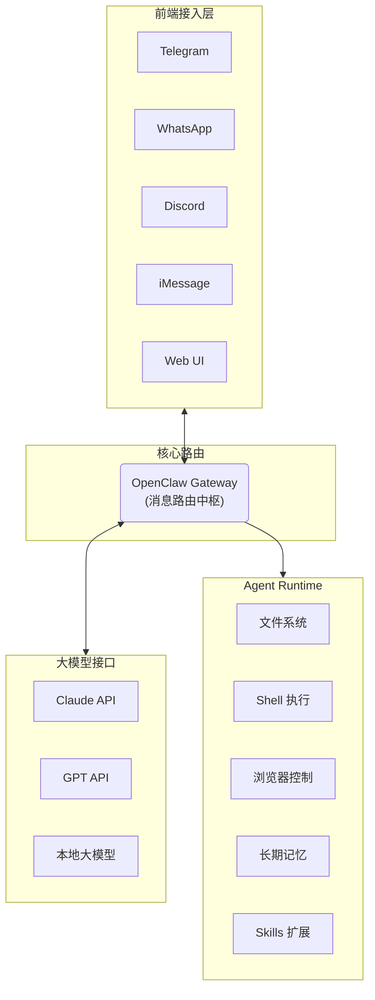
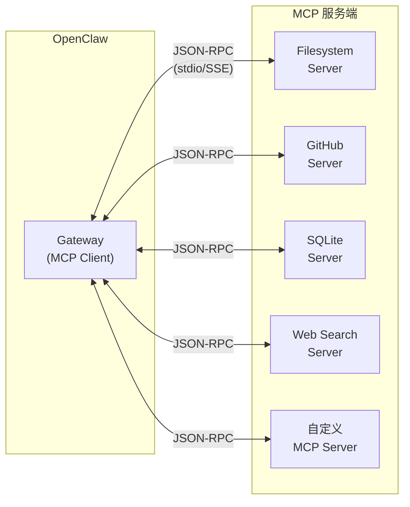

import Tabs from "@theme/Tabs";
import TabItem from "@theme/TabItem";

# OpenClaw 完全指南：在 Windows WSL 上打造你的 24/7 AI 私人助理

2026 年初，一个名为 **OpenClaw** 的开源项目在 GitHub 火速登顶，短短数周内收获超过 **30k+ Stars**。它不是又一个聊天机器人套壳——而是一个**运行在你自己设备上的自主 AI 代理（Autonomous Agent）**，能够读写文件、执行脚本、控制浏览器、收发消息……如同一个真正的 **AI 贾维斯**，7x24 小时守候在你的终端里。

本文将以 **Windows + WSL** 为主线，从零开始带你走完 OpenClaw 的完整安装、配置与深度调优之旅。

<!-- truncate -->

---

## 1. OpenClaw 是什么？

OpenClaw 是一个**开源、自托管的 AI 个人助手运行时（Agent Runtime）**。它的核心定位不是"对话窗口"，而是一个**消息路由 + 工具执行引擎**：



### 1.1 核心特性速览

| 特性               | 说明                                                           |
| :----------------- | :------------------------------------------------------------- |
| **自主执行**       | 不止对话——能自动读写文件、运行脚本、操控浏览器                 |
| **多通道路由**     | 同时接入 Telegram、WhatsApp、Discord、iMessage、Slack 等       |
| **模型无关**       | 支持 Claude、GPT、Gemini、DeepSeek、MiniMax，也支持本地 Ollama |
| **长期记忆**       | 跨对话记忆上下文，越用越聪明                                   |
| **Skills 生态**    | 社区驱动的能力扩展市场（ClawHub）                              |
| **隐私优先**       | 所有数据留在本地，你完全掌控                                   |
| **Companion Apps** | 提供 macOS / iOS / Android 伴侣应用                            |

---

## 2. 前置准备：WSL2 环境搭建

> Windows 用户推荐通过 WSL2 + Ubuntu 来运行 OpenClaw，这能提供最一致且稳定的 Linux 运行环境。

### 2.1 安装 WSL2

以**管理员身份**打开 PowerShell，执行：

```powershell
# 一键安装 WSL2（默认安装 Ubuntu）
wsl --install
```

如果已安装过旧版 WSL，可以升级到 WSL2：

```powershell
# 查看当前状态
wsl --status

# 设置默认版本为 WSL2
wsl --set-default-version 2

# 升级指定发行版
wsl --set-version Ubuntu 2
```

安装完成后**重启电脑**。重启后 Ubuntu 会自动启动，要求你设置 Linux 用户名和密码。

### 2.2 启用 systemd

OpenClaw 的 Gateway 作为守护进程（Daemon）运行，依赖 systemd。WSL2 默认不启用 systemd，需要手动开启：

```bash
# 在 WSL Ubuntu 终端中执行
sudo tee /etc/wsl.conf >/dev/null <<'EOF'
[boot]
systemd=true
EOF
```

然后在 **PowerShell（非 WSL）** 中重启 WSL：

```powershell
wsl --shutdown
```

重新打开 Ubuntu 终端，验证 systemd 是否正常运行：

```bash
systemctl --user status
# 如果输出状态信息而非报错，说明 systemd 已成功启用
```

### 2.3 安装 Node.js（v22+）

OpenClaw 要求 **Node.js 22** 或更高版本。推荐使用 nvm 管理 Node 版本：

```bash
# 安装 nvm
curl -o- https://raw.githubusercontent.com/nvm-sh/nvm/v0.40.1/install.sh | bash

# 重新加载 shell 配置
source ~/.bashrc

# 安装 Node.js 22 LTS
nvm install 22
nvm use 22
nvm alias default 22

# 验证
node -v   # 应输出 v22.x.x
npm -v    # 应输出 10.x.x
```

---

## 3. 安装 OpenClaw

Node.js 环境就绪后，安装 OpenClaw 核心：

<Tabs>
  <TabItem value="script" label="一键脚本安装（推荐）" default>

```bash
curl -fsSL https://openclaw.ai/install.sh | bash
```

该脚本会自动检测环境、安装依赖并全局安装 OpenClaw。

  </TabItem>

  <TabItem value="npm" label="npm / pnpm 手动安装">

```bash
# npm
npm install -g openclaw@latest

# 或 pnpm
pnpm add -g openclaw@latest
```

  </TabItem>
</Tabs>

安装完成后验证：

```bash
openclaw --version
# openclaw/x.x.x linux-x64 node-v22.x.x
```

---

## 4. 初始化配置：Onboarding 向导

OpenClaw 提供了一个交互式的 Onboarding 向导，引导你完成所有核心配置：

```bash
openclaw onboard --install-daemon
```

> `--install-daemon` 参数会同时将 OpenClaw Gateway 注册为 systemd 服务，实现后台常驻。

向导会依次引导你完成以下步骤：

```
┌────────────────────────────────────────────────────────┐
│                  OpenClaw Onboarding                   │
├────────────────────────────────────────────────────────┤
│  ① 接受安全提示（Security Acknowledgment）             │
│  ② 选择 AI 模型提供商 & 配置 API Key                   │
│  ③ 配置消息通道（Telegram / WhatsApp / Discord...）     │
│  ④ 安装 Gateway 守护进程                               │
│  ⑤ 配置工作区（Workspace）                             │
└────────────────────────────────────────────────────────┘
```

---

## 5. 模型配置详解

OpenClaw 是**模型无关（Model-Agnostic）**的，支持几乎所有主流 LLM 提供商。

### 5.1 在 Onboarding 中选择模型

向导会列出支持的模型提供商供你选择：

| 提供商        | 推荐模型                     | 特点                        |
| :------------ | :--------------------------- | :-------------------------- |
| **Anthropic** | Claude 3.5 Sonnet / Claude 4 | 工具调用能力最强，推理精准  |
| **OpenAI**    | GPT-4o / GPT-4.5             | 生态成熟，多模态能力强      |
| **Google**    | Gemini 2.0 Flash / Pro       | 超大上下文窗口（2M tokens） |
| **DeepSeek**  | DeepSeek-V3 / R1             | 性价比高，中文能力优秀      |
| **MiniMax**   | MiniMax-01                   | 国产大模型，免费额度充足    |
| **Mistral**   | Mistral Large                | 欧洲开源大模型              |

选择后，向导会要求你输入对应的 **API Key**——你需要提前在各提供商官网注册并创建。

### 5.2 配置文件详解

所有配置存储在 `~/.openclaw/openclaw.json` 中。模型相关的核心配置结构如下：

```json title="~/.openclaw/openclaw.json（模型部分）"
{
  "env": {
    "ANTHROPIC_API_KEY": "sk-ant-api03-xxxxx",
    "OPENAI_API_KEY": "sk-xxxxx",
    "GOOGLE_GENERATIVE_AI_API_KEY": "AIzaSy-xxxxx",
    "DEEPSEEK_API_KEY": "sk-xxxxx"
  },
  "agents": {
    "defaults": {
      "model": {
        "primary": "anthropic:claude-sonnet-4-20250514",
        "fallbacks": ["openai:gpt-4o", "google:gemini-2.0-flash"]
      }
    }
  }
}
```

### 5.3 模型优先级与 Fallback 机制

OpenClaw 的模型调度策略非常智能：

```
请求进入
  ↓
尝试 Primary 模型（如 Claude Sonnet 4）
  ↓ 如果失败（限流 / API 错误 / 超时）
尝试 Fallback[0]（如 GPT-4o）
  ↓ 如果失败
尝试 Fallback[1]（如 Gemini Flash）
  ↓ 全部失败
返回错误信息
```

> **最佳实践**：将最强的模型设为 `primary`，将速度快 / 成本低的模型放在 `fallbacks` 中。日常简单任务会因模型不堪重任而自动降级到更经济的选择。

### 5.4 通过 CLI 修改模型

你也可以随时通过命令行修改模型配置，无需手动编辑 JSON：

```bash
# 设置主模型
openclaw config set agents.defaults.model.primary "anthropic:claude-sonnet-4-20250514"

# 查看当前模型配置
openclaw config get agents.defaults.model
```

---

## 6. Telegram 通道配置

Telegram 是 OpenClaw 最常用的消息通道——配置完成后，你可以随时随地通过 Telegram 跟你的 AI 助手对话。

### 6.1 创建 Telegram Bot

#### Step 1：找到 BotFather

在 Telegram 中搜索 **@BotFather** 并打开对话。

#### Step 2：创建新 Bot

```
你发送:  /newbot
BotFather: Alright, a new bot. How are we going to call it?
你发送:  My OpenClaw Assistant
BotFather: Good. Now let's choose a username for your bot.
你发送:  my_openclaw_bot
BotFather: Done! Congratulations on your new bot.
         Use this token to access the HTTP API:
         7123456789:AAF-xxxxxxxxxxxxxxxxxxxxxxxxxxxx
```

> ⚠️ Bot 的 username **必须以 `bot` 结尾**。请妥善保存返回的 **API Token**。

#### Step 3：获取你的 Telegram User ID

在 Telegram 中搜索 **@userinfobot**，发送 `/start`，它会返回你的数字 User ID（如 `123456789`）。

### 6.2 在 Onboarding 中配置

在 `openclaw onboard` 向导执行到通道配置环节时：

1. 选择 **Telegram** 作为消息通道
2. 输入刚才从 BotFather 获取的**Bot Token**
3. 向导会提示你打开 Telegram，给你的新 Bot 发送 `/start`

### 6.3 配对与审批（Pairing & Approve）

OpenClaw 采用**配对审批机制**保障安全——只有经过你授权的用户才能与你的 AI 通信。

当你给 Bot 发送 `/start` 后，Bot 会回复一个 **8 位配对码**（如 `ABCD1234`），有效期 1 小时。

回到 WSL 终端，执行审批命令：

```bash
# 审批 Telegram 配对
openclaw pairing approve telegram ABCD1234
```

成功后你会看到：

```
✅ Pairing approved.
   Telegram user 123456789 added to allowlist.
   You can now chat with your agent via Telegram.
```

从此刻起，你可以在 Telegram 中跟你的 AI 助手自由对话了！🎉

### 6.4 群组使用（可选）

如果你想在 Telegram 群组中使用 Bot，需要额外设置隐私：

1. 在 BotFather 中发送 `/setprivacy`
2. 选择你的 Bot
3. 选择 **Disable**（允许 Bot 读取群组所有消息）

然后将 Bot 添加到群组中，群组内的用户同样需要经过配对审批流程。

---

## 7. VPN 与代理配置

在中国大陆使用 OpenClaw 需要特别注意网络配置，因为 OpenClaw 需要访问海外的 LLM API 端点。

### 7.1 代理配置方案

<Tabs groupId="vpn-solutions">
<TabItem value="wsl-host" label="方案一：WSL 宿主机代理（推荐）" default>

如果你的 Windows 宿主机已经运行了 Clash for Windows / v2rayN 等代理工具，WSL 可以直接复用：

#### Step 1：在代理工具中启用局域网访问

- **Clash for Windows**：开启 `Allow LAN`，记下端口（默认 `7890`）
- **v2rayN**：开启 `允许来自局域网的连接`

#### Step 2：获取 Windows 宿主机 IP

在 WSL 中执行：

```bash
# 获取宿主机 IP（通常为 172.x.x.1）
HOST_IP=$(cat /etc/resolv.conf | grep nameserver | awk '{print $2}')
echo $HOST_IP
```

#### Step 3：设置代理环境变量

```bash
# 临时设置（当前终端会话有效）
export HTTP_PROXY="http://${HOST_IP}:7890"
export HTTPS_PROXY="http://${HOST_IP}:7890"
export ALL_PROXY="socks5://${HOST_IP}:7890"
export NO_PROXY="localhost,127.0.0.1,::1"
```

#### Step 4：持久化代理配置

将代理配置写入 `~/.bashrc`，使其每次启动 WSL 自动生效：

```bash
cat >> ~/.bashrc << 'PROXY_EOF'

# ===== WSL Proxy Configuration =====
proxy_on() {
    local HOST_IP=$(cat /etc/resolv.conf | grep nameserver | awk '{print $2}')
    export HTTP_PROXY="http://${HOST_IP}:7890"
    export HTTPS_PROXY="http://${HOST_IP}:7890"
    export ALL_PROXY="socks5://${HOST_IP}:7890"
    export NO_PROXY="localhost,127.0.0.1,::1"
    echo "🌐 Proxy ON → ${HOST_IP}:7890"
}

proxy_off() {
    unset HTTP_PROXY HTTPS_PROXY ALL_PROXY NO_PROXY
    echo "🔒 Proxy OFF"
}

# 默认启动代理
proxy_on
PROXY_EOF

source ~/.bashrc
```

现在你可以随时通过 `proxy_on` 和 `proxy_off` 命令切换代理。

</TabItem>

<TabItem value="proxychains" label="方案二：使用 proxychains">

如果部分应用不遵循环境变量，可以使用 `proxychains`：

```bash
# 安装 proxychains
sudo apt install proxychains4 -y

# 编辑配置
sudo nano /etc/proxychains4.conf
```

在配置文件末尾修改：

```ini
[ProxyList]
socks5  172.x.x.1  7890
```

然后通过 proxychains 启动 OpenClaw：

```bash
proxychains4 openclaw start
```

</TabItem>

<TabItem value="vpn-client" label="方案三：WSL 内置 VPN 客户端">

对于需要全局 VPN 的场景，可以在 WSL 内安装 VPN 客户端：

```bash
# 以 WireGuard 为例
sudo apt install wireguard -y

# 导入配置
sudo cp /mnt/c/Users/YourName/wg0.conf /etc/wireguard/

# 启动 VPN
sudo wg-quick up wg0

# 验证
curl -s ipinfo.io | grep country
```

</TabItem>
</Tabs>

### 7.2 验证网络连通性

配置好代理后，测试是否能正常访问 LLM API：

```bash
# 测试 OpenAI API 连通性
curl -s https://api.openai.com/v1/models -H "Authorization: Bearer $OPENAI_API_KEY" | head -c 200

# 测试 Anthropic API 连通性
curl -s https://api.anthropic.com/v1/messages \
  -H "x-api-key: $ANTHROPIC_API_KEY" \
  -H "anthropic-version: 2023-06-01" \
  -d '{"model":"claude-sonnet-4-20250514","max_tokens":10,"messages":[{"role":"user","content":"hi"}]}'
```

---

## 8. 开机自启与服务管理

一个真正的 AI 助手应该**始终在线**。以下是让 OpenClaw 在重启后自动恢复运行的完整配置。

### 8.1 OpenClaw systemd 服务

如果你在 Onboarding 时使用了 `--install-daemon`，OpenClaw 已经自动注册了 systemd 服务。可以通过以下命令管理：

```bash
# 查看服务状态
systemctl --user status openclaw-gateway

# 手动启动 / 停止 / 重启
systemctl --user start openclaw-gateway
systemctl --user stop openclaw-gateway
systemctl --user restart openclaw-gateway

# 设置开机自启
systemctl --user enable openclaw-gateway

# 持久化用户级 systemd（关键！使服务在用户未登录时也能运行）
loginctl enable-linger $USER
```

### 8.2 手动创建 systemd 服务

如果你没有使用 `--install-daemon`，可以手动创建：

```bash
mkdir -p ~/.config/systemd/user

cat > ~/.config/systemd/user/openclaw-gateway.service << 'SERVICE_EOF'
[Unit]
Description=OpenClaw AI Gateway
After=network-online.target
Wants=network-online.target

[Service]
Type=simple
ExecStart=%h/.nvm/versions/node/v22.13.1/bin/node %h/.nvm/versions/node/v22.13.1/bin/openclaw start --daemon
Restart=always
RestartSec=10
Environment=PATH=%h/.nvm/versions/node/v22.13.1/bin:/usr/local/bin:/usr/bin:/bin
Environment=HOME=%h
WorkingDirectory=%h

[Install]
WantedBy=default.target
SERVICE_EOF

# 重载并启动
systemctl --user daemon-reload
systemctl --user enable --now openclaw-gateway
loginctl enable-linger $USER
```

> ⚠️ 注意：`ExecStart` 中的 Node.js 路径需要根据你的实际安装路径调整。可以通过 `which node` 和 `which openclaw` 查看。

### 8.3 WSL 自动启动配置

默认情况下 WSL 在 Windows 重启后不会自动运行。需要手动配置：

<Tabs groupId="wsl-autostart">
<TabItem value="task-scheduler" label="方法一：Windows 任务计划程序" default>

1. 打开 `taskschd.msc`（任务计划程序）
2. 创建基本任务：
   - **触发器**：用户登录时
   - **操作**：启动程序
   - **程序**：`wsl.exe`
   - **参数**：`-d Ubuntu -u your_username -- bash -c "systemctl --user start openclaw-gateway"`

</TabItem>

<TabItem value="startup-folder" label="方法二：启动文件夹快捷方式">

1. 按 `Win + R`，输入 `shell:startup` 打开启动文件夹
2. 创建快捷方式，目标设置为：

```
wsl.exe -d Ubuntu -- bash -lc "sleep 5 && systemctl --user start openclaw-gateway"
```

> `sleep 5` 给 systemd 足够的初始化时间。

</TabItem>

<TabItem value="wsl-conf" label="方法三：wsl.conf boot command">

在 WSL 的 `/etc/wsl.conf` 中添加：

```ini
[boot]
systemd=true
command="su - your_username -c 'XDG_RUNTIME_DIR=/run/user/$(id -u your_username) systemctl --user start openclaw-gateway'"
```

</TabItem>
</Tabs>

### 8.4 健康检查

确认服务正常运行的快捷检查：

```bash
# 查看 Gateway 运行状态
openclaw status

# 查看日志
journalctl --user -u openclaw-gateway -f --no-pager -n 50

# 验证 Telegram Bot 是否在线
# 在 Telegram 中给你的 Bot 发一条消息，看是否有回应
```

---

## 9. 自定义 API 与模型接入

OpenClaw 最强大的特性之一是**支持任何 OpenAI-Compatible 的 API 端点**，这意味着你可以接入任何第三方 API 代理、企业内部模型服务，甚至本地运行的开源模型。

### 9.1 接入 OpenAI-Compatible API

许多第三方 API 代理服务（如 OpenRouter、Together AI、硅基流动 SiliconFlow 等）都兼容 OpenAI 的 API 格式。所有自定义模型和提供商的配置都在 **`~/.openclaw/openclaw.json`** 中完成，修改后**重启 Gateway 即可生效**。

直接编辑 `~/.openclaw/openclaw.json`，在 `models.providers` 中添加自定义提供商：

```json title="~/.openclaw/openclaw.json（自定义模型部分）"
{
  "models": {
    "mode": "merge",
    "providers": {
      "my-silicon-flow": {
        "baseUrl": "https://api.siliconflow.cn/v1",
        "apiKey": "sk-xxxxxx",
        "api": "openai-completions",
        "models": [
          {
            "id": "deepseek-ai/DeepSeek-V3",
            "name": "DeepSeek-V3 (SiliconFlow)",
            "reasoning": true,
            "input": ["text"],
            "cost": {
              "input": 2.0,
              "output": 8.0,
              "cacheRead": 0,
              "cacheWrite": 0
            },
            "contextWindow": 64000,
            "maxTokens": 8192
          },
          {
            "id": "Qwen/Qwen2.5-72B-Instruct",
            "name": "Qwen2.5-72B (SiliconFlow)",
            "reasoning": false,
            "input": ["text"],
            "cost": {
              "input": 4.13,
              "output": 4.13,
              "cacheRead": 0,
              "cacheWrite": 0
            },
            "contextWindow": 131072,
            "maxTokens": 4096
          }
        ]
      }
    }
  }
}
```

> 💡 **关键字段说明**：
>
> - `mode: "merge"` — 表示与内置模型列表合并，保留原有模型
> - `api: "openai-completions"` — 指定 API 兼容格式
> - `models` — **使用数组格式**，每个模型包含 `id`、`name`、`reasoning`、`cost` 等字段
> - Provider ID（如 `my-silicon-flow`）将作为引用前缀

然后在同一配置文件中，将自定义模型设为主模型，引用格式为 **`<provider-id>/<model-id>`**：

```json title="~/.openclaw/openclaw.json（设置主模型）"
{
  "agents": {
    "defaults": {
      "model": {
        "primary": "my-silicon-flow/deepseek-ai/DeepSeek-V3"
      },
      "models": {
        "my-silicon-flow/deepseek-ai/DeepSeek-V3": {
          "alias": "sf-deepseek"
        }
      }
    }
  }
}
```

配置完成后，重启 Gateway 使其生效：

```bash
openclaw gateway restart
```

### 9.2 接入本地 Ollama 模型

对于追求完全离线隐私的用户，可以使用 Ollama 在本地运行开源大模型：

#### Step 1：安装 Ollama

```bash
# 在 WSL 中安装 Ollama
curl -fsSL https://ollama.com/install.sh | sh

# 拉取模型（推荐 64k+ 上下文的模型）
ollama pull llama3.1:70b
ollama pull qwen2.5:32b
ollama pull deepseek-r1:32b
```

#### Step 2：配置 OpenClaw 连接 Ollama

```bash
# 设置 Ollama API Key（本地使用任意值即可）
openclaw config set models.providers.ollama.apiKey "ollama-local"
```

> ⚠️ **关键提醒**：OpenClaw 连接 Ollama 时，Base URL 应该使用 `http://localhost:11434`（**不加** `/v1` 后缀）。使用 `/v1` 端点会导致工具调用（Tool Calling）功能失效。

#### Step 3：设置 Ollama 为主模型

```bash
openclaw config set agents.defaults.model.primary "ollama:llama3.1:70b"
```

#### Step 4：确保 Ollama 服务运行

```bash
# 启动 Ollama 服务（如果未自动启动）
ollama serve &

# 验证服务状态
curl http://localhost:11434/api/tags
```

### 9.3 混合模型策略

在实际使用中，推荐采用**云端 + 本地混合**的模型策略：

```json
{
  "agents": {
    "defaults": {
      "model": {
        "primary": "anthropic:claude-sonnet-4-20250514",
        "fallbacks": [
          "my-silicon-flow:deepseek-ai/DeepSeek-V3",
          "ollama:qwen2.5:32b"
        ]
      }
    }
  }
}
```

这样做的好处是：

- **日常使用**：优先使用最强的云端模型（如 Claude Sonnet 4）
- **云端限流时**：自动降级到第三方 API 代理（如 SiliconFlow 的 DeepSeek-V3）
- **网络断开时**：兜底使用本地 Ollama 模型，确保服务不中断

---

## 10. 进阶配置与技巧

### 10.1 多 Agent 配置

OpenClaw 支持配置多个不同角色的 Agent，针对不同场景使用不同的系统提示词和模型：

```json title="openclaw.json — agents 配置"
{
  "agents": {
    "default": {
      "name": "Jarvis",
      "persona": "你是一个高效的 AI 助手，擅长编程、文件管理和信息检索。",
      "model": {
        "primary": "anthropic:claude-sonnet-4-20250514"
      }
    },
    "coder": {
      "name": "CodeBot",
      "persona": "你是一个专注于编程的 AI 助手，精通多种编程语言。",
      "model": {
        "primary": "anthropic:claude-sonnet-4-20250514"
      }
    },
    "writer": {
      "name": "Writer",
      "persona": "你是一个创意写作助手，擅长中英文写作和翻译。",
      "model": {
        "primary": "openai:gpt-4o"
      }
    }
  }
}
```

### 10.2 Skills 安装与管理

Skills 是 OpenClaw 的扩展能力包。截至 2026 年 2 月，ClawHub 官方注册表已托管超过 **13,700+** 个社区贡献 Skill（[awesome-openclaw-skills](https://github.com/VoltAgent/awesome-openclaw-skills) 精选了其中 5,494 个）。安装方式非常灵活：

<Tabs groupId="skill-install">
<TabItem value="clawhub" label="ClawHub CLI（推荐）" default>

```bash
# 搜索可用 Skills
npx clawhub@latest search gmail

# 安装 Skill（自动部署到 ~/.openclaw/skills/）
npx clawhub@latest install agent-browser
npx clawhub@latest install better-notion
npx clawhub@latest install n8n

# 列出已安装的 Skills
openclaw skills list

# 移除 Skill
openclaw skills remove agent-browser
```

</TabItem>
<TabItem value="manual" label="手动安装">

```bash
# 将 Skill 文件夹复制到以下路径之一：
# 全局级
~/.openclaw/skills/
# 项目级（优先级最高）
<project>/skills/

# 优先级顺序：Workspace > Local > Bundled
```

</TabItem>
<TabItem value="chat" label="聊天安装">

你也可以直接把 Skill 的 GitHub 链接粘贴到对话中，让 AI 助手自动安装配置——非常方便。

</TabItem>
</Tabs>

**各类别热门 Skills 推荐**（均来自 [ClawHub 官方注册表](https://github.com/openclaw/skills)）：

| 类别               | Skill                                                                                                                         | 功能                                 |
| :----------------- | :---------------------------------------------------------------------------------------------------------------------------- | :----------------------------------- |
| 🔧 浏览器 & 自动化 | [`agent-browser`](https://github.com/openclaw/skills/tree/main/skills/thesethrose/agent-browser/SKILL.md)                     | Rust 实现的无头浏览器自动化 CLI      |
| 🔧 浏览器 & 自动化 | [`2captcha`](https://github.com/openclaw/skills/tree/main/skills/adinvadim/2captcha/SKILL.md)                                 | 通过 2Captcha 服务自动解决验证码     |
| 📝 笔记 & PKM      | [`better-notion`](https://github.com/openclaw/skills/tree/main/skills/tyler6204/better-notion/SKILL.md)                       | Notion 页面和数据库完整 CRUD 操作    |
| 📝 笔记 & PKM      | [`apple-notes`](https://github.com/openclaw/skills/tree/main/skills/steipete/apple-notes/SKILL.md)                            | 通过 memo CLI 管理 macOS Apple Notes |
| 📝 笔记 & PKM      | [`bear-notes`](https://github.com/openclaw/skills/tree/main/skills/steipete/bear-notes/SKILL.md)                              | 创建、搜索和管理 Bear 笔记           |
| 🔍 搜索 & 研究     | [`academic-deep-research`](https://github.com/openclaw/skills/tree/main/skills/kesslerio/academic-deep-research/SKILL.md)     | 透明、严谨的学术深度研究             |
| 🔍 搜索 & 研究     | [`arxiv-search-collector`](https://github.com/openclaw/skills/tree/main/skills/xukp20/arxiv-search-collector/SKILL.md)        | 模型驱动的 arXiv 论文检索工作流      |
| 📊 效率 & 任务     | [`asana`](https://github.com/openclaw/skills/tree/main/skills/k0nkupa/asana/SKILL.md)                                         | 通过 REST API 集成 Asana 项目管理    |
| 📊 效率 & 任务     | [`n8n`](https://github.com/openclaw/skills/tree/main/skills/thomasansems/n8n/SKILL.md)                                        | 通过 API 管理 n8n 工作流自动化       |
| 💬 通信            | [`agentmail-integration`](https://github.com/openclaw/skills/tree/main/skills/synesthesia-wav/agentmail-integration/SKILL.md) | 为 Agent 分配专属邮箱                |
| 💬 通信            | [`beeper`](https://github.com/openclaw/skills/tree/main/skills/krausefx/beeper/SKILL.md)                                      | 搜索和浏览本地 Beeper 聊天记录       |
| ☁️ DevOps          | [`agentic-devops`](https://github.com/openclaw/skills/tree/main/skills/tkuehnl/agentic-devops/SKILL.md)                       | Docker、进程管理、日志分析和健康监控 |
| 🔐 安全            | [`heimdall`](https://github.com/openclaw/skills/tree/main/skills/henrino3/heimdall/SKILL.md)                                  | 安装前扫描 Skill 中的恶意模式        |
| 🤖 Agent 协议      | [`claw-to-claw`](https://github.com/openclaw/skills/tree/main/skills/tonacy/claw-to-claw/SKILL.md)                            | Agent 间协调通信协议                 |

> ⚠️ **安全提醒**：ClawHub 提供 VirusTotal 合作扫描，但 Skills 本质上是社区开源代码。安装前务必检查源码，推荐使用 [Snyk Skill Security Scanner](https://github.com/snyk/agent-scan) 或 [Agent Trust Hub](https://ai.gendigital.com/agent-trust-hub) 进行安全审计。

### 10.3 安全加固

OpenClaw 拥有强大的系统级权限，安全配置至关重要：

```bash
# 设置消息通道的 DM 策略为"配对审批"（默认）
openclaw config set channels.telegram.dmPolicy "pairing"

# 查看已授权的用户列表
openclaw pairing list

# 撤销某个用户的授权
openclaw pairing revoke telegram <user_id>
```

> **安全建议**：
>
> - 第三方 Skills 视为不可信代码，安装前务必审查
> - 定期检查 `openclaw pairing list` 中的授权用户
> - 如果不需要远程访问，不要暴露 Gateway 端口到公网

### 10.4 日志与调试

```bash
# 实时查看 Gateway 日志
journalctl --user -u openclaw-gateway -f

# 查看最近的错误日志
journalctl --user -u openclaw-gateway --since "1 hour ago" -p err

# OpenClaw 内置日志
openclaw logs --tail 100

# 开启 Debug 模式（排错用）
openclaw config set log.level "debug"
openclaw restart
```

### 10.5 杀手级 Skills 与扩展生态推荐

要想把 OpenClaw 的潜力发挥到极致（真正的 "Auto-Agent"），你需要了解它繁荣的扩展生态。以下推荐的 Skills **均可在 [awesome-openclaw-skills](https://github.com/VoltAgent/awesome-openclaw-skills) 中找到**：

#### 1. 核心商城与生态中枢

- **[ClawHub (`clawhub.ai`)](https://www.clawhub.ai/)**：官方维护的插件注册表，截至 2026 年 2 月已托管 **13,729** 个社区 Skill，通过 `npx clawhub@latest search <关键词>` 探索。
- **MCP 集成**：OpenClaw 原生支持 **MCP (Model Context Protocol)** 协议（详见[下一节](#11-mcp-model-context-protocol-集成)），配置后可直接调用数百个 MCP 服务端工具。
- **ClawForge**：可视化的 Node-based 工作流引擎。不想在终端手写 JSON？你可以类似 Coze 的工作流节点连线，把各个 Skills 串联成极为复杂的自动化流水线。

#### 2. 强烈推荐的「神级」赋能 Skills

将普通的聊天机器人变成真正的 **Auto-Agent**，核心就在这些扩展：

- 🧠 **[`agent-memory-ultimate`](https://github.com/openclaw/skills/tree/main/skills/globalcaos/agent-memory-ultimate/SKILL.md)** (长记忆化)：生产级记忆系统——每日日志、睡眠巩固、SQLite + FTS5 全文搜索，支持 WhatsApp / ChatGPT / VCF 导入。你半年前随口提过的饮品偏好，它点外卖时始终能倒背如流。
- 🐳 **[`agentic-devops`](https://github.com/openclaw/skills/tree/main/skills/tkuehnl/agentic-devops/SKILL.md)** (DevOps 工具箱)：产品级 Agent DevOps 套件——Docker 容器管理、进程管控、日志分析、健康监控一站式搞定。
- 🐙 **[`auto-pr-merger`](https://github.com/openclaw/skills/tree/main/skills/autogame-17/auto-pr-merger/SKILL.md)** (开发自动化)：自动化 GitHub PR 检出、检查、合并工作流。结合 [`azure-devops`](https://github.com/openclaw/skills/tree/main/skills/pals-software/azure-devops/SKILL.md) 还能管理 Azure DevOps 项目和 PR。
- � **[`better-notion`](https://github.com/openclaw/skills/tree/main/skills/tyler6204/better-notion/SKILL.md)** (知识大脑)：Notion 页面、数据库完整 CRUD。授权后，AI 相当于读懂了你的整个工作日常，在 Telegram 直接问："上周开会讨论的排期是多少？"
- 🕷️ **[`agent-browser`](https://github.com/openclaw/skills/tree/main/skills/thesethrose/agent-browser/SKILL.md)** (无头浏览器)：Rust 实现的高性能无头浏览器自动化 CLI，搭配 [`2captcha`](https://github.com/openclaw/skills/tree/main/skills/adinvadim/2captcha/SKILL.md) 验证码破解 Skill 可实现完整的自动化爬虫流程。
- 📰 **[`biz-reporter`](https://github.com/openclaw/skills/tree/main/skills/ariktulcha/biz-reporter/SKILL.md)** (商业智能)：自动从 Google Analytics GA4、Google Search Console、Stripe 拉取数据并生成商业分析报告。
- 🔐 **[`heimdall`](https://github.com/openclaw/skills/tree/main/skills/henrino3/heimdall/SKILL.md)** (安全审计)：在安装新 Skill 之前，自动扫描和识别恶意模式，守护你的 Agent 安全。

> 💡 **发现更多 Skills**：浏览 [awesome-openclaw-skills](https://github.com/VoltAgent/awesome-openclaw-skills) 仓库，按 **30+ 分类**（Git & GitHub、Browser & Automation、DevOps & Cloud、Search & Research、Notes & PKM 等）精选发现。

---

## 11. MCP (Model Context Protocol) 集成

**MCP（Model Context Protocol）** 是由 Anthropic 主导的开放协议标准，旨在为 AI 模型与外部工具/数据源提供统一的通信接口。OpenClaw **原生支持 MCP 协议**，这意味着你可以直接接入整个 MCP 生态中数百个现成的工具服务器，无需单独安装 Skill。

### 11.1 MCP 架构简介



核心概念：

| 概念             | 说明                                                                         |
| :--------------- | :--------------------------------------------------------------------------- |
| **MCP Host**     | OpenClaw Gateway 作为 MCP 客户端（Host），负责发起工具调用请求               |
| **MCP Server**   | 独立运行的工具服务端，暴露 `tools`（可调用操作）和 `resources`（可读取数据） |
| **传输协议**     | 支持 `stdio`（本地管道）和 `SSE`（HTTP 远程）两种传输方式                    |
| **Tool Calling** | LLM 根据上下文自动决定调用哪个 MCP Server 的哪个 Tool                        |

### 11.2 配置 MCP 服务器

在 OpenClaw 的配置目录中创建 `mcp.json`：

```json title="~/.openclaw/mcp.json"
{
  "mcpServers": {
    "filesystem": {
      "command": "npx",
      "args": [
        "-y",
        "@modelcontextprotocol/server-filesystem",
        "/home/user/documents"
      ],
      "env": {}
    },
    "github": {
      "command": "npx",
      "args": ["-y", "@modelcontextprotocol/server-github"],
      "env": {
        "GITHUB_PERSONAL_ACCESS_TOKEN": "ghp_xxxxxxxxxxxx"
      }
    },
    "sqlite": {
      "command": "npx",
      "args": [
        "-y",
        "@modelcontextprotocol/server-sqlite",
        "/home/user/data/mydb.sqlite"
      ]
    },
    "brave-search": {
      "command": "npx",
      "args": ["-y", "@modelcontextprotocol/server-brave-search"],
      "env": {
        "BRAVE_API_KEY": "BSA-xxxxxxxxxxxx"
      }
    }
  }
}
```

配置完成后重启 Gateway：

```bash
systemctl --user restart openclaw-gateway
```

OpenClaw 会自动启动所有配置的 MCP Server 子进程，并将其暴露的 Tools 注入到 LLM 的可用工具列表中。

### 11.3 常用 MCP Server 推荐

| MCP Server       | 包名                                        | 功能                              |
| :--------------- | :------------------------------------------ | :-------------------------------- |
| **Filesystem**   | `@modelcontextprotocol/server-filesystem`   | 文件读写、搜索、目录管理          |
| **GitHub**       | `@modelcontextprotocol/server-github`       | 仓库管理、Issue/PR 操作、代码搜索 |
| **SQLite**       | `@modelcontextprotocol/server-sqlite`       | 数据库查询、表管理、数据分析      |
| **Brave Search** | `@modelcontextprotocol/server-brave-search` | 实时网络搜索                      |
| **Puppeteer**    | `@modelcontextprotocol/server-puppeteer`    | 浏览器自动化、截图、PDF 生成      |
| **Memory**       | `@modelcontextprotocol/server-memory`       | 基于 Knowledge Graph 的持久化记忆 |
| **PostgreSQL**   | `@modelcontextprotocol/server-postgres`     | PostgreSQL 数据库只读查询         |
| **Google Maps**  | `@modelcontextprotocol/server-google-maps`  | 地理编码、路径规划、地点搜索      |

> 完整 MCP Server 列表参见 [Anthropic MCP Servers 官方仓库](https://github.com/modelcontextprotocol/servers)。

### 11.4 MCP vs Skills：如何选择？

| 维度         | MCP Server                          | OpenClaw Skills                         |
| :----------- | :---------------------------------- | :-------------------------------------- |
| **定位**     | 通用工具协议层                      | OpenClaw 专属能力扩展                   |
| **安装方式** | 配置 `mcp.json` + npx 自动拉取      | `npx clawhub@latest install` 或手动复制 |
| **生态规模** | ~100+ 个官方/社区 Server            | 13,700+ 个 ClawHub Skill                |
| **优势**     | 协议标准化、跨平台兼容              | 深度定制、OpenClaw 原生特性             |
| **适用场景** | 通用工具（文件、数据库、搜索、API） | Agent 专属工作流、复杂自动化            |

**推荐策略**：优先使用 MCP Server 满足通用工具调用需求（文件操作、数据库查询、网络搜索），然后用 Skills 补充 OpenClaw 特有的自动化工作流（Agent 记忆、安全审计、Agent 间通信等）。

### 11.5 编写自定义 MCP Server

如果你有特殊需求，编写一个自定义 MCP Server 非常简单。以 Node.js 为例：

```bash
# 安装 MCP SDK
npm install @modelcontextprotocol/sdk
```

```typescript title="my-mcp-server.ts"
import { McpServer } from "@modelcontextprotocol/sdk/server/mcp.js";
import { StdioServerTransport } from "@modelcontextprotocol/sdk/server/stdio.js";
import { z } from "zod";

const server = new McpServer({
  name: "my-custom-server",
  version: "1.0.0",
});

// 注册一个 Tool
server.tool(
  "get-weather",
  "获取指定城市的天气信息",
  { city: z.string().describe("城市名称") },
  async ({ city }) => {
    // 在这里调用你的天气 API
    const weather = await fetchWeather(city);
    return {
      content: [{ type: "text", text: JSON.stringify(weather) }],
    };
  },
);

// 启动服务
const transport = new StdioServerTransport();
await server.connect(transport);
```

然后在 `mcp.json` 中添加配置即可：

```json
{
  "mcpServers": {
    "my-weather": {
      "command": "npx",
      "args": ["tsx", "/path/to/my-mcp-server.ts"]
    }
  }
}
```

---

## 12. 常见问题排查（FAQ）

### Q1：安装时提示 Node.js 版本不对？

```bash
# 确认 Node.js 版本
node -v

# 如果版本低于 22，通过 nvm 切换
nvm install 22 && nvm use 22
```

### Q2：Telegram Bot 发消息无回应？

排查清单：

1. **Gateway 是否在运行**：`openclaw status` 或 `systemctl --user status openclaw-gateway`
2. **配对是否完成**：`openclaw pairing list` 确认你的 Telegram User ID 在列表中
3. **API Key 是否有效**：检查 `~/.openclaw/openclaw.json` 中的 API Key
4. **代理是否正常**：`curl -s https://api.anthropic.com` 测试网络连通性

### Q3：API 调用报错 `429 Rate Limit`？

说明当前模型的调用频率超限。解决方案：

- 配置 `fallbacks` 模型实现自动降级
- 使用自定义 API 代理分散请求
- 降低 Agent 的调用频率

### Q4：WSL 重启后 OpenClaw 没有自动启动？

按照[第 8.3 节](#83-wsl-自动启动配置)配置 Windows 任务计划程序或启动文件夹快捷方式。

### Q5：Ollama 本地模型工具调用失效？

确保 OpenClaw 的 Ollama `baseUrl` 配置为 `http://localhost:11434`（**不含 `/v1`**），并使用支持 Tool Calling 的模型（如 `llama3.1`、`qwen2.5`）。

---

## 结语

OpenClaw 不是一个玩具——它是一个**真正的生产级 AI 代理运行时**。通过本文的配置，你已经拥有了：

- ✅ 在 WSL 上稳定运行的 OpenClaw 环境
- ✅ 灵活的多模型配置与自动 Fallback
- ✅ 通过 Telegram 随时随地与 AI 对话
- ✅ 代理/VPN 保障海外 API 顺畅访问
- ✅ 开机自启 + 崩溃自恢复的 7x24 常驻服务
- ✅ 自定义 API、本地模型、混合部署的进阶玩法
- ✅ MCP 协议集成，一键接入数百个外部工具
- ✅ 5,400+ 精选 Skills 生态，从学术研究到商业智能全覆盖

从现在开始，**你的 AI 助手睡着的时候，它还在工作**。

> **延伸阅读**：
>
> - [OpenClaw 官方文档](https://docs.openclaw.ai)
> - [OpenClaw GitHub](https://github.com/openclaw/openclaw)
> - [ClawHub Skills 市场](https://clawhub.ai)
> - [Awesome OpenClaw Skills](https://github.com/VoltAgent/awesome-openclaw-skills) — 5,494 精选 Skills 目录
> - [MCP 官方规范](https://modelcontextprotocol.io)
> - [MCP Servers 仓库](https://github.com/modelcontextprotocol/servers)
> - [Ollama 官方文档](https://ollama.com)
> - [WSL 官方文档](https://learn.microsoft.com/zh-cn/windows/wsl/)
