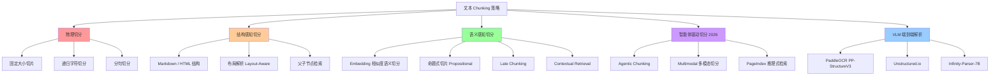
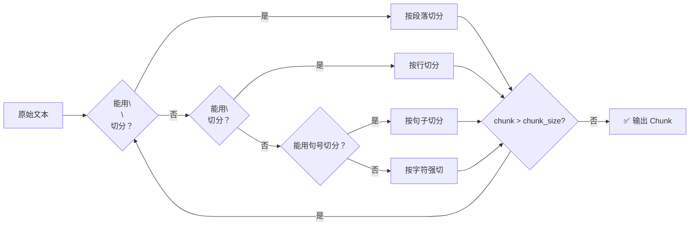
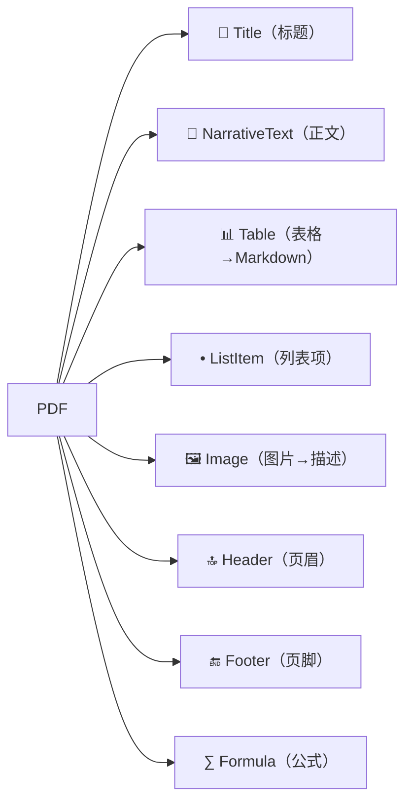
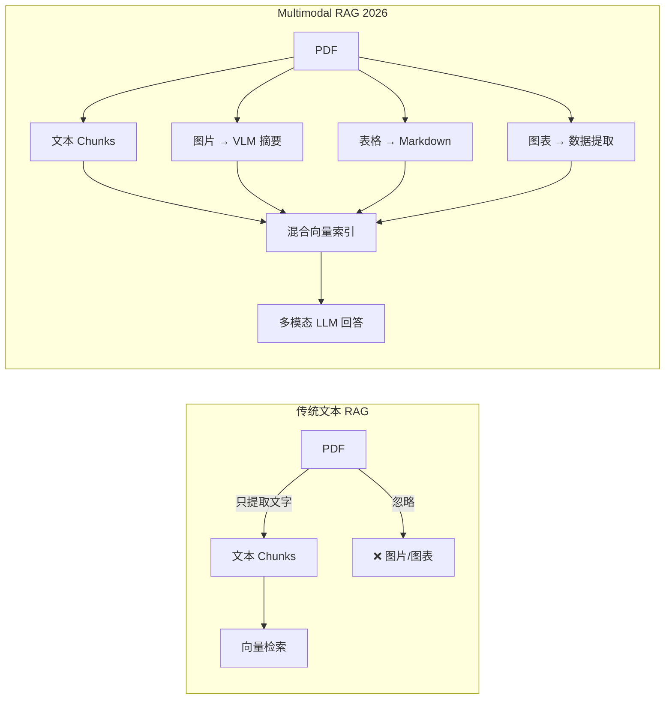
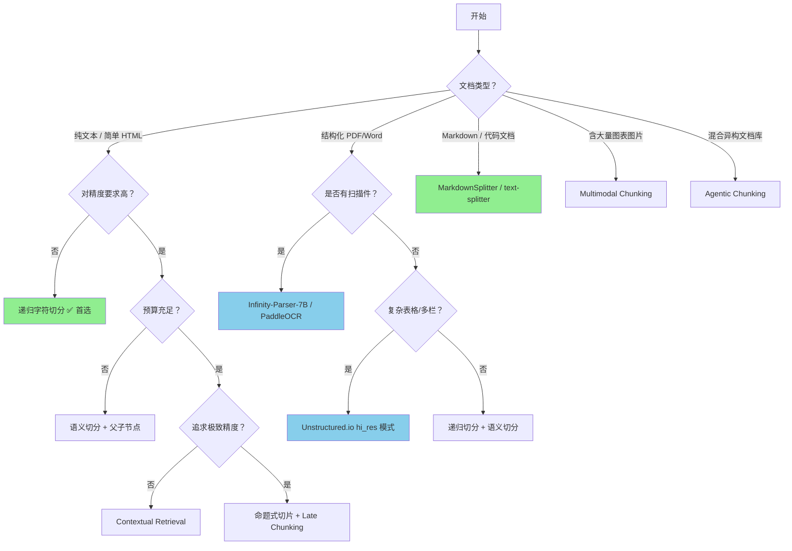

import MotionCanvasPlayer from "@site/src/components/MotionCanvasPlayer";

# RAG 核心基建：文本 Chunk 策略全景解析

> "To chunk, or not to chunk — that is the question. But _how_ to chunk is the engineering battle."

在 RAG（检索增强生成）系统中，**分块（Chunking）是整个 Pipeline 的地基**。检索质量上限由 Embedding 模型决定，下限却由分块质量决定。无论你使用多么强大的 LLM 或 向量数据库，一旦 Chunk 切错了位置、割裂了语义，后续所有优化都是徒劳。

本文将带你由浅入深地走完整条 Chunk 技术发展路线图——从最原始的固定切片，一路升级到 VLM 端到端文档理解。

{/* truncate */}

---

## 一、为什么分块这么重要？

在向量检索中，用户的 Query 会与 Chunk 的 Embedding 做相似度匹配。如果一个 Chunk：

- **太大**：Embedding 被稀释，相关内容淹没在噪声里，相似度下降
- **太小**：语义上下文丢失，即使检索到了也无法给 LLM 足够的背景
- **切割位置错误**：一句完整的话被拦腰切断，或者一张表格的一半在这个 Chunk 另一半在下一个，导致语义断层

**一个直观的例子**：

```
原文：张三在北京清华大学攻读计算机硕士期间，
      因发表论文《高效 RAG 分块策略》而广受关注。

❌ 错误切分（固定字符数）：
Chunk A: "张三在北京清华大学攻读计算机硕士期间，因发表论文《高效 R"
Chunk B: "AG 分块策略》而广受关注。"

✅ 正确切分（语义边界）：
Chunk: "张三在北京清华大学攻读计算机硕士期间，因发表论文《高效 RAG 分块策略》而广受关注。"
```

Query: "谁写了 RAG 分块论文？" — 在错误切分下，任何一个 Chunk 都回答不了这个问题。

---

## 二、Chunking 技术全景图



---

## 三、第一层：物理切分（最基础）

### 3.1 固定大小切片（Fixed-Size Chunking）

**最简单、最粗暴**的方案。按固定字符数或 Token 数切割，配合 Overlap 保留边界上下文。

**原理**：

<div style={{ marginTop: "2rem", marginBottom: "2rem" }}>
  <MotionCanvasPlayer
    src="/animation/src/project_chunking_overlap.js"
    auto={true}
  />
</div>

**代码实现**（使用 LangChain）：

```python
from langchain_text_splitters import CharacterTextSplitter

splitter = CharacterTextSplitter(
    separator="\n\n",
    chunk_size=1000,       # 每个 chunk 最大字符数
    chunk_overlap=200,     # 重叠字符数，保留上下文
    length_function=len,
    is_separator_regex=False,
)

texts = splitter.split_text(document_text)
```

**Tiktoken 版（Token 计数，适合 OpenAI 场景）**：

```python
from langchain_text_splitters import TokenTextSplitter

splitter = TokenTextSplitter(
    encoding_name="cl100k_base",  # GPT-4 tokenizer
    chunk_size=512,
    chunk_overlap=64,
)
```

**痛点分析**：

| 问题                  | 描述                                                     |
| --------------------- | -------------------------------------------------------- |
| 语义割裂              | 一句话被切成两半，Embedding 质量严重下降                 |
| 固定 Overlap 浪费存储 | 20% Overlap 意味着存储 20% 的冗余数据                    |
| 不感知文档结构        | 表格、列表、代码块被随机切断                             |
| 最优 chunk_size 难定  | 事实性问题最优 256-512 token，分析性问题最优 1024+ token |

**动画演示：文本分块策略的演进与痛点解决**

<div style={{ marginTop: "2rem", marginBottom: "2rem" }}>
  <MotionCanvasPlayer
    src="/animation/src/project_chunking_fixed.js"
    auto={true}
  />
</div>

:::warning 2026 关键发现：「Context Cliff」效应
**2026 年 1 月的系统性分析**揭示了一个重要阈值——当发送给 LLM 的上下文总量超过 **2,500 tokens** 时，响应质量出现断崖式下降。这意味着：

- 不是 Chunk 越大越好、上下文越多越好
- 精准的检索（少量高质量 Chunk）优于宽泛的检索（大量中等质量 Chunk）
- `Top-K=5 × 512tok = 2560tok` 可能是性能劣化点；尝试 `Top-K=3 × 512tok` 或更小的 chunk_size
  :::

:::note 关于 Overlap 的最新认知（2026 年 1 月）
传统上推荐 10-20% 的 `chunk_overlap`，但最新实验表明：**Overlap 并不总是有效**。

- 对于段落边界清晰的文档（如 Markdown、结构化报告），Overlap 几乎无收益，反而增加约 20% 索引成本
- 对边界模糊的流水线式文本（如对话记录、连续叙述），Overlap 收益更显著
- **建议**：先不加 Overlap 建基线，仅在发现边界信息丢失时才开启
  :::

:::note 什么时候用固定切分？

- 纯文本、逻辑结构简单、快速原型验证
- 对延迟极度敏感、无法承担 Embedding 计算成本
- **Vecta 2026 年 2 月基准**：对学术文档，512-token 递归切分准确率 **69%**，固定切分 **67%**，均显著优于语义切分（过度碎片化导致精度损失）
  :::

---

### 3.2 递归字符切分（Recursive Character Text Splitter）

**LangChain 最常用的切分器**，也是绝大多数 RAG 项目的默认选择。

**核心思路**：按照优先级从高到低依次尝试分隔符 `["\n\n", "\n", " ", ""]`，尽量在段落边界切分，而不是在字符中间强行切断。

<div style={{ marginTop: "2rem", marginBottom: "2rem" }}>
  <MotionCanvasPlayer
    src="/animation/src/project_chunking_semantic.js"
    auto={true}
  />
</div>

```python
from langchain_text_splitters import RecursiveCharacterTextSplitter

splitter = RecursiveCharacterTextSplitter(
    chunk_size=1000,
    chunk_overlap=200,
    separators=["\n\n", "\n", "。", "！", "？", " ", ""],
    # 中文场景增加中文标点作为分隔符
)

docs = splitter.create_documents([document_text])
```

**递归切分逻辑**：



**Chonkie — 更现代的递归切分器**：

[Chonkie](https://github.com/chonkie-ai/chonkie) 是一个专为生产环境设计的轻量级 Chunking 库（2024年开源），它的 `RecursiveChunker` 支持 Token 感知和多语言 Recipe：

```python
from chonkie import RecursiveChunker, RecursiveRules

# 基础用法：Token-aware 递归切分
chunker = RecursiveChunker(
    tokenizer="character",  # 或 "gpt2"、HuggingFace tokenizer
    chunk_size=2048,
    rules=RecursiveRules(),  # 可自定义分隔符优先级
    min_characters_per_chunk=24,  # 过滤过短的碎片
)

# 📦 内置 Recipe：针对 Markdown、代码等格式的预设规则
chunker = RecursiveChunker.from_recipe("markdown", lang="en")

# 批量处理
chunks = chunker(["文档1内容", "文档2内容"])
```

**Rust 实现 — `text-splitter`（高性能场景）**：

[benbrandt/text-splitter](https://github.com/benbrandt/text-splitter) 是一个纯 Rust 实现的文本切分库，支持 Python 调用，5-10x 的性能优势，适合高吞吐量批处理场景：

```python
# pip install semantic-text-splitter
from semantic_text_splitter import TextSplitter
from tokenizers import Tokenizer

# 使用 Hugging Face Tokenizer (Token 级别的精确计数)
tokenizer = Tokenizer.from_pretrained("bert-base-uncased")
splitter = TextSplitter.from_huggingface_tokenizer(tokenizer, capacity=512)

chunks = splitter.chunks(long_document)

# Markdown 感知切分（保留标题层级结构）
from semantic_text_splitter import MarkdownSplitter
md_splitter = MarkdownSplitter(capacity=1024)
md_chunks = md_splitter.chunks(markdown_text)
```

**`text-splitter` 的语义层级**（从低到高）：

| 层级          | 分隔符类型         | 说明                 |
| ------------- | ------------------ | -------------------- |
| 1             | 字符               | 最低优先级，强制切断 |
| 2             | Unicode 词边界     | 单词级别             |
| 3             | Unicode 句子边界   | 句子级别             |
| 4             | 换行（`\n`）       | 行级别               |
| 5             | 连续换行（`\n\n`） | 段落级别             |
| 6（Markdown） | `###`、`##`、`#`   | 标题层级，最高优先级 |

---

## 四、第二层：结构感知切分

### 4.1 Markdown / 代码结构拆分

对于技术文档、工程手册类内容，Markdown 的标题层级天然就是最好的分隔符：

```python
from langchain_text_splitters import MarkdownHeaderTextSplitter

headers_to_split_on = [
    ("#", "Header 1"),
    ("##", "Header 2"),
    ("###", "Header 3"),
]

md_splitter = MarkdownHeaderTextSplitter(
    headers_to_split_on=headers_to_split_on,
    strip_headers=False,  # 保留标题，作为 chunk 上下文
)

splits = md_splitter.split_text(markdown_doc)

# 每个 split 会携带 metadata：
# {"Header 1": "RAG 系统设计", "Header 2": "分块策略", ...}
```

通过这种方式，检索时可以通过 `metadata` 过滤特定章节，或在 Chunk 前面自动添加标题路径作为上下文：

```python
for split in splits:
    # metadata 包含层级标题路径
    context_header = " > ".join([
        v for k, v in sorted(split.metadata.items())
    ])
    # "RAG 系统设计 > 分块策略 > 递归切分"
    enriched_text = f"[{context_header}]\n{split.page_content}"
```

### 4.2 布局感知解析（Layout-Aware Parsing）

**适用场景**：PDF 报告、学术论文、法律文书、带有大量表格的年报。

这类文档用简单文本切分会产生两大灾难：

1. **表格被拆散**：表头和表体分属不同 Chunk，检索时永远获取不到完整信息
2. **多栏布局乱序**：双栏 PDF 的左右两栏被线性拼接，句子顺序混乱

**Unstructured.io — 现代文档解析的行业标杆**：

[Unstructured.io](https://github.com/Unstructured-IO/unstructured) 识别文档中的每个**元素（Element）**：标题、正文、表格、列表、图片，并保留其结构语义：

```python
from unstructured.partition.pdf import partition_pdf
from unstructured.chunking.title import chunk_by_title

# 解析 PDF，使用高精度模式（启用 OCR 和 vision 模型）
elements = partition_pdf(
    filename="annual_report_2024.pdf",
    strategy="hi_res",          # "auto" | "fast" | "hi_res"
    infer_table_structure=True,  # 识别表格结构
    extract_images_in_pdf=True,  # 提取图片
)

# 按标题层级切分（H1-H4 作为天然分隔符）
chunks = chunk_by_title(
    elements,
    max_characters=1500,         # 最大 chunk 大小
    new_after_n_chars=1200,      # 达到此大小时寻找下一个标题
    combine_text_under_n_chars=500,  # 合并过短的片段
)

# 表格会被自动转为 Markdown 格式，保留完整结构
for chunk in chunks:
    print(f"Type: {chunk.category}")
    print(f"Text: {chunk.text[:200]}...")
    print(f"Metadata: {chunk.metadata.to_dict()}")
```

**Unstructured 元素类型**：



**PaddleOCR PP-StructureV3 — 中文场景利器**：

对于大量中文 PDF、扫描件，[PaddleOCR](https://github.com/PaddlePaddle/PaddleOCR) 的 `PP-StructureV3` 提供了端到端的文档理解能力：

- **PP-DocLayoutV2**：基于 RT-DETR-L 的高精度版面分析，识别 20+ 区域类型
- **PP-OCRv5**：支持 80+ 语言的高精度文字识别
- **PP-Chart2Table**：将图表转换为结构化表格
- **阅读顺序恢复**：自动纠正多栏 PDF 的阅读顺序

```python
from paddleocr import PPStructure, save_structure_res
from paddleocr.ppstructure.recovery.recovery_to_doc import sorted_layout_boxes

table_engine = PPStructure(
    recovery=True,          # 恢复文档布局
    use_gpu=True,
    lang="ch",              # 中英文混合
    layout=True,            # 版面分析
    table=True,             # 表格识别
    ocr=True,               # OCR 文字识别
)

img_path = "financial_report.pdf"
result = table_engine(img_path)

# 结果包含：文字区域、表格（HTML 格式）、图像区域
for region in result:
    region_type = region["type"]   # text, table, figure, title...
    content = region["res"]
    print(f"[{region_type}]: {content[:100]}")
```

### 4.3 父子节点检索（Parent-Child / Small-to-Big Retrieval）

**核心思路**：检索时用小 Chunk 精准匹配，生成时用大 Chunk 提供完整上下文。

<div style={{ marginTop: "2rem", marginBottom: "2rem" }}>
  <MotionCanvasPlayer
    src="/animation/src/project_chunking_parent_child.js"
    auto={true}
  />
</div>

**LangChain 实现**：

```python
from langchain.retrievers import ParentDocumentRetriever
from langchain_text_splitters import RecursiveCharacterTextSplitter
from langchain_chroma import Chroma
from langchain_openai import OpenAIEmbeddings

# 子节点（用于精确向量匹配）
child_splitter = RecursiveCharacterTextSplitter(chunk_size=200)
# 父节点（用于提供上下文给 LLM）
parent_splitter = RecursiveCharacterTextSplitter(chunk_size=2000)

vectorstore = Chroma(embedding_function=OpenAIEmbeddings())
store = InMemoryStore()

retriever = ParentDocumentRetriever(
    vectorstore=vectorstore,
    docstore=store,
    child_splitter=child_splitter,
    parent_splitter=parent_splitter,
)

# 索引文档
retriever.add_documents(docs)

# 检索：返回大的 Parent Chunk，但匹配是在 Child 上做的
results = retriever.invoke("什么是 RAG？")
```

**父子检索的优势**：

- 检索精度由 200-token 小粒度保证（高相似度匹配）
- 生成质量由 2000-token 大上下文保证（完整语义）
- 实现成本低，无需额外 Embedding 成本

---

## 五、第三层：语义感知切分

### 5.1 Embedding 相似度语义切分（Semantic Chunking）

**核心思路**：不再按固定大小切割，而是利用 Embedding 模型找到文本中的"语义转折点"。

<div style={{ marginTop: "2rem", marginBottom: "2rem" }}>
  <MotionCanvasPlayer
    src="/animation/src/project_chunking_semantic_detail.js"
    auto={true}
  />
</div>

**LangChain SemanticChunker 实战**：

```python
from langchain_experimental.text_splitter import SemanticChunker
from langchain_openai import OpenAIEmbeddings

# percentile: 取相似度差异的第 X 百分位作为阈值
chunker = SemanticChunker(
    embeddings=OpenAIEmbeddings(),
    breakpoint_threshold_type="percentile",    # percentile | interquartile | standard_deviation | gradient
    breakpoint_threshold_amount=95,            # 第 95 百分位的差异点才切分
    buffer_size=1,                             # 计算相似度时前后各缓冲 1 句
)

# 替代：使用开源 Embedding（本地部署）
from langchain_community.embeddings import HuggingFaceEmbeddings

local_embeddings = HuggingFaceEmbeddings(
    model_name="BAAI/bge-m3",   # 多语言、高质量
    model_kwargs={"device": "cuda"},
    encode_kwargs={"normalize_embeddings": True},
)

chunker_local = SemanticChunker(
    embeddings=local_embeddings,
    breakpoint_threshold_type="standard_deviation",
)

chunks = chunker.create_documents([long_text])
print(f"生成 {len(chunks)} 个语义连贯的 Chunk")
```

**Chonkie SDPMChunker（更高级的语义切分）**：

Chonkie 提供了基于 SDPM（Skip-level Double-Pass Merging）算法的语义切分器，在相似度计算上更智能：

```python
from chonkie import SDPMChunker

chunker = SDPMChunker(
    embedding_model="minishlab/potion-base-8M",  # 高速推理 embedding
    threshold=0.5,    # 语义相似度阈值
    chunk_size=512,   # 最大 token 数上限
    skip_window=1,    # 跳步窗口，避免局部极值
    min_sentences=1,
)

chunks = chunker("这是一段很长的中文技术文档...")
```

**语义切分的真实性能数据**（Chroma Research，2024）：

| 方法                                     | Recall@20           | 计算成本             | 推荐指数           |
| ---------------------------------------- | ------------------- | -------------------- | ------------------ |
| RecursiveCharacterTextSplitter (400 tok) | 85.4% - 89.5%       | 低                   | ⭐⭐⭐⭐           |
| LLMSemanticChunker                       | **91.9%**           | 高（LLM 调用）       | ⭐⭐⭐             |
| ClusterSemanticChunker                   | **91.3%**           | 中（多轮 Embedding） | ⭐⭐⭐⭐           |
| Page-level Chunking                      | **64.8%**（最稳定） | 低                   | ⭐⭐⭐（分页文档） |

:::caution 语义切分的局限性
**NAACL 2025 研究警告**：在某些场景下，固定 200-word 切分的效果可与语义切分持平甚至更优。语义切分带来的额外 Embedding 计算成本并不总是值得的。

**实践建议**：先用递归切分跑基线，有明显语义断层问题时再升级到语义切分。
:::

---

### 5.2 命题式切片（Propositional Chunking）

**理论上效果最好**的切分方案，也是计算成本最高的方案。由蒋树生等研究者在论文 ["Dense X Retrieval: What Retrieval Granularity Should We Use?"](https://arxiv.org/abs/2312.06648) 中提出。

**核心思路**：用 LLM 将每个段落分解为多个**独立的原子命题（Propositions）**，每个命题是一个完整的、自包含的陈述事实。

<div style={{ marginTop: "2rem", marginBottom: "2rem" }}>
  <MotionCanvasPlayer
    src="/animation/src/project_chunking_propositional.js"
    auto={true}
  />
</div>

每个命题都是一个**高密度、低噪声**的知识点，Embedding 质量极高，检索精度大幅提升。

**实战代码**：

```python
from langchain_openai import ChatOpenAI
from langchain_core.output_parsers import JsonOutputParser

PROPOSITION_PROMPT = """你是一名知识拆解专家。
请将以下段落拆解为多个独立的原子命题（Propositions）。

规则：
1. 每个命题必须是完整、独立的陈述（无需上下文就能理解）
2. 避免使用代词（用实体名称替换"他"、"它"等）
3. 保留所有关键信息，不要遗漏
4. 输出 JSON 数组格式

段落：
{passage}

输出格式：
["命题1", "命题2", "命题3", ...]"""

llm = ChatOpenAI(model="gpt-4o-mini", temperature=0)
parser = JsonOutputParser()

def extract_propositions(passage: str) -> list[str]:
    prompt = PROPOSITION_PROMPT.format(passage=passage)
    response = llm.invoke(prompt)
    propositions = parser.invoke(response)
    return propositions

# 批量处理（注意 API 成本！）
all_propositions = []
for paragraph in document_paragraphs:
    props = extract_propositions(paragraph)
    all_propositions.extend(props)

print(f"从 {len(document_paragraphs)} 段落提取了 {len(all_propositions)} 个命题")
# 通常 1 段 → 5-10 个命题，数量膨胀 5-10 倍
```

**命题式切片的性能权衡**：

| 指标         | 数据                                               |
| ------------ | -------------------------------------------------- |
| 检索精度提升 | +15% ~ +25%（vs 固定切分）                         |
| Token 消耗   | 文档体量的 3-5 倍（提取阶段）                      |
| 延迟         | 每段落需 1 次 LLM 调用，百万字文档需数小时         |
| 存储增幅     | 5-10 倍（每个原子命题独立存储）                    |
| 推荐场景     | 企业知识库、法规合规、医疗文献（不计成本追求精度） |

:::tip 降低命题切片成本
使用 `gpt-4o-mini` 或 `Qwen2.5-7B` 替代 `gpt-4o`，成本降低 90%，效果损失约 5-10%。
对于大规模离线处理，可以把命题提取做成异步批量任务。
:::

---

### 5.3 Late Chunking（延迟切分）

**Jina AI 于 2024 年提出**的革命性思路——彻底颠倒"先切块再 Embedding"的传统顺序。

**传统流程** vs **Late Chunking**：

```
传统流程：
文档 → [切块] → Block1 Block2 Block3 → [Embedding] → e1 e2 e3
问题：每个 Block 的 Embedding 只看到自己的内容，没有全局上下文

Late Chunking：
文档 → [Long-Context Embedding] → [token embeddings] → [后切块 + 聚合] → e1 e2 e3
优势：每个 token embedding 天然包含整篇文档的注意力上下文
```

**直观理解**：

<div style={{ marginTop: "2rem", marginBottom: "2rem" }}>
  <MotionCanvasPlayer
    src="/animation/src/project_chunking_late.js"
    auto={true}
  />
</div>

**代码实现**（使用 Jina AI 的 long-context embedding）：

```python
import numpy as np
import requests

def late_chunking_embed(text: str, chunk_boundaries: list[tuple]) -> list[np.ndarray]:
    """
    chunk_boundaries: [(start_token, end_token), ...] 切块的 Token 边界
    """
    # 1. 整体 Embedding（保留所有 token 的上下文信息）
    response = requests.post(
        "https://api.jina.ai/v1/embeddings",
        headers={"Authorization": f"Bearer {JINA_API_KEY}"},
        json={
            "model": "jina-embeddings-v3",
            "input": [text],
            "task": "retrieval.passage",
            "late_chunking": True,  # 启用 Late Chunking 模式
            "dimensions": 1024,
        }
    )
    # Jina API 直接返回每个 chunk 的 embedding
    embeddings = [item["embedding"] for item in response.json()["data"]]
    return embeddings

# 或者使用开源模型自行实现
from transformers import AutoTokenizer, AutoModel
import torch

model_name = "jinaai/jina-embeddings-v2-base-en"
tokenizer = AutoTokenizer.from_pretrained(model_name)
model = AutoModel.from_pretrained(model_name, trust_remote_code=True)

def late_chunking_open(text: str, chunk_size: int = 256) -> list[np.ndarray]:
    # Tokenize 整篇文档
    inputs = tokenizer(text, return_tensors="pt", truncation=False)
    total_tokens = inputs["input_ids"].shape[1]

    # 前向传播，获取所有 token 的上下文 embedding
    with torch.no_grad():
        outputs = model(**inputs)
    token_embeddings = outputs.last_hidden_state[0]  # [seq_len, hidden_dim]

    # 按固定 token 数切块，每块取 mean pooling
    chunk_embeddings = []
    for start in range(0, total_tokens, chunk_size):
        end = min(start + chunk_size, total_tokens)
        chunk_emb = token_embeddings[start:end].mean(dim=0).numpy()
        chunk_embeddings.append(chunk_emb)

    return chunk_embeddings
```

**Late Chunking 的局限性**：

- 受限于 Embedding 模型的 **上下文窗口**（jina-v3 支持 8192 token）
- 超长文档仍需先做粗粒度分段
- 目前支持的模型较少（需要 long-context embedding model）

---

### 5.4 Contextual Retrieval（上下文检索增强）

**Anthropic 于 2024 年提出**，通过 LLM 为每个 Chunk **生成上下文描述**后再 Embedding，将检索失败率降低 35%。

**原理**：

<div style={{ marginTop: "2rem", marginBottom: "2rem" }}>
  <MotionCanvasPlayer
    src="/animation/src/project_chunking_contextual.js"
    auto={true}
  />
</div>

**实战实现**（Anthropic 官方方案）：

```python
from anthropic import Anthropic
from langchain_text_splitters import RecursiveCharacterTextSplitter

client = Anthropic()

CONTEXT_PROMPT = """<document>
{whole_document}
</document>

请用 1-2 句话说明以下 chunk 在整篇文档中的位置和作用，
以便在没有整体文档的情况下也能理解该 chunk 的语义。
不需要解释 chunk 的具体内容，只需说明上下文。

<chunk>
{chunk_content}
</chunk>"""

def add_context_to_chunks(document: str, chunks: list[str]) -> list[str]:
    contextual_chunks = []
    for chunk in chunks:
        # 使用 Claude 生成上下文说明
        response = client.messages.create(
            model="claude-3-haiku-20240307",  # 使用 haiku 降低成本
            max_tokens=200,
            messages=[{
                "role": "user",
                "content": CONTEXT_PROMPT.format(
                    whole_document=document[:10000],  # 文档前 10000 字符
                    chunk_content=chunk
                )
            }]
        )
        context = response.content[0].text
        contextual_chunk = f"{context}\n\n{chunk}"
        contextual_chunks.append(contextual_chunk)

    return contextual_chunks

# 使用 prompt caching 降低成本（Anthropic 特色功能）
def add_context_with_caching(document: str, chunks: list[str]) -> list[str]:
    """使用 prompt caching，相同的 document 只需首次完整传输"""
    contextual_chunks = []
    for chunk in chunks:
        response = client.messages.create(
            model="claude-3-haiku-20240307",
            max_tokens=200,
            system=[{
                "type": "text",
                "text": "你是一名文档分析专家，专注于理解文档上下文关系。",
                "cache_control": {"type": "ephemeral"}  # 缓存 system prompt
            }],
            messages=[{
                "role": "user",
                "content": [
                    {"type": "text", "text": f"<document>{document}</document>",
                     "cache_control": {"type": "ephemeral"}},  # 缓存整篇文档
                    {"type": "text", "text": f"请为以下 chunk 生成上下文描述：\n<chunk>{chunk}</chunk>"}
                ]
            }]
        )
        context = response.content[0].text
        contextual_chunks.append(f"{context}\n\n{chunk}")

    return contextual_chunks
```

---

### 5.5 Agentic Chunking（智能体驱动切分）

**2025-2026 年最前沿的切分范式**：不再使用固定规则，而是让 LLM **扮演人类编辑**，动态决定每个切分边界在哪里——综合考量内容密度、主题转换、段落逻辑。

**核心思路**：让 Agent 分析整篇文档，选择最优的切分策略，甚至在不同 Section 使用不同的切分方法。

```
传统切分：固定规则 → 所有段落用同一把尺子
Agentic 切分：Agent 感知内容 → 代码用语义切分，表格整体保留，事实陈述做命题切片
```

**实战实现**（使用 LangGraph 构建切分 Agent）：

```python
from langgraph.graph import StateGraph, END
from langchain_openai import ChatOpenAI
from langchain_core.messages import HumanMessage
from typing import TypedDict
import json

class ChunkState(TypedDict):
    text: str
    doc_type: str  # detected document type
    strategy: str  # chosen strategy
    chunks: list[str]

llm = ChatOpenAI(model="gpt-4o-mini", temperature=0)

def detect_document_type(state: ChunkState) -> ChunkState:
    """Agent 分析文档类型，决定最优切分策略"""
    analysis_prompt = f"""分析以下文档的前 500 个字符，判断文档类型和最优切分策略。

文档内容：
{state['text'][:500]}

请输出 JSON 格式：
{{"doc_type": "narrative|technical|financial|legal|mixed",
  "strategy": "recursive|semantic|propositional|by_title|by_page",
  "reason": "选择理由"}}"""

    response = llm.invoke([HumanMessage(content=analysis_prompt)])
    result = json.loads(response.content)
    return {**state, "doc_type": result["doc_type"], "strategy": result["strategy"]}

def apply_strategy(state: ChunkState) -> ChunkState:
    """根据 Agent 决策应用对应策略"""
    strategy = state["strategy"]

    if strategy == "recursive":
        from langchain_text_splitters import RecursiveCharacterTextSplitter
        splitter = RecursiveCharacterTextSplitter(chunk_size=512, chunk_overlap=0)
        chunks = splitter.split_text(state["text"])

    elif strategy == "by_title":
        from langchain_text_splitters import MarkdownHeaderTextSplitter
        splitter = MarkdownHeaderTextSplitter(
            headers_to_split_on=[("#", "H1"), ("##", "H2"), ("###", "H3")]
        )
        chunks = [doc.page_content for doc in splitter.split_text(state["text"])]

    elif strategy == "semantic":
        from langchain_experimental.text_splitter import SemanticChunker
        from langchain_openai import OpenAIEmbeddings
        splitter = SemanticChunker(embeddings=OpenAIEmbeddings())
        chunks = splitter.split_text(state["text"])

    else:  # fallback
        chunks = state["text"].split("\n\n")

    return {**state, "chunks": chunks}

# 构建 Agent Graph
graph = StateGraph(ChunkState)
graph.add_node("detect", detect_document_type)
graph.add_node("apply", apply_strategy)
graph.add_edge("detect", "apply")
graph.add_edge("apply", END)
graph.set_entry_point("detect")

agent_chunker = graph.compile()

# 使用
result = agent_chunker.invoke({"text": document_text, "doc_type": "", "strategy": "", "chunks": []})
print(f"文档类型：{result['doc_type']}")
print(f"选用策略：{result['strategy']}")
print(f"切分结果：{len(result['chunks'])} 个 Chunk")
```

**Agentic Chunking 的性能数据**（2026 年研究报告）：

- 与纯规则切分相比，因不当切分导致的**错误假设平均减少约 92%**
- 特别适合混合内容文档（正文 + 代码 + 表格 + 图表并存）
- 代价：每次文档处理需额外 1-2 次 LLM 推理（策略选择阶段），约增加 $0.001/页 的成本

:::tip Agentic Chunking 最适合哪些场景？

- **多格式混合文档**：一个 PDF 里既有叙述段落，又有代码示例，还有数据表格
- **大规模异构文档库**：不同部门上传的文档格式不统一，无法统一制定切分规则
- **长期运营的知识库**：随着文档类型增多，基于规则的切分维护成本越来越高
  :::

---

### 5.6 Multimodal Chunking（多模态切分）

**现代文档 = 文字 + 图片 + 表格 + 图表**。当 RAG 只处理文字时，图表数据、产品说明图等关键信息被完全丢失。行业研究表明，企业报告中图表占信息量的 **30-50%**。

**多模态 RAG 架构对比**：



**实战：VLM 驱动的 PDF 多模态切分**：

```python
import fitz  # PyMuPDF
from openai import OpenAI
import base64

client = OpenAI()

def describe_image_with_vlm(image_bytes: bytes) -> str:
    """使用 VLM 为图片生成文字描述，供向量检索使用"""
    img_b64 = base64.b64encode(image_bytes).decode()
    response = client.chat.completions.create(
        model="gpt-4o",
        messages=[{
            "role": "user",
            "content": [
                {"type": "image_url",
                 "image_url": {"url": f"data:image/png;base64,{img_b64}"}},
                {"type": "text",
                 "text": "请用 2-3 句话描述这张图片/图表的核心内容，"
                         "重点提取可供检索的关键信息（数字、趋势、实体名称）。"}
            ]
        }]
    )
    return response.choices[0].message.content

def build_multimodal_chunks(pdf_path: str) -> list[dict]:
    """构建包含文字、图片描述的多模态 Chunk 列表"""
    doc = fitz.open(pdf_path)
    all_chunks = []

    for page_num in range(len(doc)):
        page = doc[page_num]

        # ① 文字 Chunks
        page_text = page.get_text("text")
        if len(page_text.strip()) > 50:
            all_chunks.append({
                "type": "text",
                "content": page_text,
                "metadata": {"page": page_num, "source": pdf_path}
            })

        # ② 图片 Chunks：VLM 描述后入库
        for img_ref in page.get_images(full=True):
            xref = img_ref[0]
            img_data = doc.extract_image(xref)
            description = describe_image_with_vlm(img_data["image"])
            all_chunks.append({
                "type": "image",
                "content": description,      # 文字描述用于向量检索
                "raw_image": img_data["image"],  # 原图用于 VLM 生成时展示
                "metadata": {"page": page_num, "source": pdf_path}
            })

    return all_chunks
```

**多模态 Chunk 类型处理策略**：

| 元素类型    | 处理方法              | 存储形式        | 检索效果               |
| ----------- | --------------------- | --------------- | ---------------------- |
| 文字段落    | 递归/语义切分         | 文本向量        | ✅ 最佳                |
| 数据表格    | 整体保留→ Markdown    | 文本向量        | ✅ 极好（不切分！）    |
| 图表/信息图 | VLM 提取文字摘要      | 摘要向量 + 原图 | ✅ 好（注意 VLM 成本） |
| 产品图片    | CLIP Embedding        | 图像向量        | ✅ 适合视觉搜索        |
| 数学公式    | LaTeX 提取 + 文字解释 | 文本向量        | ⚠️ 依赖 VLM 质量       |
| 页眉页脚    | 过滤丢弃              | —               | —                      |

:::note PageIndex — 推理式检索的新范式（2026）
[PageIndex](https://pageindex.ai) 提出了一种不依赖固定 Chunk 的检索方式：让 LLM 像人类阅读器一样，通过文档的目录结构和标题层级**推理**出相关信息在哪里，然后动态导航到该位置提取内容，无需预先切分整篇文档。这将「分块后检索」转变为「按需导航式读取」，在结构化文档上展现出独特优势。
:::

---

## 六、第四层：VLM 端到端文档解析（最前沿）

传统方法都基于一个假设：文档已经是**可读取的文本**。但现实中大量文档是扫描件、图片 PDF，或者有复杂的混合布局（数学公式 + 代码 + 图表 + 多栏文字）。

VLM（视觉语言模型）端到端解析彻底绕过了 OCR + 规则 → 切分的传统 Pipeline，直接从图片理解文档。

### 6.1 Infinity-Parser-7B — 当前 SOTA

[infly/Infinity-Parser-7B](https://huggingface.co/infly/Infinity-Parser-7B) 是截止 2025 年底公开的**最强开源文档解析模型**之一：

- **训练数据**：Infinity-Doc-400K（40 万份扫描文档，包含大量版式变化和结构标注）
- **强化学习框架**：LayoutRL（可验证的版式奖励），确保输出结构与原始版面高度一致
- **SOTA 性能**：在 OmniDocBench、olmOCR-Bench、PubTabNet、FinTabNet 等基准全面领先

**基准成绩**（OmniDocBench，越低越好，Edit Distance）：

| 模型                   | 文本      | 表格      | 公式      | 综合      |
| ---------------------- | --------- | --------- | --------- | --------- |
| GPT-4o                 | 0.142     | 0.381     | 0.624     | 0.387     |
| InternVL2-8B           | 0.198     | 0.467     | 0.751     | 0.472     |
| **Infinity-Parser-7B** | **0.089** | **0.213** | **0.318** | **0.207** |

**使用方式**（Hugging Face Transformers）：

```python
from transformers import Qwen2_5_VLForConditionalGeneration, AutoProcessor
from qwen_vl_utils import process_vision_info
import torch

# 加载模型（需要约 16GB VRAM）
model = Qwen2_5_VLForConditionalGeneration.from_pretrained(
    "infly/Infinity-Parser-7B",
    torch_dtype=torch.bfloat16,
    device_map="auto",
)
processor = AutoProcessor.from_pretrained("infly/Infinity-Parser-7B")

def parse_document_page(image_path: str) -> str:
    """将文档图片解析为结构化 Markdown"""
    messages = [
        {
            "role": "user",
            "content": [
                {"type": "image", "image": image_path},
                {"type": "text", "text": "请将这份文档图片转换为结构化的 Markdown 格式，"
                 "保留所有文字、表格（转为 Markdown 表格）、"
                 "标题层级和排版结构。"},
            ],
        }
    ]

    text = processor.apply_chat_template(
        messages, tokenize=False, add_generation_prompt=True
    )
    image_inputs, video_inputs = process_vision_info(messages)
    inputs = processor(
        text=[text],
        images=image_inputs,
        videos=video_inputs,
        return_tensors="pt",
    ).to(model.device)

    generated_ids = model.generate(**inputs, max_new_tokens=2048)
    output_text = processor.batch_decode(
        generated_ids[:, inputs.input_ids.shape[1]:],
        skip_special_tokens=True
    )[0]

    return output_text  # 结构化 Markdown 输出

# 将 PDF 所有页面解析为 Markdown 后，再用 MarkdownSplitter 切分
import fitz  # PyMuPDF

def parse_pdf_with_vlm(pdf_path: str) -> list[str]:
    doc = fitz.open(pdf_path)
    all_pages_md = []

    for page_num in range(len(doc)):
        page = doc[page_num]
        pix = page.get_pixmap(matrix=fitz.Matrix(2, 2))  # 2x 分辨率
        img_path = f"/tmp/page_{page_num}.png"
        pix.save(img_path)

        page_md = parse_document_page(img_path)
        all_pages_md.append(page_md)

    return all_pages_md
```

### 6.2 Unstructured.io 的 VLM 增强模式

Unstructured.io 从 2024 年底开始集成 VLM Two-Pass 处理流程：

```python
from unstructured.partition.pdf import partition_pdf

# Two-Pass VLM 模式：
# Pass 1: 传统布局分析定位元素
# Pass 2: VLM 重新处理每个元素，提升 OCR 精度和表格理解
elements = partition_pdf(
    filename="complex_report.pdf",
    strategy="hi_res",
    # VLM 增强选项
    vlm_model="gpt-4o",              # 或 "claude-3-5-sonnet"
    extract_image_block_types=["Image", "Table"],
    extract_image_block_to_payload=True,
    # 表格转为 HTML（更适合 LLM 理解）
    infer_table_structure=True,
    extract_tables_as_html=True,
)
```

---

## 七、SOTA 方案对比与选型指南

### 7.1 全方案性能对比（含 2026 最新数据）

| 方案                              | 语义完整性 | 结构保留   | 实现复杂度 | 成本                 | 延迟 | 推荐场景                                           |
| --------------------------------- | ---------- | ---------- | ---------- | -------------------- | ---- | -------------------------------------------------- |
| **固定切片**                      | ⭐⭐       | ⭐         | ⭐         | 免费                 | 极低 | 快速原型、纯文本                                   |
| **递归字符切分**                  | ⭐⭐⭐     | ⭐⭐       | ⭐         | 免费                 | 极低 | **通用首选**（2026 Vecta: 69% 准确率，最优性价比） |
| **Markdown 结构切分**             | ⭐⭐⭐⭐   | ⭐⭐⭐⭐   | ⭐⭐       | 免费                 | 低   | 技术文档、Wiki                                     |
| **Unstructured.io**               | ⭐⭐⭐⭐   | ⭐⭐⭐⭐⭐ | ⭐⭐⭐     | 中（API费用）        | 中   | 复杂 PDF、年报                                     |
| **PaddleOCR PP-StructureV3**      | ⭐⭐⭐⭐   | ⭐⭐⭐⭐   | ⭐⭐⭐     | 低（本地部署）       | 中   | 中文扫描件                                         |
| **语义切分**                      | ⭐⭐⭐⭐⭐ | ⭐⭐⭐     | ⭐⭐⭐     | 低（Embedding）      | 中   | 叙述型文档（注意 Context Cliff！）                 |
| **父子节点检索**                  | ⭐⭐⭐⭐⭐ | ⭐⭐⭐     | ⭐⭐⭐     | 低                   | 低   | 通用 RAG 优化（最佳升级路径）                      |
| **Contextual Retrieval**          | ⭐⭐⭐⭐⭐ | ⭐⭐⭐     | ⭐⭐⭐⭐   | 高（LLM费用）        | 中   | 高精度知识库 QA（-35% 检索失败率）                 |
| **命题式切片**                    | ⭐⭐⭐⭐⭐ | ⭐⭐       | ⭐⭐⭐⭐⭐ | 极高（LLM 大量调用） | 极高 | 专业知识库、合规审查                               |
| **Late Chunking**                 | ⭐⭐⭐⭐⭐ | ⭐⭐⭐     | ⭐⭐⭐     | 低                   | 中   | 长文档语义连贯                                     |
| **Agentic Chunking** 🆕2026       | ⭐⭐⭐⭐⭐ | ⭐⭐⭐⭐⭐ | ⭐⭐⭐⭐   | 中（LLM 策略选择）   | 中   | 混合格式文档库、异构知识库                         |
| **Multimodal Chunking** 🆕2026    | ⭐⭐⭐⭐⭐ | ⭐⭐⭐⭐⭐ | ⭐⭐⭐⭐⭐ | 高（VLM 描述费用）   | 高   | 含图表图片的企业报告                               |
| **VLM 端到端（Infinity-Parser）** | ⭐⭐⭐⭐⭐ | ⭐⭐⭐⭐⭐ | ⭐⭐⭐⭐   | 高（GPU 推理）       | 高   | 扫描件、复杂混合版式                               |

### 7.2 决策树：选哪种方案？



### 7.3 生产推荐堆栈

**🥇 通用 RAG（80% 场景）**：

```
递归字符切分 (512 token) + 父子节点检索 + BGE-M3 Embedding
```

**🥈 高质量 PDF 处理**：

```
Unstructured.io hi_res → 按标题切分 → Contextual Retrieval → BGE-M3
```

**🥉 极致精度知识库（预算充足）**：

```
Infinity-Parser-7B 解析 → MarkdownSplitter → 命题式切片
→ Contextual Retrieval (Claude Haiku) → OpenAI text-embedding-3-large
```

**🇨🇳 中文扫描件专项**：

```
PaddleOCR PP-StructureV3 → 按版面区域切分
→ 语义切分 (BAAI/bge-m3) → 父子节点检索
```

---

## 八、实战陷阱与最佳实践

### 8.1 常见陷阱

**陷阱 1：Chunk Size 选错**

不同查询类型的最优 Chunk Size 差异巨大（NVIDIA 2024 基准）：

```
事实性问题（"哪年建厂？"）：最优 Chunk = 256-512 token
分析性问题（"分析公司战略"）：最优 Chunk = 1024+ token
```

**解决方案**：混合索引，同时存储不同粒度的 Chunk，根据 Query 类型动态选择。

**陷阱 2：忽略 Chunk 的元数据**

```python
# ❌ 错误：只存文本
{"text": "Q3 净利润增长 23.5%"}

# ✅ 正确：携带完整元数据
{
    "text": "Q3 净利润增长 23.5%",
    "metadata": {
        "source": "ACME_财报_2024Q3.pdf",
        "page": 15,
        "section": "财务亮点 > 利润分析",
        "chunk_index": 42,
        "document_date": "2024-10-31",
    }
}
```

**陷阱 3：表格未做特殊处理**

表格行被普通切分器拆散后，Embedding 质量极差。

```python
# ✅ 将表格转为 Markdown 后整体存储（不切分）
table_chunk = {
    "text": """| 季度 | 收入 | 利润 | 增长率 |
|------|------|------|--------|
| Q1   | 10亿 | 2亿  | +15%   |
| Q2   | 12亿 | 2.5亿| +25%   |
| Q3   | 15亿 | 3亿  | +20%   |""",
    "metadata": {"type": "table", "need_split": False}
}
```

**陷阱 4：Chunk 没有经过质量过滤**

```python
def filter_chunks(chunks: list[str], min_length: int = 50) -> list[str]:
    """过滤过短、纯噪声的 Chunk"""
    filtered = []
    for chunk in chunks:
        text = chunk.strip()
        # 过滤过短 chunk
        if len(text) < min_length:
            continue
        # 过滤纯数字/符号（如页眉页脚）
        non_alpha_ratio = sum(not c.isalpha() for c in text) / len(text)
        if non_alpha_ratio > 0.7:
            continue
        filtered.append(text)

    print(f"过滤前：{len(chunks)} 个 Chunk，过滤后：{len(filtered)} 个")
    return filtered
```

### 8.2 评估 Chunk 质量的方法

不要等到 RAG 系统上线才发现切分质量差，提前用以下方式评估：

```python
from langchain_openai import OpenAIEmbeddings
import numpy as np

def evaluate_chunk_coherence(chunks: list[str], embeddings_model) -> float:
    """
    评估 Chunk 内语义连贯性：
    同一 Chunk 内部句子的相似度应高于跨 Chunk 的相似度
    """
    embeddings = embeddings_model.embed_documents(chunks)

    # 计算相邻 Chunk 之间的相似度（应该较低，表明切分点合理）
    inter_chunk_sims = []
    for i in range(len(embeddings) - 1):
        sim = np.dot(embeddings[i], embeddings[i+1])
        inter_chunk_sims.append(sim)

    avg_boundary_sim = np.mean(inter_chunk_sims)
    print(f"相邻 Chunk 平均相似度: {avg_boundary_sim:.3f}")
    # 目标：该值应低于 0.8（如果太高说明切分位置不合适）

    return avg_boundary_sim
```

---

## 九、总结

文本分块技术的演进，本质上是对「**如何让机器理解人类书写逻辑**」这一问题的持续深挖：

```
固定切片 → 递归切分 → 语义切分 → 命题切片 → VLM 端到端理解
  物理     →  语法感知  →  语义感知  →  知识原子化  →  视觉认知
```

**2026 年的核心结论**：

1. **没有万能方案**：最优策略取决于文档类型、查询类型和成本预算
2. **递归切分仍是最优基线（Vecta 2026 验证）**：512-token 递归切分通用场景准确率 69%，优于更复杂方案
3. **Context Cliff 是 2026 新的优化红线**：上下文超过 2,500 tokens 质量断崖下降，精准 Top-K 比加大 Chunk 更重要
4. **Overlap 先不加**：边界清晰的文档先跑无 Overlap 基线，节省 20% 存储
5. **Embedding 模型 ≥ 切分策略**：换 BGE-M3 性价比高于换切分方法
6. **Agentic 切分解锁异构文档库**：混合格式场景让 Agent 决策比统一规则更有效
7. **Multimodal Chunking 是 2026 刚需**：企业报告中图表占 30-50% 信息量，不处理就丢失一半数据

:::tip 2026 版 RAG Chunking 优先实施路线图

```
Step 1  递归切分 512 token（先不加 Overlap）→ 建立基线
Step 2  升级 Embedding → BGE-M3 / text-embedding-3-large
Step 3  加父子节点检索 → 性价比最高的质量提升
Step 4  控制 Top-K，不超过 Context Cliff（2,500 tokens）
Step 5  加 Contextual Retrieval（若基线 Recall < 80%）
Step 6  处理图片和图表 → Multimodal Chunking
Step 7  复杂异构场景 → 升级到 Agentic Chunking
```

:::

随着 LLM 上下文窗口持续扩大（GPT-4o: 128K, Gemini 2.0: 1M+），「全文塞入 LLM」看似可行，但 **Context Cliff 效应**告诉我们：信息量越多 ≠ 回答质量越高。精准的检索、合理的 Chunk 粒度，在可见的未来仍将是 RAG 最关键的工程优化点。

---

## 参考资料

**论文**

- [Dense X Retrieval: What Retrieval Granularity Should We Use?](https://arxiv.org/abs/2312.06648)（2023）— 命题式切片理论基础
- [Late Chunking in Long-Context Embedding Models](https://arxiv.org/abs/2409.04701)（Jina AI，2024）
- NAACL 2025 Findings — 语义切分 vs 固定切分对比研究
- arXiv 2025 (Qu et al.) — Semantic Chunking 成本收益分析

**工具与库**

- [Chonkie](https://docs.chonkie.ai/oss/chunkers/recursive-chunker) — 轻量级 Chunking 库（RecursiveChunker + SDPMChunker）
- [benbrandt/text-splitter](https://github.com/benbrandt/text-splitter) — Rust 高性能文本切分，支持 Python
- [Unstructured.io](https://github.com/Unstructured-IO/unstructured) — 结构化文档解析（含 VLM Two-Pass 模式）
- [PaddleOCR PP-StructureV3](https://github.com/PaddlePaddle/PaddleOCR) — 中文文档理解
- [LangChain Text Splitters](https://python.langchain.com/docs/modules/data_connection/document_transformers/) — SemanticChunker、MarkdownSplitter 等

**模型**

- [Infinity-Parser-7B](https://huggingface.co/infly/Infinity-Parser-7B)（infly，2025）— 当前 SOTA 开源文档解析
- [BAAI/bge-m3](https://huggingface.co/BAAI/bge-m3) — 推荐的多语言 Embedding 模型
- [jinaai/jina-embeddings-v3](https://huggingface.co/jinaai/jina-embeddings-v3) — 支持 Late Chunking 的长上下文 Embedding

**行业研究**

- NVIDIA 文档分块基准研究（2024）
- Chroma Research: SemanticChunking Recall 性能分析（2024）
- Anthropic [Contextual Retrieval](https://www.anthropic.com/news/contextual-retrieval)（2024）— 检索失败率降低 35%
- Vecta.io 文档分块基准（2026 年 2 月）— 512-token 递归切分准确率最高 69%
- 「Context Cliff」系统性分析（2026 年 1 月）— 2,500 token 质量拐点
- [PageIndex](https://pageindex.ai) — 推理式文档导航新范式（2026）
