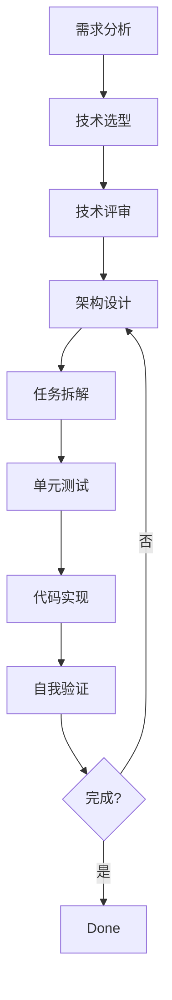

# Claude Skills 全方位指南：从新手入门到 Agentic Workflow 实战

随着 AI 开发工具的进化，我们已经从简单的 "Chat" 模式进入了 "Agentic"（代理化）时代。Claude Code 的 **Skills** 系统正是这一变革的核心。

本文将带你由浅入深地了解什么是 Claude Skills，它能为你的开发效率带来怎样的质变，并深度解析两个实战项目：`full-stack-skill` 与 `AI-Storyboard`。


---

## 什么是 Claude Skills？

简单来说，**Skills 是 Claude Code 的“外挂大脑”和“技能包”**。

通过定义 `SKILL.md` 文件，你可以赋予 Claude 特定的领域知识、工作流指令、自定义命令以及工具使用权限。

### 核心组成部分

1.  **SKILL.md (必选)**: 技能的主体说明文档，包含 Frontmatter 元数据和具体的 Prompt 指令。
2.  **Scripts**: 可以让 Claude 执行的自动化脚本（Python, Shell 等）。
3.  **Examples**: 提供 Few-shot 示例，让 Claude 的输出更符合预期。
4.  **Template**: 为特定任务定义固定的输出格式。

### 它能带来什么提升？

- **标准化**: 将繁杂的开发规范（如 API 命名、Lint 规则）固化，避免重复沟通。
- **自动化**: 一键运行复杂的部署、迁移或重写任务。
- **隔离性**: 通过 `context: fork` 在子代理（Subagent）中执行任务，保证主会话不被杂乱信息干扰。

---

## 实战案例一：Full-Stack Skills (全栈开发生命周期管理)

[RainLib/full-stack-skill](https://github.com/RainLib/full-stack-skill) 是一个将全栈开发流程标准化的插件。

它不仅仅是一个指令集，而是一个 **状态化的 8 阶段工作流**：

1.  **需求分析 (Requirements)**: 梳理业务核心价值。
2.  **技术选型 (Tech Selection)**: 确定栈组合。
3.  **技术评审 (Tech Review)**: 评估可行性。
4.  **架构设计 (Program Design)**: 绘制系统蓝图。
5.  **任务拆解 (Task Breakdown)**: 细化执行步骤。
6.  **单元测试 (Unit Testing)**: 测试驱动开发 (TDD)。
7.  **代码实现 (Code Development)**: 沉浸式编码。
8.  **自我验证 (Self-Verification)**: 质量最后把关。



### 为什么好用？

- **状态持久化**: 所有的进度记录在 `docs/history.json` 中，你可以随时暂停，下次让 Claude 从断点继续。
- **子代理解耦**: 复杂的逻辑分析运行在独立 Subagent 中，确保最后生成的代码干净、精准。

---

## 实战案例二：AI-Storyboard (智能分镜系统)

[RainLib/AI-Storyboard](https://github.com/RainLib/AI-Storyboard) 是 Claude Skills 在创意领域的巅峰之作。

它通过 Skill 架构协调了一个工作组：

- **Producer (制片人)**: 统筹全局。
- **Scriptwriter (编剧)**: 生成引人入胜的故事。
- **Storyboard Artist (分镜师)**: 创作 9 宫格、4 格提示词。
- **Director (导演)**: 进行最后的质量控制。
- **Animator (动效师)**: 生成 Motion Prompts。

这套系统将 Claude 的编程能力转化为逻辑严密的创作流，极大地降低了影视分镜的制作门槛。

---

## 社区热门 Skills 推荐

除了官方提供的基础能力，社区中涌现出了许多极具创意的项目。以下是经过筛选的“必装”推荐：

### 1. 官方精选 (Official)

- **[frontend-design](https://github.com/anthropics/skills/blob/main/skills/frontend-design)**: 强制 Claude 摆脱“AI 定式感”，做出更大胆、更具设计感的 UI 决策。React & Tailwind 开发者必备。
- **[web-artifacts-builder](https://github.com/anthropics/skills/tree/main/skills/web-artifacts-builder)**: 针对 claude.ai 的 HTML Artifacts 进行优化，支持 React + shadcn/ui。
- **[mcp-builder](https://github.com/anthropics/skills/tree/main/skills/mcp-builder)**: 如果你想让 Claude 接入数据库或外部 API，这是构建 MCP Server 的权威指南。

### 2. 社区神作 (Community)

- **[obra/superpowers](https://github.com/obra/superpowers)**: 内置 20+ 战斗实测的技能，包含 TDD、深度调试和复杂的执行计划。
- **[loki-mode](https://github.com/asklokesh/claudeskill-loki-mode)**: 极具野心的“初创公司”系统，编排了 37 个 Agent，从 PRD 到部署一气呵成。
- **[ios-simulator-skill](https://github.com/conorluddy/ios-simulator-skill)**: 自动化 iOS 模拟器操作，支持 App 构建与自动化测试。
- **[Trail of Bits Security Skills](https://github.com/trailofbits/skills)**: 专业级的安全审计工具，集成 CodeQL 和 Semgrep 进行漏洞检测。

> [!TIP]
> 更多优质 Skill 可以在 [Awesome Claude Skills](https://github.com/travisvn/awesome-claude-skills) 仓库中找到。

---

## 进阶资料：深度解析 Skill 架构

如果你想开始动手写自己的 Skill，以下这些细节将直接决定你的 Agent 是否“聪明”。

### 1. 元数据 (Metadata) 与 Frontmatter 详解

每个 `SKILL.md` 的顶部都必须包含 Frontmatter。以下是一个典型的配置项示例：


```markdown
---
name: my-advanced-skill
description: 描述该技能的具体用途，Claude 会根据此描述判断何时调用。
disable-model-invocation: true # 如果该技能只是静态指令或脚本，设为 true 可节省 Token。
context: fork # 极其重要！在子代理解中执行，防止上下文污染。
allowed-tools: [Read, Grep] # 限制该 Skill 只能使用的工具，提高安全性。
---
```

**关键技巧：字符串替换**

- `$ARGUMENTS`: 获取用户在使用 `/command <args>` 时传入的参数。
- `${CLAUDE_SKILL_DIR}`: 指向当前 Skill 所在的物理路径，方便调用同目录下的脚本。

### 2. 标准目录结构

一个生产级的 Skill 不仅仅是一个 MD 文件，而是一个结构严谨的目录：

```text
my-skill/
├── SKILL.md          # 核心大脑：包含元数据和主 Prompt
├── template.md        # 输出模板：强制 Claude 按照特定格式输出结果
├── examples/
│   └── sample_1.md    # 示例库：通过 Few-shot 让 AI 模仿你的风格
└── scripts/
    └── deploy.sh      # 脚本库：Claude 可以直接运行的代码，实现真正的自动化
```

### 3. 注意事项与最佳实践

- **Prompt 的精准度**: 描述 (Description) 越清晰，Claude 触发该技能的概率就越准确。
- **安全性**: 如果 Skill 包含外部脚本，务必在 Prompt 中告知 Claude 在运行前进行安全确认。
- **渐进披露**: 不要在一个 `SKILL.md` 中塞入几千行指令。利用 Docusaurus 风格的链接跳转，让 Claude 在需要时才去读取详细文档。
- **测试你的 Skill**: 就像写代码一样，给你的 Skill 喂入不同的场景，观察它是否能正确触发并输出。

---

## 如何安装和获取这些 Skills？

现在已经有成熟的 Skills 生态圈：

- **[Skills.sh](https://skills.sh/)**: 官方/社区 Skills 排行榜。
- **[SkillsMP](https://skillsmp.com/)**: 丰富的插件库（推荐关注 [OpenClaw 飞书插件](https://skillsmp.com/skills/openclaw-openclaw-extensions-feishu-skills-feishu-perm-skill-md)）。

### 安装方式

#### 1. 快速安装 (推荐)

使用 `npx` 一键添加：

```bash
npx skills add RainLib/full-stack-skill
```

#### 2. 个人技能路径

如果你想在所有项目中使用，克隆到全局目录：

```bash
git clone https://github.com/RainLib/full-stack-skill ~/.claude/skills/full-stack-skills
```

#### 3. 项目特定技能

仅在某个项目生效，放入项目根目录的 `.claude/skills/` 下。

---

## 结语

Claude Skills 不仅仅是 Prompt 工程的进阶，它是通往真正 "AI 协同编程" 的必经之路。通过构建自己的 Skill 库，你可以将昂贵的经验转化为可复用的资产。

快去 [Skill 商城](https://skills.sh/) 寻找灵感，或者开始编写你的第一个 `SKILL.md` 吧！
