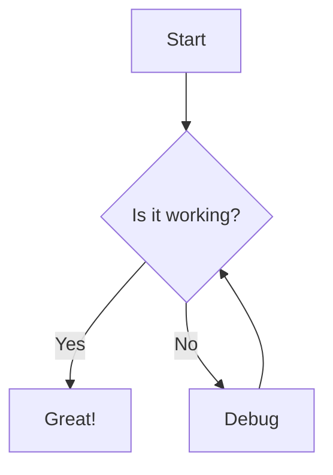
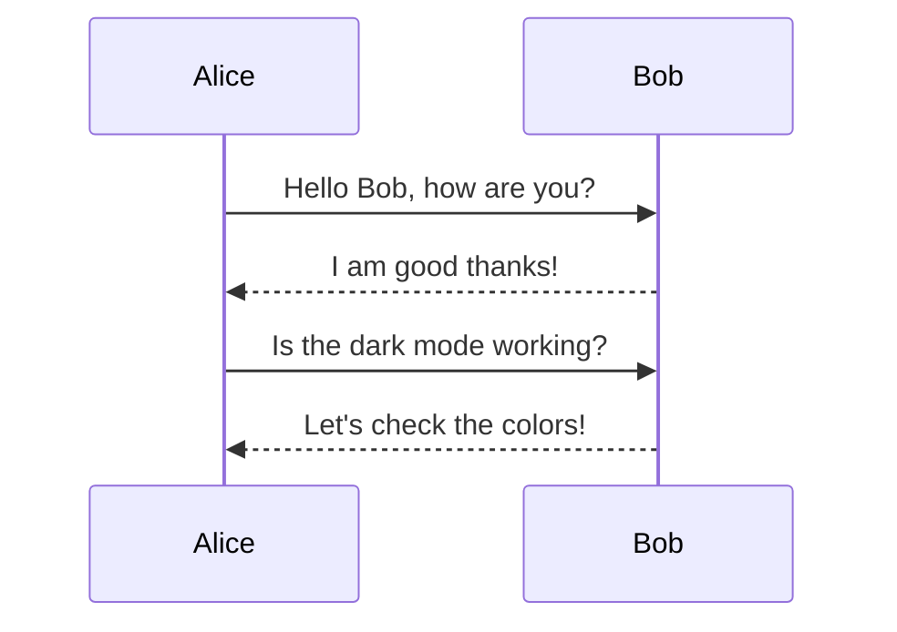
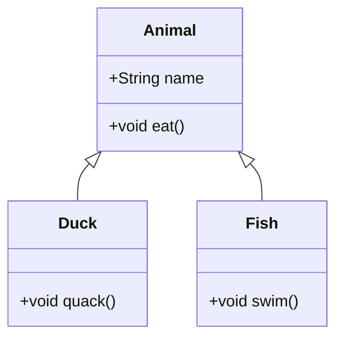
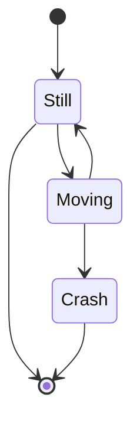

# Mermaid Theme Verification

This page tests the Mermaid diagram theming in light and dark modes.

## Flowchart

```mermaid
graph TD
    A[Start] --> B{Is it working?}
    B -- Yes --> C[Great!]
    B -- No --> D[Debug]
    D --> B
```

## Sequence Diagram

```mermaid
sequenceDiagram
    participant Alice
    participant Bob
    Alice->>Bob: Hello Bob, how are you?
    Bob-->>Alice: I am good thanks!
    Alice->>Bob: Is the dark mode working?
    Bob-->>Alice: Let's check the colors!
```

## Class Diagram

```mermaid
classDiagram
    class Animal {
        +String name
        +void eat()
    }
    class Duck {
        +void quack()
    }
    class Fish {
        +void swim()
    }
    Animal <|-- Duck
    Animal <|-- Fish
```

## State Diagram

```mermaid
stateDiagram-v2
    [*] --> Still
    Still --> [*]
    Still --> Moving
    Moving --> Still
    Moving --> Crash
    Crash --> [*]
```
