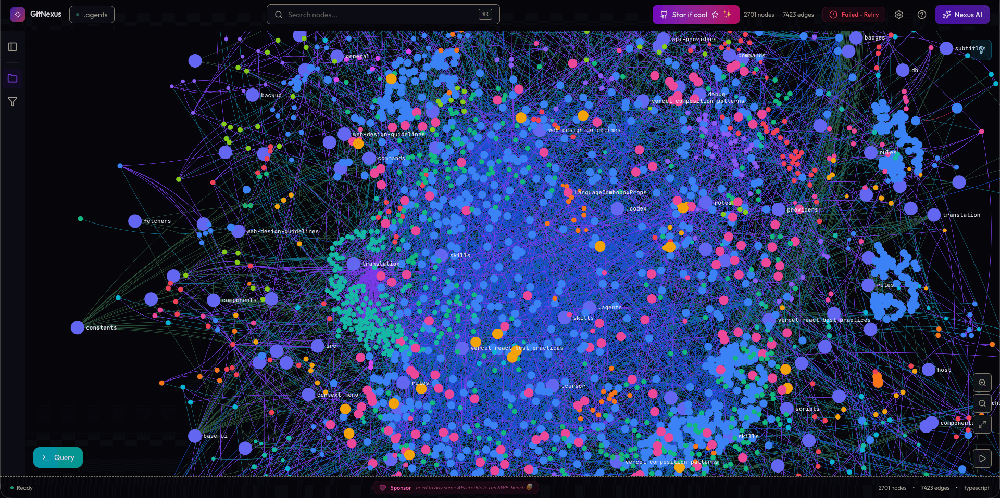

## 什么是 GitNexus？

GitNexus 是一个**零服务器 (Zero-Server)** 的代码情报引擎。它通过 Tree-sitter 解析代码 AST，并利用 KuzuDB 构建本地知识图谱。



---

## GitNexus vs 传统 Graph RAG：核心区别

传统的 Graph RAG 方案（如 Microsoft GraphRAG、LlamaIndex 的 KG 增强等）通常将非结构化文本提取为三元组后构建图谱，然后在查询时让 LLM **逐步探索原始图边**（Raw Graph Edges），这需要多轮查询才能凑齐足够的上下文。GitNexus 的核心创新在于 **预计算关系情报 (Precomputed Relational Intelligence)**，它在索引阶段就完成了结构化分析。

### 架构路径对比

**传统 Graph RAG 的查询路径：**

```
用户提问: "UserService 有多少依赖？"
    → LLM 接收原始图谱
    → Query 1: 查找直接调用者
    → Query 2: 这些调用者在哪些文件？
    → Query 3: 哪些是测试文件？需要过滤
    → Query 4: 哪些是高风险变更？
    → 经过 4+ 轮查询后，才拼凑出答案
```

**GitNexus Smart Tools 的查询路径：**

```
用户提问: "UserService 有多少依赖？"
    → impact({target: "UserService", direction: "upstream"})
    → 一次调用即返回完整结构化结果：
        8 个调用者, 3 个功能集群, 置信度均 > 90%
```

### 关键差异对比

| 维度                 | 传统 Graph RAG                       | GitNexus                                           |
| -------------------- | ------------------------------------ | -------------------------------------------------- |
| **图谱数据来源**     | 非结构化文本 → LLM 提取三元组        | 代码 AST → Tree-sitter 精确解析                    |
| **索引粒度**         | 文档/段落级别                        | 函数、类、方法、接口级别                           |
| **关系类型**         | 通用实体关系 (is-a, has-a)           | 代码专属关系 (CALLS, IMPORTS, EXTENDS, IMPLEMENTS) |
| **查询方式**         | LLM 多轮探索原始图边                 | 预计算的 Smart Tools，**一次调用返回完整结果**     |
| **Token 消耗**       | 高（多轮查询 + 原始图谱序列化）      | 低（预结构化响应，仅返回相关上下文）               |
| **置信度**           | 依赖 LLM 的推理准确性                | 基于 AST 解析的确定性评分 (Confidence Scoring)     |
| **社区/集群检测**    | 通常需要额外的图算法库               | 内置社区检测，自动分组相关符号                     |
| **执行流追踪**       | ❌ 不支持                            | ✅ 从入口点追踪完整调用链 (Process Detection)      |
| **对小模型的友好度** | 差（依赖大模型的推理能力来探索图谱） | 优（工具端完成重活，小模型也能获得完整上下文）     |

> [!IMPORTANT]
> GitNexus 的核心优势不在于"图谱更大"，而在于 **"更聪明的工具"**。传统 Graph RAG 把原始图谱交给 LLM 自行探索，GitNexus 则是把**预处理好的结构化答案**直接交给 LLM。这意味着更少的 Token 消耗、更高的准确性，以及对小参数模型的民主化支持。

---

## 核心使用方法

GitNexus 提供了两种主要的交互方式：**CLI + MCP**（推荐用于生产开发）和 **Web UI**（用于快速探索）。

### 1. 快速开始 (CLI)

通过 npm 全局安装 GitNexus：

```bash
npm install -g gitnexus
```

在你的项目根目录下执行分析：

```bash
npx gitnexus analyze
```

此命令会自动完成以下工作：

- 扫描文件树并构建初始知识图谱。
- 使用 Tree-sitter 解析函数、类、方法和接口。
- 自动在 `.claude/skills/` 下安装 Agent 技能。
- 生成 `AGENTS.md` 和 `CLAUDE.md` 环境上下文文件。

### 2. 配置 MCP (Model Context Protocol)

为了让你的编辑器（如 Cursor）或终端（如 Claude Code）具备这些“超能力”，你需要配置 MCP 服务：

```bash
npx gitnexus setup
```

该命令会探测你安装的编辑器并写入全局配置。例如，在 Cursor 的 `mcp.json` 中，它会添加如下配置：

```json
{
  "mcpServers": {
    "gitnexus": {
      "command": "npx",
      "args": ["-y", "gitnexus@latest", "mcp"]
    }
  }
}
```

---

## 详细功能设计与触发

GitNexus 并非简单的搜索工具，它通过一组智能工具（Smart Tools）改变了 Agent 的工作方式：

### 1. 影响分析 (Impact Analysis)

**触发指令**：`impact({target: "SymbolName", direction: "upstream"})`

- **设计原理**：实时通过知识图谱计算某个符号被修改后的“爆炸半径”。
- **优势**：它能告诉 AI，修改 `UserService` 会导致哪些 API 路由失效，而不仅仅是找到包含该字符串的文件。

### 2. 全方位上下文 (360° Context)

**触发指令**：`context({name: "functionName"})`

- **设计原理**：返回该函数的所有入站调用、出站调用、所属模块以及其参与的业务流程。

### 3. 基于语义的流程搜索 (Process-Grouped Search)

**触发指令**：`query({query: "Login Flow"})`

- **设计原理**：不仅仅匹配关键词，还会根据社区检测算法找出相关的逻辑集合（Clusters）。

---

## 关键技术考量：是否支持增量？

这是开发者最关心的问题之一。

- **现状 (v0.x)**：目前的 GitNexus 在执行 `gitnexus analyze` 时主要进行全量或基于文件的重新扫描。
- **增量支持 (Roadmap)**：开发者在路线图中明确列出了 **Incremental Indexing**。
- **当前优化**：虽然目前是全量扫描，但由于其采用了高效的 KuzuDB 和本地 WASM 运算，即使是中型项目的索引速度也非常快（通常在秒级或数分钟内）。

> [!TIP]
> 如果项目非常巨大，可以使用 `gitnexus analyze --skip-embeddings` 来跳过向量嵌入生成，这会极大缩短索引耗时，同时保留核心的图谱关联能力。

---

## 为什么你的 AI 需要它？

在没有 GitNexus 的情况下，AI 助手往往只是在“盲人摸象”。有了 GitNexus 提供的 **Precomputed Relational Intelligence (预计算关系情报)**：

- **更精准**：AI 不再会遗漏跨文件的微妙依赖。
- **更廉价**：通过一两次工具调用即可获取全局图谱，大幅减少消耗的 Token。
- **更强大**：即使是小参数模型，在 GitNexus 的加持下也能理解复杂的企业级代码库。

**推荐指数**：⭐⭐⭐⭐⭐
**演示地址**：[gitnexus.vercel.app](https://gitnexus.vercel.app)
